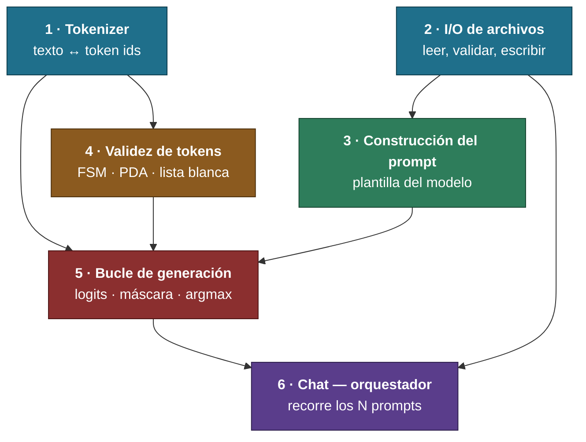

# FLOW.md — El proyecto de un vistazo

> [!important] Para qué es este archivo
> Ver **qué bloques hay, qué le entrega cada uno al siguiente y en qué orden se construyen**, sin leer el diseño entero.
> El detalle vive en `[[PROJECT]]`. Aquí solo está la forma.

---

## Orden de construcción

> [!info] Se implementa de arriba abajo
> Cada bloque solo depende de los que están **encima**. Ninguno necesita algo de más abajo.

---

## Qué le entrega cada bloque a cuál

| De | A | Qué le pasa |
|---|---|---|
| 1 · Tokenizer | 5 · Generación | Texto → ids, ids → texto |
| 1 · Tokenizer | 4 · Validez | El `dict` del vocabulario, string → id |
| 2 · I/O | 3 · Prompt | Catálogo de funciones y prompts, ya validados |
| 2 · I/O | 6 · Chat | Las rutas y los datos de entrada |
| 3 · Prompt | 5 · Generación | Un string listo para tokenizar |
| 4 · Validez | 5 · Generación | Los ids permitidos en el estado actual del JSON |
| 5 · Generación | 6 · Chat | Un resultado validado, por prompt |
| 6 · Chat | 2 · I/O | Los N resultados y el registro de fallos, para escribir |

---

## El mismo mapa, pero en orden de ejecución

> [!info] Lo que pasa cuando corre el programa
> El de arriba es el orden en que se **construye**. Este es el orden en que las cosas **ocurren**.

```mermaid
graph LR
    CLI["<b>__main__</b><br/>argparse"] --> IO["<b>2</b><br/>leer y validar<br/>los dos JSON"]
    IO --> CHAT["<b>6 · Chat</b><br/>por cada prompt"]
    CHAT --> PR["<b>3</b><br/>construir<br/>el texto"]
    PR --> TOK["<b>1</b><br/>texto → ids"]
    TOK --> GEN

    subgraph GEN["<b>5 · bucle token a token</b>"]
        direction LR
        L["pedir<br/>logits"] --> M["aplicar<br/>máscara"]
        M --> A["argmax"]
        A --> C{"profundidad<br/>= 0?"}
        C -->|"no"| L
    end

    VAL["<b>4</b><br/>qué ids<br/>son válidos"] -.->|"consulta"| M
    C -->|"sí"| DEC["<b>1</b><br/>ids → texto"]
    DEC --> PY["json.loads<br/>+ pydantic"]
    PY --> CHAT
    CHAT --> OUT["<b>2</b><br/>escribir los N<br/>resultados"]

    style GEN fill:#2a1a1a,stroke:#8b2f2f
    style VAL fill:#8b5a1f,stroke:#4d310d,color:#fff
    style CHAT fill:#5a3d8b,stroke:#2f1f4d,color:#fff
```

---

## Estado

| # | Bloque | Diseño | Implementación | Tests |
|---|---|---|---|---|
| 1 | Tokenizer | ✅ | 🔵 | ⚪ |
| 2 | I/O de archivos | ⚪ | ⚪ | ⚪ |
| 3 | Construcción del prompt | ⚪ | ⚪ | ⚪ |
| 4 | Validez de tokens | ⚪ | ⚪ | ⚪ |
| 5 | Bucle de generación | ⚪ | ⚪ | ⚪ |
| 6 | `Chat` orquestador | ⚪ | ⚪ | ⚪ |

**Estados:** ✅ cerrado · 🔵 en curso · ⚪ pendiente · 🔴 bloqueado

> [!note] Se actualiza al cerrar cada bloque
> Este archivo es la vista rápida. La fuente de verdad sigue siendo `[[PROJECT]]`.

> [!info] Bloque 1 — dónde va (2026-08-12)
> Diseño cerrado y construcción empezada en `src/tokenizer.py`: atributos, tablas byte↔carácter verificadas y las dos cargas ya partidas en `_load_vocab` y `_load_mergeboard`.
> ==El `Tokenizer` todavía no construye== — 4 fallos verificados en ejecución, listados en `[[PROJECT#Abierto en este bloque]]`.
> Falta también la **regla de pre-tokenización** (`[[PROJECT#Pre-tokenización — cómo parte Qwen de verdad]]`) y los cuerpos de `encode` y `decode`.
