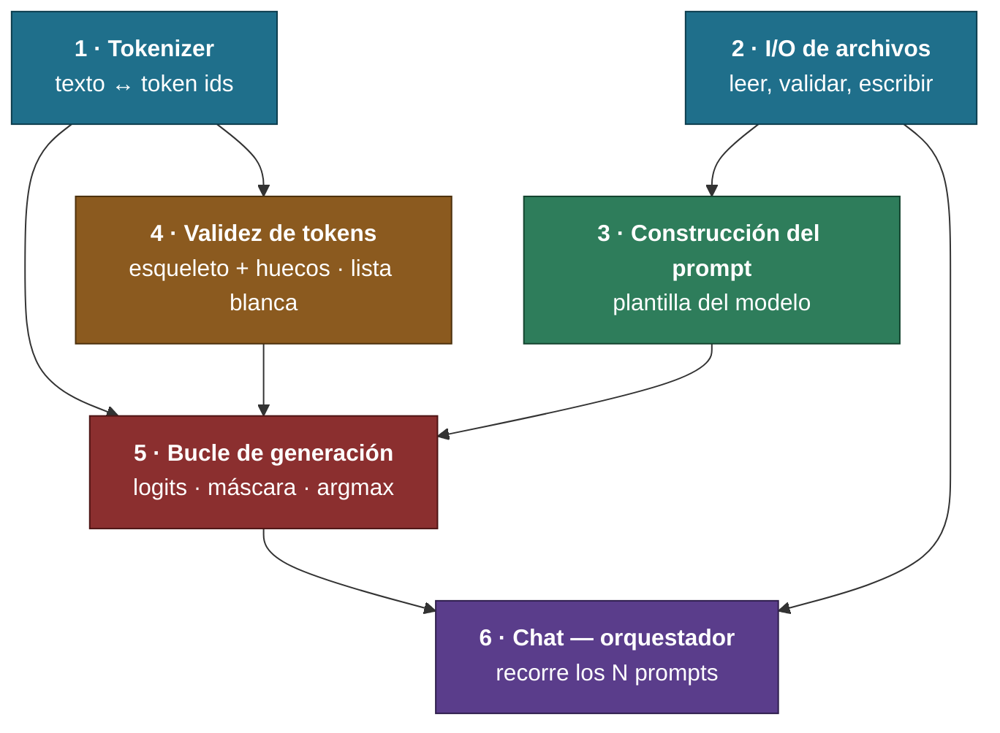

# FLOW.md — El proyecto de un vistazo

> [!important] Para qué es este archivo
> Ver **qué bloques hay, qué le entrega cada uno al siguiente y en qué orden se construyen**, sin leer el diseño entero.
> El detalle vive en `[[PROJECT]]`. Aquí solo está la forma.

---

## Orden de construcción

> [!info] Se implementa de arriba abajo
> Cada bloque solo depende de los que están **encima**. Ninguno necesita algo de más abajo.

---

## Qué le entrega cada bloque a cuál

| De | A | Qué le pasa |
|---|---|---|
| 1 · Tokenizer | 5 · Generación | Texto → ids, ids → texto |
| 1 · Tokenizer | 4 · Validez | El `dict` del vocabulario, string → id |
| 2 · I/O | 3 · Prompt | Catálogo de funciones y prompts, ya validados |
| 2 · I/O | 6 · Chat | Las rutas y los datos de entrada |
| 3 · Prompt | 5 · Generación | Un string listo para tokenizar |
| 4 · Validez | 5 · Generación | Los ids permitidos en el estado actual del JSON |
| 5 · Generación | 6 · Chat | Un resultado validado, por prompt |
| 6 · Chat | 2 · I/O | Los N resultados y el registro de fallos, para escribir |

---

## El mismo mapa, pero en orden de ejecución

> [!info] Lo que pasa cuando corre el programa
> El de arriba es el orden en que se **construye**. Este es el orden en que las cosas **ocurren**.

```mermaid
graph LR
    CLI["<b>__main__</b><br/>argparse"] --> IO["<b>2</b><br/>leer y validar<br/>los dos JSON"]
    IO --> CHAT["<b>6 · Chat</b><br/>por cada prompt"]
    CHAT --> PR["<b>3</b><br/>construir<br/>el texto"]
    PR --> TOK["<b>1</b><br/>texto → ids"]
    TOK --> GEN

    subgraph GEN["<b>5 · bucle token a token</b>"]
        direction LR
        L["pedir<br/>logits"] --> M["aplicar<br/>máscara"]
        M --> A["argmax"]
        A --> C{"profundidad<br/>= 0?"}
        C -->|"no"| L
    end

    VAL["<b>4</b><br/>qué ids<br/>son válidos"] -.->|"consulta"| M
    C -->|"sí"| DEC["<b>1</b><br/>ids → texto"]
    DEC --> PY["json.loads<br/>+ pydantic"]
    PY --> CHAT
    CHAT --> OUT["<b>2</b><br/>escribir los N<br/>resultados"]

    style GEN fill:#2a1a1a,stroke:#8b2f2f
    style VAL fill:#8b5a1f,stroke:#4d310d,color:#fff
    style CHAT fill:#5a3d8b,stroke:#2f1f4d,color:#fff
```

---

## Estado

| # | Bloque | Diseño | Implementación | Tests |
|---|---|---|---|---|
| 1 | Tokenizer | ✅ | ✅ | ✅ |
| 2 | I/O de archivos | ✅ | ✅ | ✅ |
| 3 | Construcción del prompt | ✅ | ✅ | ✅ |
| 4 | Validez de tokens | ✅ | ✅ cache cerrado 09-02 | ✅ **80 verdes 09-03** |
| 5 | Bucle de generación | ✅ | ✅ | ✅ **32 verdes 09-03** |
| 6 | `Chat` orquestador | 🔵 **próximo** | ⚪ | ⚪ |

**Estados:** ✅ cerrado · 🔵 en curso · ⚪ pendiente · 🔴 bloqueado

> [!note] Se actualiza al cerrar cada bloque
> Este archivo es la vista rápida. La fuente de verdad sigue siendo `[[PROJECT]]`.

> [!success] Bloques 2 y 3 — cerrados (2026-08-25)
> `src/filemanager.py` con los seis métodos y los tres getters (**46 tests**), y `src/promptbuilder.py` con la plantilla de chat de Qwen y el catálogo en JSON (**20 tests**). `flake8` y `mypy --strict` limpios en los dos.

> [!success] Bloque 4 — cerrado (2026-08-31)
> **`src/guardian.py` completo y verificado:** once métodos, **64 tests verdes**, `flake8` y `mypy --strict` limpios.
> Los tests los escribió un **agente ciego** que nunca abrió `src/`. De sus 5 rojos salieron **dos errores reales del código** —el cero a la izquierda y el cierre tras un punto—, los dos en la rama `number` de `_char_ok` y corregidos por él.
> **Diseño:** esqueleto + huecos, sin pila de estructura JSON. El modelo solo escribe **hojas** —nombre de función y valores—; el resto lo inyecta `Guardian`.
> ==El contrato en PDF se borró al cerrar el bloque, por decisión suya.==

> [!success] Bloque 4 — cache cerrado (2026-09-02)
> `_cache_flags` arreglado por él y **verificado contra las listas blancas reales**: 15 estados de `number` con los dos cierres y 7 de `string`, ==ningún par de estados con la misma clave devuelve listas distintas==.
> `Guardian` gana `get_written()`, que expone lo escrito en la hoja en curso — lo pide el tope del Bloque 5. **Método público nuevo: arrastra su test.**
> ==**Los 80 tests siguen sin correrse.**== `make` ya funciona: `make testN test=4`, ~4 minutos.

> [!success] ==Bloque 5 — CERRADO (2026-09-03)==
> `src/interface.py` con `Interface` y `Output`. **32 tests verdes**, `flake8` y `mypy --strict` limpios en `src/` —8 archivos—, y la pasada de estilo hecha.
> ==**Quedan las docstrings**, por decisión suya: llegan al final del proyecto.== El subject las exige, así que siguen siendo pendiente global, no del bloque.
> **Siguiente: Bloque 6, `Chat`** — arrastra el decode de los `Ġ` y el `json.loads` del resultado.

> [!success] Bloque 4 — los 80 tests corridos por fin (2026-09-03)
> `make testN test=4` → ==**80 passed en 2 min 23 s**==. Es la **primera corrida** de la suite completa del bloque, cache incluido: se escribieron el 08-31 y el 09-01 y arrastraban dos sesiones sin ejecutarse.

> [!success] Bloque 5 — contrato y tests cerrados (2026-09-03)
> **`tests/blackbox_test_bloque_5.md`** —el contrato— y **`tests/test_bloque_5.py`** con ==**32 tests verdes en 1 min 33 s**==, escritos por un agente de caja negra que nunca abrió `src/`.
> ==**Los cuatro estados de `Output` se disparan**==: los dos que el modelo real no provoca —fallo y tope— se fuerzan con una función de logits fabricada, que el `Callable` del `__init__` admite por diseño. **`get_written()` queda probado.**
> **El único rojo fue del contrato:** cinco longitudes de prompt contadas a ojo, no medidas. De ahí la **regla de cifras** —lo que mide un artefacto se mide, lo que es promesa se clava— y la regla suya: ==un rojo solo se justifica si rompe su código==.
> **Falta para cerrar el bloque:** la pasada de estilo, con los docstrings de `src/interface.py`.

> [!success] Bloque 5 — construcción cerrada (2026-09-02)
> `reply` devuelve `Output`, modelo `pydantic` con `log` y `output`, y **tres estados**: prompt vacío · fallo del modelo · corte por tope · salida correcta.
> ==**11 de 11 prompts reales correctos**==, de 1,0 s a 7,0 s. `flake8` y `mypy --strict` limpios en `src/`. **Todos los requisitos del bloque cumplidos.**
> **El decode del texto crudo pasó al Bloque 6**, donde ya vive el `json.loads`: el `_json_str` mezcla texto real y disfraz del vocabulario, así que no hay conversión posible sobre la cadena entera.
> **Falta:** el contrato —el encargo del agente de caja negra— y los tests.

> [!info]- Bloque 5 — arrancado (2026-09-02), histórico
> **Lista de requisitos cerrada** antes de teclear, y `src/interface.py` con el `__init__` y `reply` escritos por él el mismo día. ==**Los 11 prompts reales salen con función y argumentos correctos**==, de 0,8 s a 6,8 s.
> **Decisión de diseño suya:** `Interface` **no conoce ningún SDK** — recibe las rutas como `Path` y la función de logits como `Callable`. Construir el modelo pasa a `Chat`.
> **Falta lo que `reply` devuelve:** el modelo `pydantic` con el estado, y con él el decode del texto crudo que hoy mete `Ġ` en las hojas `string`.

> [!info]- Bloque 4 — reabierto para el cache (2026-09-01), histórico
> El **bonus 4** entró dentro del bloque, por decisión suya: el cache envuelve `get_valid_ids` y no toca el cálculo. Funciona —el primer prompt lo llena, los siguientes no recorren el vocabulario— pero ==**`_cache_flags` tiene un bug abierto**==: `0.` y `0.5` comparten flag sin compartir lista blanca.
> **16 tests nuevos** de un segundo agente ciego, sección 10 de `tests/test_bloque_4.py`. ==Ninguno de los 80 se ha corrido: `make` está roto en la máquina.==

> [!important] Método refundado (2026-08-31)
> El ciclo de un bloque: **lista de requisitos cerrada** → **él teclea y el agente verifica ejecutando** → **contrato escrito después** → **agente de tests ciego** → **él diagnostica los rojos** → **correcciones entre los dos** → **tres pasadas y cierre**.
> ==Los nombres, atributos y firmas ya no se cierran en el diseño: salen mientras se escribe.== Detalle en `[[SYSTEM]]`, plantilla del PDF en `[[contract]]`.

> [!success] Bloque 1 — dónde va (2026-08-17)
> **Construcción cerrada** en `src/tokenizer.py`: `encode` y `decode` completos, con el bucle de fusiones de BPE y los 26 tokens especiales cargados de `added_tokens`.
> ==El test que zanja el bloque pasa== — `assert mi_ids == sdk_ids` con los archivos reales de Qwen, en 43 textos. **129 tests verdes** en `tests/test_bloque_1.py`.
> Consecuencia: el **bonus 2 sigue vivo**, no hay que caer al plan B de usar el `encode` del SDK.
> Queda solo la pasada de **guards** y la de **`flake8`/`mypy`** — ver `[[PROJECT#Abierto en este bloque]]`.
