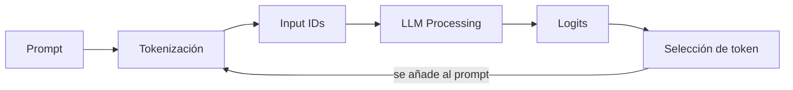

# HANDOFF.md — call me maybe

> [!important] Qué es este archivo
> Subject traducido y estructurado desde `en.subject.pdf`. Solo lectura salvo la sección final de relevo — ver `[[SYSTEM#Relevo de agente]]`.

---

## 🎯 Resumen

> [!info] Objetivo del proyecto
> Construir una herramienta de **function calling**: traduce prompts en lenguaje natural a llamadas de función estructuradas, usando un LLM pequeño (**Qwen/Qwen3-0.6B**, 0.6B parámetros).

Dado `"What is the sum of 40 and 2?"`, la solución **no** devuelve `42`. Devuelve:

```json
{
  "function": "fn_add_numbers",
  "arguments": {"a": 40, "b": 2}
}
```

> [!important] La pieza central: constrained decoding
> Modelos pequeños fallan generando JSON válido con solo prompting (~30% éxito). El proyecto exige **constrained decoding**: modificar los logits del modelo *antes* de elegir cada token, para forzar JSON válido y conforme al schema — no basta con confiar en que el modelo "lo haga bien".

> [!warning] Prohibido explícitamente
> No vale que el modelo genere JSON espontáneamente a partir del prompt. Prompting + esperanza no es la técnica que este proyecto evalúa.

---

## 📐 Restricciones generales

### Lenguaje y estilo

- [ ] **Python 3.10+**
- [ ] Cumple **flake8**
- [ ] Manejo de excepciones con `try-except` — el programa **nunca** debe crashear sin controlar. Un crash en la evaluación = no funcional
- [ ] Context managers para recursos (archivos, conexiones) — sin fugas
- [ ] **Type hints** completos (`typing`) en parámetros, retornos y variables donde aplique
- [ ] Pasa **mypy** sin errores
- [ ] **Docstrings** en funciones y clases, estilo PEP 257 (Google o NumPy)

### Librerías

| Origen | Restricción | Impacto |
|---|---|---|
| Subject | Todas las clases deben usar **pydantic** para validación | Diseño de clases debe apoyarse en modelos pydantic |
| Subject | Permitido: `numpy`, `json` | — |
| Subject | **Prohibido**: `dspy`, `pytorch`, `huggingface`, `transformers`, `outlines`, y similares | No hay atajos de constrained decoding vía librería — se implementa a mano |
| Subject | Prohibido usar métodos o atributos **privados** de `llm_sdk` | Solo la interfaz pública documentada abajo |
| Subject | La elección de función la hace el **LLM**, nunca heurísticas ni "magia medieval" | El enrutado prompt→función no puede ser un `if/else` sobre palabras clave |
| Entorno | Entorno virtual y dependencias (`numpy`, `pydantic`) instaladas con **uv** | `uv sync` es lo único que correrá el revisor/moulinette |
| Entorno | `llm_sdk` se copia en el mismo directorio que `src` | No se instala como paquete externo |

> [!warning] Bloqueo de diseño
> Sin `pydantic` en cada clase, sin constrained decoding manual, sin heurísticas para elegir función. Estos tres son innegociables desde Fase 1.

---

## 🗂️ Estructura del repositorio

> [!warning] Obligatorio en la entrega
> - [ ] `src/` — implementación
> - [ ] `pyproject.toml` + `uv.lock` — gestión de dependencias
> - [ ] `llm_sdk/` — copiado del paquete provisto
> - [ ] `data/input/` — ficheros de test (para demo)
> - [ ] `README.md` — documentación completa
> - [ ] Cualquier archivo adicional necesario para correr la solución

> [!warning] No incluir
> `output/` no se sube al repo — se genera durante el peer review.

### Comando de ejecución

```bash
uv run python -m src [--functions_definition <function_definition_file>] [--input <input_file>] [--output <output_file>]
```

Por defecto lee de `data/input/` y escribe en `data/output/`. Ejemplo completo:

```bash
uv run python -m src \
  --functions_definition data/input/functions_definition.json \
  --input data/input/function_calling_tests.json \
  --output data/output/function_calls.json
```

---

## 📥 Ficheros de entrada

### `function_calling_tests.json`

Array de prompts en lenguaje natural a procesar.

```json
[
  {"prompt": "What is the sum of 2 and 3?"},
  {"prompt": "What is the sum of 265 and 345?"},
  {"prompt": "Greet shrek"},
  {"prompt": "Greet john"},
  {"prompt": "Reverse the string 'hello'"}
]
```

### `functions_definition.json`

Funciones disponibles: nombre, parámetros (nombre + tipo), tipo de retorno, descripción.

```json
[
  {
    "name": "fn_add_numbers",
    "description": "Add two numbers together and return their sum.",
    "parameters": {
      "a": {"type": "number"},
      "b": {"type": "number"}
    },
    "returns": {"type": "number"}
  },
  {
    "name": "fn_greet",
    "description": "Generate a greeting message for a person by name.",
    "parameters": {
      "name": {"type": "string"}
    },
    "returns": {"type": "string"}
  },
  {
    "name": "fn_reverse_string",
    "description": "Reverse a string and return the reversed result.",
    "parameters": {
      "s": {"type": "string"}
    },
    "returns": {"type": "string"}
  }
]
```

> [!warning] No hardcodear contra el ejemplo
> Los prompts y el set de funciones **cambian** en el peer review. Nada de soluciones atadas a estos ejemplos concretos. También hay que manejar JSON inválido o archivos ausentes en ambos ficheros de entrada.

---

## 🤖 Interacción con el LLM

### `llm_sdk` — clase `Small_LLM_Model`

| Método | Firma | Qué hace |
|---|---|---|
| `get_logits_from_input_ids` | `(input_ids: List[int]) -> List[float]` | Logits del modelo dado una lista de token IDs |
| `get_path_to_vocab_file` | `() -> str` | Ruta al fichero de vocabulario (token ↔ ID) |
| `encode` | `(text: str) -> Tensor` | Texto → tensor de token IDs |
| `decode` *(opcional)* | `(token_ids: List[int]) -> str` | Token IDs → texto |

> [!important] Solo interfaz pública
> Nada de atributos o métodos privados de `llm_sdk` — restricción explícita del subject.

### Pipeline de generación



Se repite token a token hasta completar la respuesta. En **Selección de token** es donde entra constrained decoding.

### Constrained decoding — el mecanismo

1. El modelo produce logits para todos los tokens posibles
2. Se identifica qué tokens mantienen **JSON válido y conformidad con el schema esperado**
3. Los tokens inválidos (rompen schema o estructura) → logit a **-infinito**
4. Se muestrea solo entre los tokens válidos que quedan

> [!example] Aplicación concreta
> Si `functions_definition.json` dice que un campo es `number`, el decoder en ese punto de la generación solo permite tokens que continúen un entero o float válido — nunca letras sueltas o comillas fuera de lugar.

> [!tip] Pista del subject
> Usar el fichero de vocabulario (`get_path_to_vocab_file`) para mapear tokens ↔ su representación en string. Ahí se decide, en cada paso, qué tokens son válidos.

---

## 📤 Formato de salida

Archivo único: `data/output/function_calling_results.json`. Un objeto por prompt, con **exactamente** estas claves:

| Clave | Tipo | Contenido |
|---|---|---|
| `prompt` | `string` | El prompt original |
| `name` | `string` | Nombre de la función elegida |
| `parameters` | `object` | Todos los argumentos requeridos, con el tipo correcto |

```json
[
  {
    "prompt": "What is the sum of 2 and 3?",
    "name": "fn_add_numbers",
    "parameters": {"a": 2.0, "b": 3.0}
  },
  {
    "prompt": "Reverse the string 'hello'",
    "name": "fn_reverse_string",
    "parameters": {"s": "hello"}
  }
]
```

### Reglas de validación

- [ ] JSON válido (sin comas colgantes, sin comentarios)
- [ ] Claves y tipos coinciden **exactamente** con `functions_definition.json`
- [ ] Sin claves extra ni prosa en ningún punto de la salida
- [ ] Todos los argumentos requeridos presentes
- [ ] Tipos de argumento correctos (number, string, boolean, etc.)

---

## 🎯 Rendimiento y fiabilidad

| Métrica | Objetivo |
|---|---|
| Precisión | 90%+ función y argumentos correctos |
| Validez JSON | 100% parseable y conforme al schema |
| Velocidad | Todos los prompts de test en menos de 5 minutos, hardware estándar |
| Robustez | Maneja inputs malformados, ficheros ausentes, edge cases sin crashear |

> [!info] Por qué importa
> Qwen3-0.6B es pequeño. El subject remarca que la fiabilidad no sale del tamaño del modelo, sino de la guía estructural — el constrained decoding es lo que cierra la brecha.

### Edge cases a testear

Strings vacíos, números grandes, caracteres especiales, tipos incorrectos, prompts ambiguos, funciones con múltiples parámetros.

---

## 🧪 Testing (según el subject)

- [ ] Programas de test para verificar funcionalidad (no se entregan ni califican) — `pytest` o `unittest`
- [ ] Cubrir edge cases

> [!note] Esto no reemplaza `[[SYSTEM#Testing]]`
> El flujo de tests del sistema (discusión → agente escribe test → estudiante aprueba y ejecuta) aplica igual. Esta sección es lo que el subject exige como mínimo.

---

## 📄 README.md — requisitos

> [!warning] Primera línea obligatoria, en cursiva
> *This project has been created as part of the 42 curriculum by \<login1\>[, \<login2\>[, \<login3\>[...]]].*

Debe incluir, como mínimo:

- [ ] **Description** — qué es el proyecto, objetivo, overview breve
- [ ] **Instructions** — compilación, instalación, ejecución
- [ ] **Resources** — referencias clásicas del tema (docs, artículos, tutoriales) + cómo se usó IA (para qué tareas, qué partes)
- [ ] **Algorithm explanation** — el enfoque de constrained decoding en detalle
- [ ] **Design decisions** — elecciones clave de la implementación
- [ ] **Performance analysis** — precisión, velocidad, fiabilidad
- [ ] **Challenges faced** — dificultades y cómo se resolvieron
- [ ] **Testing strategy** — cómo se validó
- [ ] **Example usage** — ejemplos claros de ejecución

> [!warning] Idioma
> El README se escribe en **inglés**.

---

## ⭐ Bonus (opcional, no requerido para aprobar)

- [ ] Soporte para múltiples modelos LLM además de Qwen/Qwen3-0.6B
- [ ] Recodificar el tokenizer: evitar `encode`/`decode` directos en el código principal, usar `get_logits_from_input_ids` y `get_path_to_vocab_file` en su lugar
- [ ] Mecanismos avanzados de recuperación de errores
- [ ] Optimizaciones de rendimiento (caching, batching)
- [ ] Suite de tests exhaustiva
- [ ] Visualización del proceso de generación
- [ ] Soporte para argumentos de función anidados y complejos
- [ ] Implementación pública de `encode` y `decode` (opcional) del tokenizer
- [ ] Demostración de cómo encoding/decoding se integran con constrained decoding

> [!warning] Deben funcionar
> Los bonus tienen que estar implementados y funcionando — no solo descritos en el README. Puede pedirse demostrarlos en la evaluación.

---

## 📦 Entrega y peer review

- [ ] Todo el trabajo evaluado vive dentro del repositorio Git
- [ ] Verificar nombres de archivo exactos

> [!warning] Modificación en vivo durante evaluación
> Puede pedirse una **modificación breve** del proyecto durante la evaluación: cambio menor de comportamiento, unas líneas de código, una feature fácil de añadir. No aplica siempre, pero hay que estar preparado. Factible en pocos minutos salvo que se indique otro plazo.

---

## 🔄 Contextualización para el siguiente agente

> [!info] Agente 5 — activo
> **Periodo:** Cierre de Fase 0 → **Fase 1 abierta**, 6 bloques definidos y Bloque 1 en diseño.
>
> **Qué se hizo:**
> - **Cuestionario de repaso de sesión, institucionalizado.** Petición suya: al abrir cada sesión, un cuestionario corto sobre lo anterior, con histórico acumulado. Sección nueva `[[PROJECT#🔁 Cuestionarios de repaso de sesión]]` + entrada en `Posible mejoras al sistema.md`.
> - **Repaso del 2026-08-10:** 6 fallos registrados con su corrección, y una lista de lo que hay que volver a preguntar.
> - **Fase 1 arrancada.** Lista de **responsabilidades sueltas** completa (14 obligatorias + 7 de bonus), dada por cerrada por él.
> - **6 bloques definidos y ordenados** por dependencia, con el contrato de qué entrega cada uno. Mapa de flujo de `[[PROJECT]]` regenerado.
> - **`workflow/FLOW.md` creado** a petición suya: vista rápida en dos diagramas — orden de construcción y orden de ejecución.
> - **Bloque 1 (Tokenizer) abierto:** mecanismo acordado (bucle de fusiones BPE, dos diccionarios, tabla byte↔carácter, acumulación de bytes en `decode`). Sin clases ni firmas todavía.
>
> **Dónde se quedó:** `[[PROJECT#Bloque 1 — Tokenizer]]`, sección *Abierto en este bloque*. Lo siguiente que él tiene que proponer son las clases, atributos y firmas del tokenizer.
>
> **Decisiones tomadas:**
> - **Nunca se aborta la ejecución**, aunque falle un porcentaje alto de prompts: la salida lleva siempre N objetos. Un archivo con 12 objetos donde se esperaban 20 es indistinguible de un programa colgado.
> - **Los fallos van a un log aparte** con la forma `{índice_del_prompt: mensaje}` — la clave es el índice, no el nombre de la función, porque varios fallos pueden compartir función.
> - **`Chat` recibe las piezas construidas, no las fabrica.** Llegó él solo con la analogía del motor y el carro.
> - **La construcción del prompt es bloque propio**, separado del I/O, para que el bonus 1 no obligue a tocar la lectura de archivos.
> - **El tokenizer es bloque propio y va primero**, no un paso del bloque de entrada.
> - **Función inexistente no necesita guard:** la máscara lo hace imposible por diseño.
>
> **Callejones sin salida:**
> - Explicar por qué `Chat` no debe construir sus dependencias, con tres razones (tests, localizar fallos, costuras de bonus) → *"no entiendo nada"*, *"estás hablando muy enredado"*, tres mensajes seguidos. Lo que funcionó fue **callarse y dejar que él lo reformulara**: llegó solo con las piezas del carro. No dar otra vuelta a la explicación — dejarle construir su analogía.
> - Decir "decode" sin aclarar de quién era la función. Confundió su `decode` con `bytes.decode("utf-8")` de Python. Instrucción nueva en `[[PSYCHOLOGY]]`: marcar siempre si una función es suya, de Python o del SDK.
>
> **Abierto:**
> - **Tercera reincidencia** en decodificar byte a byte. Está marcado para el próximo repaso, con el caso de `"Greet José"`.
> - **Explicarle otra vez la tabla byte↔carácter**, pero **después** de que responda el cuestionario. Petición explícita.
> - Cómo encontrar el par de mayor prioridad de BPE sin recorrer 150.000 reglas por vuelta.
> - Mecanismo del bonus 3: hay límite de reintentos y no se aborta, pero falta decidir qué cambia entre intentos y cuánto vale N.
> - 7 propuestas en `Posible mejoras al sistema.md`.
>
> **Sobre el estudiante:** Cortó al agente por escribir como decidido algo que solo se había hablado (*"no decidimos nada aún"*) — tercera vez que detecta al agente saliéndose de su sitio, ya es patrón. Y cuando pide una definición a mitad de un diseño no está divagando: está tapando el hueco que le impide seguir. Detalle en `[[PSYCHOLOGY]]`.
>
> **Siguiente paso:** Cuestionario de repaso con el guion ya escrito en `[[PROJECT#🔁 Cuestionarios de repaso de sesión]]`, después la explicación pendiente, y después las clases del Bloque 1 — las propone él.

> [!info]- Agente 4 — histórico
> **Periodo:** Repaso del flujo pedido en la nota del `[[NOTEBOOK]]` del 06/08 → **cierre completo de la Fase 0**.
>
> **Qué se hizo:**
> - **Repaso del flujo entero**, contado por él de memoria. 3 fallos: paraba en el primer `}` (llegó solo al contador de profundidad), `input_ids[30:]` invertido, y creía que el fichero de entrada traía `name`/`parameters` vacíos y la salida un campo `response`.
> - **Nueve temas cerrados en una sesión.** Fase 0 pasa de 0/10 a **10/10 en `dominado`**. Detalle de cada uno en la tabla del cuestionario de `[[PROJECT]]`, con lo que ya traía y lo que se añadió.
> - **`Input/Output` y `Restricciones generales` volcados** — los dos huecos que arrastraban tres agentes. La tabla de restricciones tiene ahora 14 filas agrupadas por origen.
> - **Leído el código del `llm_sdk`** y volcado a `[[PROJECT#Interfaz real del llm_sdk]]`: expone **6 métodos públicos, no los 4 del subject**.
> - **Sección `Alcance — bonus`** en Fase 1, con los 9 bonus, su coste y cuándo entra cada uno.
> - Instalada la skill `psychologist-analyst` (`~/.agents/skills/`, enlazada en `~/.claude/skills/`). **No estaba instalada** pese a lo que decía `[[PSYCHOLOGY]]` — todas las anotaciones de perfil hasta hoy se hicieron sin ella.
> - `PSYCHOLOGY.md`: 2 fortalezas nuevas con evidencia, 4 observaciones y 4 instrucciones nuevas en *Hacer*.
> - Una propuesta nueva en `Posible mejoras al sistema.md`.
>
> **Dónde se quedó:** **Fase 0 completa, Fase 1 desbloqueada y sin empezar.** Nada de Fase 1 está tocado: `Responsabilidades sueltas` y `Bloques` siguen vacíos. Entrar o no en Fase 1 es decisión suya.
>
> **Decisiones tomadas:**
> - **Se implementan los 9 bonus.** Decisión suya. Consecuencia registrada: el bonus 7 (argumentos anidados) cambia el algoritmo de la máscara y hay que decidirlo **antes** de diseñarla; el 1 y el 2·8·9 no cambian el algoritmo pero exigen dejar la costura (una clase de por medio para el modelo y otra para el tokenizer).
> - **Selección de token: greedy (`np.argmax`), no sampling** — por reproducibilidad. Consecuencia: el softmax no se calcula nunca en el bucle.
> - **Nombre del fichero de salida: `function_calling_results.json`.** El subject se contradice — el ejemplo del comando dice `function_calls.json`, pero la especificación y la checklist dicen `function_calling_results.json`.
> - **El Tema 3 se cierra aunque los imports relativos quedaran a medias.** Petición suya: *"quiero que se refuerce en el momento en el que se toque en una fase futura"*. No bloquea Fase 0; el agente que esté en Fase 2 lo explica cuando aparezca el primer import relativo, **sin esperar a que lo pida**.
>
> **Callejones sin salida:**
> - Explicar la contradicción del subject citando tres números de línea del PDF → *"no entiendo nada"*. Al reducirlo a los dos nombres de archivo y la frase "elige uno", lo pilló.
> - Preguntar en abstracto *"¿lo que cuentas son tokens o caracteres?"* → *"no entendí la pregunta"*. Con las dos opciones puestas como dos líneas de texto comparadas, contestó bien al primer intento.
> - Dar la regla sin el coste de la alternativa mala (el `dict` de vocabulario con el string de clave) → *"no entendí bien eso"*. Con el bucle por valor escrito al lado del acceso por clave, cerró solo.
>
> **Abierto:**
> - **Reforzar los imports relativos** cuando aparezca el primero en Fase 2. Está anotado en la fila del Tema 3 y en el mapa de flujo de `[[PROJECT]]`.
> - Dos preguntas de diseño ya listadas en `[[PROJECT#A analizar en esta fase]]`: el campo `reasoning` en el JSON generado, y el formato del texto del prompt.
> - `Makefile` y `.gitignore` siguen **vacíos**, por decisión suya desde el Agente 1.
> - 6 propuestas en `Posible mejoras al sistema.md`, a decidir al cierre del proyecto.
>
> **Sobre el estudiante:** El salto de ritmo —9 temas en una sesión tras tres sesiones sin cerrar ninguno— no vino de estudiar más, sino de tener ya el flujo completo del proyecto en la cabeza: cada tema nuevo tenía dónde engancharse. Lo que funciona es ponerle el caso límite y callarse; corrige su propio diseño solo. Y cuando pregunta *"¿te parece que ya lo domino?"* está pidiendo criterio, no ánimo. Detalle en `[[PSYCHOLOGY]]`.
>
> **Siguiente paso:** Fase 1 arranca listando **todas las responsabilidades sueltas** que exige el subject, sin agruparlas todavía; después propone él los bloques y el orden de dependencia. Antes de nada, mirar si hay nota nueva en `[[NOTEBOOK]]`.

> [!info]- Agente 3 — histórico
> **Periodo:** Retomar el `Pendiente en el Tema 1` (2026-08-06) → recorrido completo del flujo + Tema 9 (`numpy`).
>
> **Qué se hizo:**
> - **Flujo completo del proyecto recorrido de punta a punta**, con el estudiante explicando y el agente corrigiendo. 7 fallos corregidos, todos anotados con su corrección en `[[PROJECT#Registro de la sesión 2026-08-06]]`. Al final lo reconstruyó entero solo.
> - **Tema 9 (`numpy`)** preguntado. Llegó solo al enfoque de **lista blanca**. Extracto completo en `[[PROJECT#Extracto — numpy y la máscara]]`.
> - **Tema 10 (constrained decoding)** definido correctamente por él, de refilón. No preguntado a fondo.
> - `PROJECT.md`: progreso del cuestionario en el mapa de flujo, 4/6 puntos del Tema 1 cerrados, nueva sección **A analizar en esta fase** en Fase 1.
> - `PSYCHOLOGY.md`: 5 observaciones nuevas + 3 instrucciones nuevas en *Hacer*.
> - `FIRST.md` y `Posible mejoras al sistema.md`: dos peticiones explícitas del estudiante (ver Decisiones).
>
> **Dónde se quedó:** Fase 0. Temas 1, 9 y 10 en 🔵 — **ninguno cerrado**, a la espera de que él los dé por cerrados. Quedan 7 sin tocar: 2 `uv`, 3 `python -m`, 4 `argparse`, 5 JSON, 6 Tokenización, 7 Logits/softmax, 8 Vocabulario.
>
> **Decisiones tomadas:**
> - **"Punto 0" es el flujo teórico, no el arranque técnico.** El agente empezó por `uv run python -m src` siguiendo la nota del Agente 2 y el estudiante lo cortó: *"no era técnica sino teóricamente… los comandos aún ni los he visto"*. Los conceptos van antes que las herramientas, aunque el orden de ejecución diga lo contrario.
> - **Respuestas cortas.** Petición explícita, anotada en `[[FIRST]]` como regla.
> - **Registrar la interacción del cuestionario en `PROJECT.md`.** Petición explícita tras no poder retomar el Tema 1: solo estaba el resultado, no las preguntas. Anotada como propuesta en `Posible mejoras al sistema.md` y **ya aplicada** en esta sesión.
> - **El formato del texto del prompt es Fase 1, no Fase 0.** El agente lo arrastró como pendiente del Tema 1 y el estudiante lo cortó: *"no entiendo por qué lo traes"*. Movido a `[[PROJECT#A analizar en esta fase]]`.
>
> **Callejones sin salida:**
> - Empezar por el comando `uv run` → no lo entendió y cortó. No es que le falte el concepto: es que las herramientas sin el flujo detrás no le anclan a nada.
> - Explicar el coste de un `for` sobre 150.000 logits con argumentos → lo que funcionó fue el **peor caso concreto** (`{"name": ` solo admite `"`, y el modelo quiere escribir `Sure`). Con el caso límite delante corrigió su propio diseño solo.
> - Explicaciones largas y estructuradas con tablas y varias secciones → *"no entendí nada"*. Al reducirlo a dos bloques de código y una pregunta, lo pilló al primer intento.
>
> **Abierto:**
> - 7 temas del cuestionario sin tocar; 3 en 🔵 pendientes de que él los cierre.
> - Del Tema 1 queda solo montar la salida (juntar los N resultados y escribir `function_calling_results.json`).
> - `Input/Output` y `Restricciones generales` de `PROJECT.md` siguen vacíos — datos en este `HANDOFF.md` sin volcar. Bloquea el cierre de Fase 0.
> - 5 propuestas en `Posible mejoras al sistema.md`, a decidir al cierre del proyecto.
> - El estudiante iba a crear un `notebook.md` propio al cerrar la sesión.
>
> **Sobre el estudiante:** Su método es explicar el flujo entero en voz alta, por pasos, con la tabla de métodos del SDK delante y confirmación tras cada paso. Absorbió 7 correcciones sin bloquearse. Cuando llega a su límite lo dice claro (*"no sé nada más"*) en vez de improvisar. Detalle en `[[PSYCHOLOGY]]`.
>
> **Siguiente paso:** Lo marca la nota del **06/08 en `[[NOTEBOOK]]`** — archivo nuevo creado en esta sesión, bitácora del estudiante. Léelo el último y haz lo que diga la nota del día más reciente antes de nada.

> [!info]- Agente 2 — histórico
> **Periodo:** Contextualización completa (2026-08-05) → primer tema del cuestionario de verificación de Fase 0.
>
> **Qué se hizo:**
> - Contextualización completa (`FIRST` → `SYSTEM` → `PSYCHOLOGY` → `HANDOFF` → `PROJECT`) y chequeo de arranque. Todo en orden; `.gitignore` y `Makefile` siguen vacíos por decisión del estudiante.
> - `PROJECT.md`: rellenado el frontmatter (`proyecto: call me maybe`, `fecha_inicio: 2026-08-04`), creada la sección **Cuestionario de verificación** con tabla de 10 temas y estados, y la subsección **Pendiente en el Tema 1**.
> - **Tema 1 (function calling) preguntado y contestado**, pero **NO cerrado** — a petición explícita del estudiante.
> - Reordenado el cuestionario a **orden de ejecución del programa**: `uv` → `python -m` → `argparse` → `JSON` → tokenización → logits → vocabulario → `numpy` → constrained decoding.
> - `PSYCHOLOGY.md`: 4 observaciones nuevas en bitácora + sección *Instrucciones para el próximo agente* rellenada por primera vez.
> - `Posible mejoras al sistema.md`: propuesta nueva del estudiante (cuestionario obligatorio pre-Fase 1 con formato y orden definidos).
>
> **Dónde se quedó:** Fase 0. Tema 1 en 🔵, temas 2–10 en ⚪. El punto exacto de arranque está en `[[PROJECT#Pendiente en el Tema 1]]`: el estudiante quiere **profundizar en el flujo y la mecánica del proyecto en orden de ejecución, desde el punto 0**, antes de pasar al Tema 2. Eso es lo primero que hay que hacer, no el Tema 2.
>
> **Decisiones tomadas:**
> - **El cuestionario no cierra un tema por respuestas correctas.** El estudiante contestó bien el Tema 1 y aun así pidió no cerrarlo. Se le pregunta a él.
> - **Orden de ejecución, no orden temático.** Con sus palabras: *"primero tengo que entender cómo funciona la puerta y cómo se abre antes de entrar a entender la sala"*. Por eso `uv`/`python -m`/`argparse` subieron del final al principio de la tabla.
> - El cuestionario **no está contemplado en `[[SYSTEM]]`** — Fase 0 dice literalmente que el estado se actualiza *"cuando el estudiante lo indica"*. Se anotó como propuesta de mejora en vez de tocar `SYSTEM.md` a mitad de proyecto.
> - No se rellenaron todavía `Input/Output` ni la tabla de `Restricciones generales` de `PROJECT.md` — los datos están en este `HANDOFF.md` sin volcar. Queda pendiente para cerrar Fase 0.
>
> **Callejones sin salida:**
> - Lanzar corrección + 3 preguntas en un solo mensaje → el estudiante corta y pide ir por partes. Una pregunta por mensaje.
> - Preguntar en abstracto ("¿de dónde sale esa información?") → *"no sé, me estoy perdiendo un poco"*. Lo que funcionó fue congelar la generación en `{"name": "` y preguntar qué textos podían ir ahí: llegó solo en dos turnos.
>
> **Abierto:**
> - `[[PROJECT#Pendiente en el Tema 1]]` — 5 puntos de mecánica sin recorrer.
> - Temas 2–10 del cuestionario sin empezar.
> - `Input/Output` y `Restricciones generales` de `PROJECT.md` vacíos.
> - Las 4 propuestas de `Posible mejoras al sistema.md`, a decidir al cerrar el proyecto (las dos de cuestionario se solapan → fusionar).
>
> **Sobre el estudiante:** Dos fallos conceptuales corregidos en el Tema 1 — creía que el modelo *ejecuta* la función, y que `functions_definition.json` solo servía como contexto del prompt. Llegó solo a ambos con escenas concretas. Busca internalizar, no aprobar el check. Detalle en `[[PSYCHOLOGY]]`.
>
> **Siguiente paso:** El recorrido del flujo en orden de ejecución descrito en `[[PROJECT#Pendiente en el Tema 1]]`.

> [!info]- Agente 1 — histórico
> **Periodo:** Desde `FIRST.md` (contextualización inicial) hasta cierre de esa sesión.
>
> **Qué se hizo:** Chequeo inicial del proyecto (`.gitignore` y `Makefile` no existían → creados vacíos, por decisión explícita del estudiante — no se rellenan todavía). Lectura completa del subject (`en.subject.pdf`, 21 páginas) y traducción/estructuración en este `HANDOFF.md`. Mapa de temas de Fase 0 propuesto (18 temas iniciales) y filtrado con el estudiante sección por sección — quedaron 10 temas pendientes tras descartar 8 ya dominados. `PROJECT.md` actualizado con la tabla de mapa de temas (general + aplicado al proyecto) y el prompt de estudio para NotebookLM. Tres propuestas anotadas en `Posible mejoras al sistema.md`.
>
> **Dónde se quedó:** Fase 0, estudiante terminando de repasar el prompt de NotebookLM. Ningún tema marcado `dominado` todavía en `PROJECT.md`.
>
> **Decisiones tomadas:**
> - `.gitignore` y `Makefile` se crean vacíos por ahora, sin reglas — el estudiante los rellenará más adelante.
> - Ningún archivo de `workflow/` va al `.gitignore`, incluido `PSYCHOLOGY.md` — contradice la plantilla base de `[[SYSTEM]]` (que pide ignorarlo). Se respeta la decisión del estudiante y se anota como propuesta de mejora al sistema en vez de aplicarla en caliente.
> - El sistema (`[[SYSTEM]]`) exige verificar temas con evidencia, no con la sola palabra del estudiante — se anotó como propuesta explícita en `Posible mejoras al sistema.md` para no aplicarla sin pasar por el ciclo de adopción, pero ya es el criterio a seguir en el próximo repaso.
>
> **Callejones sin salida:** ninguno todavía — sesión de solo Fase 0/preparación, sin código.
>
> **Abierto:**
> - Verificar los 10 temas del mapa mediante cuestionario/discusión antes de dar la Fase 0 por cerrada y pasar a Fase 1.
> - Decidir, al cerrar el proyecto, si las 3 propuestas de `Posible mejoras al sistema.md` se adoptan al `SYSTEM.md`/plantilla base.
> - Progreso de estudio con el prompt de NotebookLM: **vistos** el video explicativo y el podcast generados. **Falta** el resto (guía escrita, mapa mental, flashcards u otro material que NotebookLM haya generado) — por ahí arranca la siguiente sesión.
>
> **Sobre el estudiante:** Prefiere revisar listas largas (como el mapa de temas) en bloques pequeños con aprobación explícita sí/no por ítem, en vez de aprobar todo de una vez. Detalle y evidencia en `[[PSYCHOLOGY]]`.
>
> **Siguiente paso:** El cuestionario de verificación de los 10 temas, cuando el estudiante vuelva con dudas o listo para continuar.
