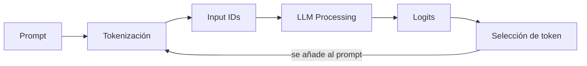

# HANDOFF.md — call me maybe

> [!important] Qué es este archivo
> Subject traducido y estructurado desde `en.subject.pdf`. Solo lectura salvo la sección final de relevo — ver `[[SYSTEM#Relevo de agente]]`.

---

## 🎯 Resumen

> [!info] Objetivo del proyecto
> Construir una herramienta de **function calling**: traduce prompts en lenguaje natural a llamadas de función estructuradas, usando un LLM pequeño (**Qwen/Qwen3-0.6B**, 0.6B parámetros).

Dado `"What is the sum of 40 and 2?"`, la solución **no** devuelve `42`. Devuelve:

```json
{
  "function": "fn_add_numbers",
  "arguments": {"a": 40, "b": 2}
}
```

> [!important] La pieza central: constrained decoding
> Modelos pequeños fallan generando JSON válido con solo prompting (~30% éxito). El proyecto exige **constrained decoding**: modificar los logits del modelo *antes* de elegir cada token, para forzar JSON válido y conforme al schema — no basta con confiar en que el modelo "lo haga bien".

> [!warning] Prohibido explícitamente
> No vale que el modelo genere JSON espontáneamente a partir del prompt. Prompting + esperanza no es la técnica que este proyecto evalúa.

---

## 📐 Restricciones generales

### Lenguaje y estilo

- [ ] **Python 3.10+**
- [ ] Cumple **flake8**
- [ ] Manejo de excepciones con `try-except` — el programa **nunca** debe crashear sin controlar. Un crash en la evaluación = no funcional
- [ ] Context managers para recursos (archivos, conexiones) — sin fugas
- [ ] **Type hints** completos (`typing`) en parámetros, retornos y variables donde aplique
- [ ] Pasa **mypy** sin errores
- [ ] **Docstrings** en funciones y clases, estilo PEP 257 (Google o NumPy)

### Librerías

| Origen | Restricción | Impacto |
|---|---|---|
| Subject | Todas las clases deben usar **pydantic** para validación | Diseño de clases debe apoyarse en modelos pydantic |
| Subject | Permitido: `numpy`, `json` | — |
| Subject | **Prohibido**: `dspy`, `pytorch`, `huggingface`, `transformers`, `outlines`, y similares | No hay atajos de constrained decoding vía librería — se implementa a mano |
| Subject | Prohibido usar métodos o atributos **privados** de `llm_sdk` | Solo la interfaz pública documentada abajo |
| Subject | La elección de función la hace el **LLM**, nunca heurísticas ni "magia medieval" | El enrutado prompt→función no puede ser un `if/else` sobre palabras clave |
| Entorno | Entorno virtual y dependencias (`numpy`, `pydantic`) instaladas con **uv** | `uv sync` es lo único que correrá el revisor/moulinette |
| Entorno | `llm_sdk` se copia en el mismo directorio que `src` | No se instala como paquete externo |

> [!warning] Bloqueo de diseño
> Sin `pydantic` en cada clase, sin constrained decoding manual, sin heurísticas para elegir función. Estos tres son innegociables desde Fase 1.

---

## 🗂️ Estructura del repositorio

> [!warning] Obligatorio en la entrega
> - [ ] `src/` — implementación
> - [ ] `pyproject.toml` + `uv.lock` — gestión de dependencias
> - [ ] `llm_sdk/` — copiado del paquete provisto
> - [ ] `data/input/` — ficheros de test (para demo)
> - [ ] `README.md` — documentación completa
> - [ ] Cualquier archivo adicional necesario para correr la solución

> [!warning] No incluir
> `output/` no se sube al repo — se genera durante el peer review.

### Comando de ejecución

```bash
uv run python -m src [--functions_definition <function_definition_file>] [--input <input_file>] [--output <output_file>]
```

Por defecto lee de `data/input/` y escribe en `data/output/`. Ejemplo completo:

```bash
uv run python -m src \
  --functions_definition data/input/functions_definition.json \
  --input data/input/function_calling_tests.json \
  --output data/output/function_calls.json
```

---

## 📥 Ficheros de entrada

### `function_calling_tests.json`

Array de prompts en lenguaje natural a procesar.

```json
[
  {"prompt": "What is the sum of 2 and 3?"},
  {"prompt": "What is the sum of 265 and 345?"},
  {"prompt": "Greet shrek"},
  {"prompt": "Greet john"},
  {"prompt": "Reverse the string 'hello'"}
]
```

### `functions_definition.json`

Funciones disponibles: nombre, parámetros (nombre + tipo), tipo de retorno, descripción.

```json
[
  {
    "name": "fn_add_numbers",
    "description": "Add two numbers together and return their sum.",
    "parameters": {
      "a": {"type": "number"},
      "b": {"type": "number"}
    },
    "returns": {"type": "number"}
  },
  {
    "name": "fn_greet",
    "description": "Generate a greeting message for a person by name.",
    "parameters": {
      "name": {"type": "string"}
    },
    "returns": {"type": "string"}
  },
  {
    "name": "fn_reverse_string",
    "description": "Reverse a string and return the reversed result.",
    "parameters": {
      "s": {"type": "string"}
    },
    "returns": {"type": "string"}
  }
]
```

> [!warning] No hardcodear contra el ejemplo
> Los prompts y el set de funciones **cambian** en el peer review. Nada de soluciones atadas a estos ejemplos concretos. También hay que manejar JSON inválido o archivos ausentes en ambos ficheros de entrada.

---

## 🤖 Interacción con el LLM

### `llm_sdk` — clase `Small_LLM_Model`

| Método | Firma | Qué hace |
|---|---|---|
| `get_logits_from_input_ids` | `(input_ids: List[int]) -> List[float]` | Logits del modelo dado una lista de token IDs |
| `get_path_to_vocab_file` | `() -> str` | Ruta al fichero de vocabulario (token ↔ ID) |
| `encode` | `(text: str) -> Tensor` | Texto → tensor de token IDs |
| `decode` *(opcional)* | `(token_ids: List[int]) -> str` | Token IDs → texto |

> [!important] Solo interfaz pública
> Nada de atributos o métodos privados de `llm_sdk` — restricción explícita del subject.

### Pipeline de generación



Se repite token a token hasta completar la respuesta. En **Selección de token** es donde entra constrained decoding.

### Constrained decoding — el mecanismo

1. El modelo produce logits para todos los tokens posibles
2. Se identifica qué tokens mantienen **JSON válido y conformidad con el schema esperado**
3. Los tokens inválidos (rompen schema o estructura) → logit a **-infinito**
4. Se muestrea solo entre los tokens válidos que quedan

> [!example] Aplicación concreta
> Si `functions_definition.json` dice que un campo es `number`, el decoder en ese punto de la generación solo permite tokens que continúen un entero o float válido — nunca letras sueltas o comillas fuera de lugar.

> [!tip] Pista del subject
> Usar el fichero de vocabulario (`get_path_to_vocab_file`) para mapear tokens ↔ su representación en string. Ahí se decide, en cada paso, qué tokens son válidos.

---

## 📤 Formato de salida

Archivo único: `data/output/function_calling_results.json`. Un objeto por prompt, con **exactamente** estas claves:

| Clave | Tipo | Contenido |
|---|---|---|
| `prompt` | `string` | El prompt original |
| `name` | `string` | Nombre de la función elegida |
| `parameters` | `object` | Todos los argumentos requeridos, con el tipo correcto |

```json
[
  {
    "prompt": "What is the sum of 2 and 3?",
    "name": "fn_add_numbers",
    "parameters": {"a": 2.0, "b": 3.0}
  },
  {
    "prompt": "Reverse the string 'hello'",
    "name": "fn_reverse_string",
    "parameters": {"s": "hello"}
  }
]
```

### Reglas de validación

- [ ] JSON válido (sin comas colgantes, sin comentarios)
- [ ] Claves y tipos coinciden **exactamente** con `functions_definition.json`
- [ ] Sin claves extra ni prosa en ningún punto de la salida
- [ ] Todos los argumentos requeridos presentes
- [ ] Tipos de argumento correctos (number, string, boolean, etc.)

---

## 🎯 Rendimiento y fiabilidad

| Métrica | Objetivo |
|---|---|
| Precisión | 90%+ función y argumentos correctos |
| Validez JSON | 100% parseable y conforme al schema |
| Velocidad | Todos los prompts de test en menos de 5 minutos, hardware estándar |
| Robustez | Maneja inputs malformados, ficheros ausentes, edge cases sin crashear |

> [!info] Por qué importa
> Qwen3-0.6B es pequeño. El subject remarca que la fiabilidad no sale del tamaño del modelo, sino de la guía estructural — el constrained decoding es lo que cierra la brecha.

### Edge cases a testear

Strings vacíos, números grandes, caracteres especiales, tipos incorrectos, prompts ambiguos, funciones con múltiples parámetros.

---

## 🧪 Testing (según el subject)

- [ ] Programas de test para verificar funcionalidad (no se entregan ni califican) — `pytest` o `unittest`
- [ ] Cubrir edge cases

> [!note] Esto no reemplaza `[[SYSTEM#Testing]]`
> El flujo de tests del sistema (discusión → agente escribe test → estudiante aprueba y ejecuta) aplica igual. Esta sección es lo que el subject exige como mínimo.

---

## 📄 README.md — requisitos

> [!warning] Primera línea obligatoria, en cursiva
> *This project has been created as part of the 42 curriculum by \<login1\>[, \<login2\>[, \<login3\>[...]]].*

Debe incluir, como mínimo:

- [ ] **Description** — qué es el proyecto, objetivo, overview breve
- [ ] **Instructions** — compilación, instalación, ejecución
- [ ] **Resources** — referencias clásicas del tema (docs, artículos, tutoriales) + cómo se usó IA (para qué tareas, qué partes)
- [ ] **Algorithm explanation** — el enfoque de constrained decoding en detalle
- [ ] **Design decisions** — elecciones clave de la implementación
- [ ] **Performance analysis** — precisión, velocidad, fiabilidad
- [ ] **Challenges faced** — dificultades y cómo se resolvieron
- [ ] **Testing strategy** — cómo se validó
- [ ] **Example usage** — ejemplos claros de ejecución

> [!warning] Idioma
> El README se escribe en **inglés**.

---

## ⭐ Bonus (opcional, no requerido para aprobar)

- [ ] Soporte para múltiples modelos LLM además de Qwen/Qwen3-0.6B
- [ ] Recodificar el tokenizer: evitar `encode`/`decode` directos en el código principal, usar `get_logits_from_input_ids` y `get_path_to_vocab_file` en su lugar
- [ ] Mecanismos avanzados de recuperación de errores
- [ ] Optimizaciones de rendimiento (caching, batching)
- [ ] Suite de tests exhaustiva
- [ ] Visualización del proceso de generación
- [ ] Soporte para argumentos de función anidados y complejos
- [ ] Implementación pública de `encode` y `decode` (opcional) del tokenizer
- [ ] Demostración de cómo encoding/decoding se integran con constrained decoding

> [!warning] Deben funcionar
> Los bonus tienen que estar implementados y funcionando — no solo descritos en el README. Puede pedirse demostrarlos en la evaluación.

---

## 📦 Entrega y peer review

- [ ] Todo el trabajo evaluado vive dentro del repositorio Git
- [ ] Verificar nombres de archivo exactos

> [!warning] Modificación en vivo durante evaluación
> Puede pedirse una **modificación breve** del proyecto durante la evaluación: cambio menor de comportamiento, unas líneas de código, una feature fácil de añadir. No aplica siempre, pero hay que estar preparado. Factible en pocos minutos salvo que se indique otro plazo.

---

## 🔄 Contextualización para el siguiente agente

> [!info] Agente 12 — activo
> **Periodo:** cuestionario del 2026-08-25 → ==**Bloques 2 y 3 cerrados**==, 195 tests verdes.
>
> **Qué se hizo:**
> - **Repaso ejecutado: 3 limpias de 6.** Lo que él escribió en `src/` el día anterior (`TypeSpec`, `validate_python([])`) resistió; los tres 🔴 heredados necesitaron el caso concreto otra vez. Entrada en `[[REVIEWS]]`, `[[PROJECT#🎯 Lista de refuerzo]]` actualizada.
> - **Bloque 2 cerrado.** Escribió `charge_logs`, `write_logs`, `charge_replies`, `write_replies` y los **tres getters**. Renombrado a `src/filemanager.py`. `flake8` y `mypy --strict` limpios. **46 tests** en `tests/test_bloque_2.py`, escritos por el agente en 8 secciones.
> - **Bloque 3 diseñado y construido el mismo día.** `src/promptbuilder.py`: plantilla de chat de Qwen en una constante, catálogo en JSON con `dump_json(exclude_none=True)`, y `get_prompt` pegando la línea del usuario. **20 tests**.
> - **Imports relativos reforzados** — el tema que él aplazó el 08-07, retomado al aparecer el primero. Detalle en `[[PROJECT#Los imports relativos — reforzado el 2026-08-25]]`.
> - **Regla nueva suya sobre cómo presentar tests:** la frase de qué garantiza va al chat, **el código solo al archivo**.
>
> **Dónde se quedó:** los tres primeros bloques cerrados. El **Bloque 4 — Validez de tokens** no está abierto: su diseño lo propone él, y es donde se decide la máscara con pila del bonus 7.
>
> **Decisiones tomadas:**
> - **El catálogo va al prompt como JSON tal cual**, no en prosa. Había elegido prosa; se movió con el dato de que Qwen fue entrenado con las herramientas en JSON. Ventaja que salió después: un catálogo anidado del bonus 7 no toca el bloque. ==Queda como **perilla**: *"si no conseguimos alcanzar el porcentaje de acierto, ahí hacemos backtracking"*.==
> - **Los `\n` de la plantilla van pegados al `<\|im_end\|>`**, sacado literal del `chat_template` de Qwen. Su primera versión usaba espacios.
> - **Las marcas se escriben, no se piden**: los 26 especiales de `added_tokens` son solo textos, nada dice cuáles son las de chat.
> - **La salida sigue siendo un array**, no un dict por índice — lo propuso y se retiró con el formato del subject delante.
> - **`write_replies` escribe siempre; `write_logs` solo si hay datos.** No son simétricos a propósito.
> - **Los `validate_*` mueren** y nacen `get_logs`/`get_functions`/`get_prompts`, uno por estructura.
> - **El guard de la ruta de salida mira `suffix`**, no el `bool` — `Path("")` no es vacío, es `PosixPath('.')`.
> - **`src/__init__.py` creado**, así `mypy --strict src/` pasa sin `--explicit-package-bases`.
>
> **Callejones sin salida:**
> - **Apilar herramienta + concepto + ejemplo.** Con `format`, la constante y la plantilla en mensajes seguidos soltó *"no entendí nada"*, *"¿qué plantilla?"*, *"¿qué constante?"*. Se cerró bajando a **una pieza por mensaje** con su salida real.
> - **Volcarle 20 tests al chat**, aunque cada uno llevara su frase. *"Déjalo solo en file"*.
> - **Atribuirme introspección sobre Qwen** — preguntó *"tú eres un modelo, deberías saber"*. Hay que decir qué es dato, qué es suposición, y que el formato **se mide**.
> - **Llamar a `mypy`/`flake8` por su nombre suelto:** usa los del sistema, que no ven el venv, y salen 5 errores falsos de `pydantic`. Siempre `./callme/bin/python -m ...`.
>
> **Abierto:**
> - **No existe `src/__main__.py`** — el subject exige `uv run python -m src`, y ahí va `argparse`. Tampoco hay `pyproject.toml` en la raíz ni regla `lint` en el `Makefile`.
> - Dónde se llaman `write_logs` y `write_replies` — se cierra con el Bloque 6.
> - ==`properties` sigue siendo una **suposición**==, no un dato del subject.
> - **Qwen trae su propio formato de herramientas** (bloque `# Tools` con `<tools>`): primera alternativa a probar cuando se mida el acierto.
> - Mecanismo del bonus 3, sin decidir.
>
> **Sobre el estudiante:** cerró dos bloques en un día, y la razón es la misma que explicaba el desastre del 08-24: **lo que está escrito en código sobrevive; lo que solo se habló, no**. Objeta las reglas que no le suman y acepta la razón honesta. Detalle en `[[PSYCHOLOGY]]`.
>
> **Siguiente paso:** el cuestionario ya escrito en `[[PROJECT#📋 Cuestionario de la próxima sesión]]` — 6 preguntas. Después, el Bloque 4.

> [!info]- Agente 11 — histórico
> **Periodo:** cuestionario del 2026-08-24 → **Bloque 1 cerrado del todo** y **Bloque 2 con `__init__` y la lectura corriendo**.
>
> **Qué se hizo:**
> - **Repaso ejecutado: ==1 limpia de 5==.** La única del Bloque 1 salió sin ayuda; **las tres del Bloque 2 fallaron**, y ese diseño lo había hecho él seis días antes sin escribir una línea. Entrada en `[[REVIEWS]]`, `[[PROJECT#🎯 Lista de refuerzo]]` con tres filas nuevas.
> - **Bloque 1 cerrado.** Pasada de **guards** (los tres puntos) y pasada de **estilo**: `flake8` limpio, `mypy --strict` limpio, **129 tests verdes**.
> - **Bloque 2 avanzado de verdad:** atributos cerrados, los **tres modelos `pydantic`** escritos a mano por él, y la lectura de los dos archivos corriendo contra los reales — 5 funciones y 11 prompts, ya como objetos del modelo.
> - **Dos reglas nuevas suyas en `[[FIRST]]`**: no citar una sesión pasada como si él la recordara, y ==comprobar que tiene contexto antes de preguntarle==.
>
> **Dónde se quedó:** `src/validator.py`, clase `FileManager`. `__init__` y `_load_json` escritos y verificados. **Faltan `charge_logs`, `write_logs`, `write_replies`** y decidir qué queda de `validate_functions` / `validate_prompts`.
>
> **Decisiones tomadas:**
> - **`decode([])` devuelve `""`** y `encode("")` devuelve `[]` — comprobado que el SDK hace lo mismo (`encode("") -> []`, `decode([]) -> ''`). Puso un guard que hacía lanzar a `encode("")` y **lo retiró él**: *"la prioridad es que devuelva lo mismo que el modelo"*.
> - **El `KeyError` de `encode` pasa a `ValueError` con mensaje propio.** Descartó comprobar la coherencia de `vocab.json` y `merges.txt` en `__init__` con argumento propio: recorrer las ~151.000 reglas **rechazaría el `Tokenizer` por una regla que ese texto quizá no pisa nunca**.
> - **Se quedan** los dos centinelas, `id`/`pattern` y el `lambda`: *"no causan problemas"*.
> - **`output_path` es `Path`**, no `FilePath` (no existe la primera vez) ni `str` (habría que partir la ruta a mano).
> - **Un solo `_load_json` con `flag`**, tras ver sus dos lectores duplicados uno al lado del otro.
> - **Sin guard de vacío en los prompts, sí en el catálogo.** Y **`write_logs` conserva el guard** de escribir solo si hay datos — pidió recomendación y aceptó la contraria.
>
> **Callejones sin salida:**
> - **Citar una decisión por su fecha.** *"El 08-18 acordaste `_load_json`"* produjo *"no entendí nada"*. Con los dos métodos puestos en dos columnas, lo vio al instante. ==Se cita el contenido, la fecha va al final.==
> - **Preguntarle por algo que acaba de conocer.** Se le preguntó qué hace `validate_python([])` dos mensajes después de enseñarle la función. Regla suya, ya en `[[FIRST]]`.
> - **Afirmar con más certeza de la que hay.** Se le dijo que el formato anidado *"se hereda"* de JSON Schema y dos mensajes después que era una suposición. Lo cazó y pidió la fuente.
> - **Dar la receta en vez de la herramienta:** *"no me digas solo es así, sino enséñame a usar pydantic"*.
>
> **Abierto:**
> - Bloque 2: los cuatro métodos que faltan · si sobran los `validate_*` · dónde se llama `write_logs` · `logs/` al `.gitignore` · **renombrar `src/validator.py`**, que conserva el nombre viejo.
> - ==`properties` es una **suposición**==, no un dato del subject — la línea del bonus dice solo *"Support for complex nested function arguments"*. **Se verifica al montar los tests del bloque**, decisión suya.
> - El `flake8` del venv `callme/` estaba roto con Python 3.14 y el `mypy` que corría era el de Homebrew; **los reparó él**.
> - Sigue sin haber `pyproject.toml` en la raíz · mecanismo del bonus 3 sin decidir.
>
> **Sobre el estudiante:** lo más útil de hoy. **Aprende lo que escribe**: preguntó él mismo si estaba pensando o solo preguntando, se le respondió con la evidencia del cuestionario, y reescribió los modelos a mano en vez de pegarlos — *"los entendí mejor"*. Y **exige el origen de cada afirmación**. Detalle en `[[PSYCHOLOGY]]`.
>
> **Siguiente paso:** el cuestionario ya escrito en `[[PROJECT#📋 Cuestionario de la próxima sesión]]` — 6 preguntas. Después, seguir el Bloque 2.

> [!info]- Agente 10 — histórico
> **Periodo:** Cuestionario de repaso del 2026-08-18 → **`pydantic` en el `Tokenizer` y el Bloque 2 a medio diseñar**.
>
> **Qué se hizo:**
> - **Repaso ejecutado.** ==4 limpias de 5==, y los cuatro 🔴 que quedaban cayeron **sin ayuda** — tres llevaban tres sesiones fallando. Entrada en `[[REVIEWS]]`, `[[PROJECT#🎯 Lista de refuerzo]]` actualizada.
> - **El repaso guiado de los tests, cortado por él.** Lo había pedido el 08-17; a los dos minutos: *"no me expliques pytest… el objetivo no es aprender pytest sino entender por qué el test valida mi trabajo"*, y después *"no tengo ahorita la capacidad para entender, estoy un poco bloqueado"*. **No se re-ofrece.**
> - **Requisito de `pydantic` recuperado literal del subject** (IV.3.1): *"All classes must use pydantic for validation"*. Lo levantó él al ver que chocaba con el `Tokenizer`.
> - **`pydantic` aplicado al `Tokenizer`, escrito por él:** `@validate_call` + `FilePath` en los tres argumentos de `__init__`. Los **3 tests de archivo ausente** los adapté yo a `ValidationError` — **129 en verde**.
> - **Bloque 2 diseñado a medias:** clase `FileManager`, seis métodos, log único `logs/logs.json` con la forma `{"prompts": {...}, "files": {...}}`, y `Chat` como quien atrapa el fallo. Todo en `[[PROJECT#Bloque 2 — I/O de archivos]]`.
>
> **Dónde se quedó:** Bloque 2 con métodos y formato del log acordados, **sin atributos, sin firmas y sin los modelos `pydantic`**. Nada escrito en `src/` para ese bloque.
>
> **Decisiones tomadas:**
> - **`FilePath` y no `str`** en el `Tokenizer`: pydantic valida existencia. Consecuencia asumida — un archivo ausente lanza `ValidationError`, no su `FileNotFoundError`, y el mensaje del log lo escribe pydantic.
> - **Las ramas `except FileNotFoundError` se quedan** aunque sean inalcanzables desde `__init__`: *"si alguien llama al método por aparte se justifican esos except"*.
> - **`FileManager`**, no `Validator` ni `Monitor` — la clase hace cuatro cosas y todas son de disco.
> - **Índice del prompt como clave del log**, con un nivel de fuera que separa fallos de prompt y de archivo. Llegó él en tres saltos.
> - **`Chat` atrapa y `FileManager` escribe.** Descartado un log por bloque.
> - **`_load_json` privado**, con las dos validaciones separadas.
>
> **Callejones sin salida:**
> - **Explicarle la herramienta cuando pregunta por la garantía.** Pidió por qué el test valida su trabajo y recibió `tmp_path` y `fixture`. Resultado: bloqueo y cambio de tema. ==Qué prueba, no cómo funciona.==
> - **Objetar sin coste concreto.** Con el log por bloque preguntó *"¿cuál es el problema de mirar los dos?"* y no se movió hasta que llegaron los dos costes reales. Las reglas sin coste no le sirven.
> - Preguntar *"¿por qué un vocabulario de juguete?"* en abstracto: contesta con el suelo de bytes, que no discrimina. **Pedirle montar un test de prioridad con la tabla real.**
>
> **Abierto:**
> - Bloque 2: atributos, firmas, modelos `pydantic` (y no atar `parameters` a un solo nivel), qué devuelven los dos `validate_*`, dónde se llama a `write_logs`, `logs/` al `.gitignore`.
> - Bloque 1: pasada de **guards** y pasada de **estilo**. ==`flake8` y `mypy` no están instalados en el venv `callme/`.== `__init__` sin `-> None`.
> - No hay `pyproject.toml` en la raíz · mecanismo del bonus 3 sin decidir · 10 propuestas en `Posible mejoras al sistema.md`.
>
> **Sobre el estudiante:** Dos cosas nuevas. Va a la fuente cuando una regla le estorba —pidió la frase literal del subject antes de decidir— y no busca excusa cuando la lee. Y cuando dice que está bloqueado, hay que parar en el acto: no es el concepto, es la energía, y él mismo propone por dónde seguir. Detalle en `[[PSYCHOLOGY]]`.
>
> **Siguiente paso:** El cuestionario ya escrito en `[[PROJECT#📋 Cuestionario de la próxima sesión]]` — 5 preguntas. Después, cerrar el diseño del Bloque 2.

> [!info]- Agente 9 — histórico
> **Periodo:** Cuestionario de repaso del 2026-08-17 → **Bloque 1 con la construcción cerrada y 129 tests en verde**.
>
> **Qué se hizo:**
> - **Repaso ejecutado.** 4 fallos, 6 limpias. Entrada en `[[REVIEWS]]`, `[[PROJECT#🎯 Lista de refuerzo]]` actualizada — tres filas subieron a ✅ y dos bajaron a 🔴 por tercera reincidencia.
> - **El bucle de fusiones de BPE, escrito por él.** Lo planteó entero antes de teclear. Tres fallos de lógica cerrados (`KeyError` del acceso con corchetes · fusión aplicada fuera del `if` · `priority_bpe` que solo dejaba fusionar el primer trozo) y dos condiciones equivocadas que habrían dejado un bucle infinito.
> - **`decode` completo.** Vuelta **limpia**: los especiales se tiran, porque detrás va `json.loads` y un `<|im_end|>` restituido revienta el parseo.
> - **Refactor de los dos centinelas** a variables locales (opción B de dos que se le ofrecieron), **verificado con 12.480 llamadas a `encode` antes y después: 0 diferencias**.
> - **`added_tokens[:3]` → todos.** Con `[:3]` cargaba 3 de los 26 especiales de Qwen, y `decode` habría reventado el día que el modelo escribiera `<think>`.
> - **`tests/test_bloque_1.py` — 129 tests.** 40 con archivos de juguete en `tmp_path` + 89 contra el modelo real. Desglose en `[[PROJECT#Dónde viven los tests]]`.
> - ==**El test que zanja el bloque pasa:** `assert mi_ids == sdk_ids` en 43 textos con el `vocab.json` real.== El **bonus 2 sigue vivo**, no hay que caer al plan B.
> - **El modelo, instalado y descargado.** `pip install -e llm_sdk` + primera construcción de `Small_LLM_Model()`. La caché de Hugging Face dejó de estar vacía.
> - **Abolida la regla de ignorar `PSYCHOLOGY.md`** en los 6 sitios donde vivía, por decisión suya.
>
> **Dónde se quedó:** Bloque 1 con la **construcción cerrada por él** y los tests verdes. Quedan las dos pasadas que él mismo ordenó: **guards** y **`flake8`/`mypy`**. El Bloque 2 no está abierto.
>
> **Decisiones tomadas:**
> - **Revisión de código en tres pasadas: lógica → guards → estilo, y no se mezclan.** Regla suya, en `Posible mejoras al sistema.md` y en `[[PSYCHOLOGY]]`.
> - **"Cuestionarios siempre primero"**, por encima del orden que deje escrito el agente saliente.
> - **La hoja de evaluación se difiere a la fase de tests** — *"ahora no nos suma demasiado porque la decisión fue hacer el encode y decode y probar"*. Está en `[[PROJECT#Validación final]]`; deja de arrastrarse como pendiente de apertura.
> - **Centinelas con nombre, y locales de `encode`** — no constantes de clase.
> - **`decode([])` lanza `ValueError`** en vez de devolver `""`. Queda anotado como asimetría con `encode("")`, que devuelve `[]`.
> - **El bonus 7 no se decide todavía.** Preguntó si el *"Fase 1, innegociable"* obligaba a decidirlo ya: no. La máscara con pila se diseña **con el Bloque 4**. Lo único que se adelanta es que el **Bloque 2 no ate `parameters` a un solo nivel de profundidad** — anotado en `[[PROJECT#Bloques]]`.
>
> **Callejones sin salida:**
> - **Agrandar el alcance de lo que pide.** Dos veces en esta sesión: pidió comprobar un renombrado y recibió 36 tests del bloque (*"no entiendo que estas testando"*); preguntó por la **construcción** y se le contestó sobre el **bloque** (*"ten mas atencion"*). ==Releer la palabra exacta antes de contestar.==
> - **Llamar "fragilidad" a algo que no lo es.** Los centinelas de 12 y 13 nueves eran un guiño deliberado suyo; su réplica —cambiar el número es tan deliberado como cambiar un `True`— era correcta. Distinguir legibilidad de acoplamiento antes de abrir la boca.
> - Preguntar por el total de bytes de `"José"`: contesta 5 contando **caracteres** y el fallo se esconde. **Preguntar por `Ã` sola.**
>
> **Abierto:**
> - Las dos pasadas del Bloque 1: guards (el `KeyError` de `encode`, la asimetría de `decode([])`) y estilo.
> - **No hay `pyproject.toml` en la raíz** — el subject lo exige con `uv.lock`, y es por donde entran `regex` y el SDK.
> - `.PHONY` del `Makefile` lo estaba arreglando él al cerrar; sin verificar.
> - Mecanismo del bonus 3, sin decidir. · 10 propuestas en `Posible mejoras al sistema.md`.
>
> **Sobre el estudiante:** Ya son **cinco reglas de proceso** creadas por él (histórico de fallos, cuestionario al cerrar, cuestionarios primero, `PSYCHOLOGY` versionado, y las tres pasadas de revisión): no solo hace el proyecto, está construyendo el método. Y en lo técnico, el diseño lo tiene antes de escribir — lo que se le va es la traducción a código, y se cierra mirando el estado de **una** variable concreta. Detalle en `[[PSYCHOLOGY]]`.
>
> **Siguiente paso:** El cuestionario ya escrito en `[[PROJECT#📋 Cuestionario de la próxima sesión]]` — 5 preguntas y un repaso guiado de `tests/test_bloque_1.py` que pidió él. Después, la fase de tests y el Bloque 2.

> [!info]- Agente 8 — histórico
> **Periodo:** Cuestionario de repaso del 2026-08-14 → **los 4 fallos cerrados, la pre-tokenización funcionando y `encode` a medio escribir**.
>
> **Qué se hizo:**
> - **Repaso ejecutado.** 3 fallos, 3 limpias. Entrada en `[[REVIEWS]]`, `[[PROJECT#🎯 Lista de refuerzo]]` actualizada.
> - **Los 4 fallos de `src/tokenizer.py`, cerrados** — más un quinto que salió por el camino: un `vocab.json` corrupto salía como *"file empty"* porque `json.JSONDecodeError` **es subclase de `ValueError`**. El `Tokenizer` construye; 6 casos verificados en ejecución.
> - **`_load_tokenizer` escrito y probado** — saca el patrón de pre-tokenización y los `special_ids` en **una sola lectura** del archivo de 11 MB. 4 casos verificados.
> - **Los dos patrones compilados** en `__init__`. `findall` reproduce el partido real de Qwen, dígitos sueltos incluidos.
> - **`encode` empezado:** pasos 0 a 3 (partir por especiales, `findall`, bytes, chars). Paró antes del bucle de merges.
> - `.gitignore` rellenado (`callme/`, `__pycache__/`, cachés) y el `.pyc` sacado del índice con `git rm --cached`.
>
> **Dónde se quedó:** `src/tokenizer.py`, dentro de `encode`, en el comentario `# HASTA ESTE PUNTO, SI` que puso él. Lo siguiente es **el bucle de fusiones de BPE** — sus palabras: *"lo que no sé es cómo pasarlo por la tabla de merge"*. El algoritmo ya está diseñado desde el 08-10; no hay que rediseñarlo.
>
> **Decisiones tomadas:**
> - **Se usa la librería `regex`.** Suya. El subject prohíbe una lista concreta (dspy, pytorch, transformers…) y `regex` no está en ella. Con `regex` se copia el patrón literal del `tokenizer.json` y **no hay traducción de `\p{L}`/`\p{N}` que verificar**. Instalada en el venv `callme/`.
> - **El bonus 1 se acota a la familia Qwen.** Suya, con el subject delante (*"You can use other models as long as your project works with Qwen/Qwen3-0.6B"*). Comprobado que gpt2, Mistral y BERT tienen `pre_tokenizer` de tipo distinto y su cadena de acceso revienta en todos.
> - **Se conservan `vocab.json` + `merges.txt`** en vez de cargarlo todo del `tokenizer.json`, que también los trae. Razón suya: lo que hay ya funciona y está probado.
> - **Los especiales se cargan, no se copian a mano** — porque los ids cambian entre modelos.
> - **`mypy` y `flake8` se pasan al final**, no durante.
>
> **Callejones sin salida:**
> - **Amontonar dos cosas en un mensaje le tumba la sesión.** Pasó **cuatro veces** y las cuatro produjeron *"no entendí nada"*. Las cuatro se resolvieron solas al partirlas en una sola pregunta. ==Una idea por mensaje, sin excepción.==
> - **Enseñarle código sin marcar si es suyo o es propuesta.** Se le mandó `self._specials_pattern` y luego un cuerpo de `encode`; cortó las dos veces (*"eso no existe"*, *"eres tú inventándote cosas"*). Marcar **tuyo** / **propuesta** siempre.
> - **Mandarle a ejecutar algo que puedes enseñarle:** *"no lo voy a correr, aprende a explicar mejor"*. Ejecutar sirve cuando su creencia compite con tu afirmación, no como sustituto de explicar.
> - **Cuatro explicaciones no le movieron** que el bucle de merges corre por trozo. Lo cerró **hacerle escribir los pares vecinos** y buscar `('t','Ġ')` en sus propias listas.
>
> **Abierto:**
> - **`encode` no tiene bugs pendientes.** Se anotaron dos al cerrar y se resolvieron ahí mismo: el `bytes_to_char` lo corrigió él, y el del `get_special_id` era una lectura desactualizada del agente. Detalle en `[[PROJECT#Abierto en este bloque]]`.
> - `decode` entero · el paso 5 de `encode` (símbolos → ids).
> - La **hoja de evaluación** y la estrategia de medición del 90%, arrastrada del 08-12.
> - No hay `pyproject.toml` en la raíz. Él trabaja con el venv `callme/` y lo dejó para la entrega.
> - Mecanismo del bonus 3, sin decidir. · 9 propuestas en `Posible mejoras al sistema.md`.
>
> **Sobre el estudiante:** Abrió la sesión preguntando si vale la pena escribir código, dado que no piensa programar profesionalmente. Lo que cerró la duda no fue el argumento sino **su propio guard invertido**: código que leído no chirría y que solo detectas si has escrito veinte guards antes. Y hoy pidió por primera vez **menos verborrea de forma explícita y repetida** — *"limítate a responder lo que te pregunto"*. Detalle en `[[PSYCHOLOGY]]`.
>
> **Siguiente paso:** El bucle de merges. Antes, los dos bugs y el cuestionario ya escrito en `[[PROJECT#📋 Cuestionario de la próxima sesión]]`.

> [!info]- Agente 7 — histórico
> **Periodo:** Cuestionario de repaso del 2026-08-12 → **Bloque 1 con las cargas partidas, la pre-tokenización investigada y `encode`/`decode` repasados**.
>
> **Qué se hizo:**
> - **Repaso ejecutado.** 3 fallos, 3 limpios. Entrada en `[[REVIEWS]]`, `[[PROJECT#🎯 Lista de refuerzo]]` actualizada: tres filas a ✅ y tres nuevas a 🟡.
> - **Hook de caveman verificado** — funciona. Sección de verificación borrada de `[[PROJECT]]`, no se le dijo nada.
> - **Las dos cargas partidas** en `_load_vocab` y `_load_mergeboard`, `@staticmethod` y recibiendo la ruta.
> - **Resuelto quién atrapa los errores de lectura:** los métodos relanzan con mensaje propio (`raise ... from error`); decide quien construye. Razón que lo cerró: al log solo llega `str(error)`, sin traza, y tres bloques distintos abren archivos.
> - **Repasados `encode` y `decode` paso a paso.** Los dos huecos que salieron: la traducción byte↔carácter en cada dirección, y que un `str` no se decodifica.
> - **Investigada la pre-tokenización real de Qwen** — sección nueva `[[PROJECT#Pre-tokenización — cómo parte Qwen de verdad]]` con el patrón, el partido de los dos textos reales y cuatro consecuencias.
>
> **Dónde se quedó:** `src/tokenizer.py` **no construye**. Cuatro fallos verificados en ejecución, con un `vocab.json`/`merges.txt` de juguete válidos: guard invertido en `_load_mergeboard`, `except:` pelado que miente en el mensaje, guard muerto en `_load_vocab`, y el `Optional` de vuelta. Detalle en `[[PROJECT#Abierto en este bloque]]`.
>
> **Decisiones tomadas:**
> - **Plan B del bonus 2, propuesto por él:** se implementan `encode`/`decode` propios, se comparan con el SDK, y si el acierto cae se usan los del SDK. Coste asumido: se pierde el bonus 2 y el 9 queda cojo.
> - **El test que zanja el bloque es `assert mi_ids == sdk_ids`**, no medir acierto. Es binario y no necesita el bucle de generación.
> - **Antes de tocar código la próxima sesión**, él trae la hoja de evaluación de Slack y se define cómo se mide el 90%. Salió de que `function_calling_tests.json` no trae resultados esperados.
> - **Los dos fallos anotados el 08-11 no eran dos:** el del `counter` estaba mal registrado, ya se incrementaba.
>
> **Callejones sin salida:**
> - **Discutir con él sobre qué hace una función no funciona; ejecutarla sí.** Dos veces: defendió `.unicode("utf-8")` hasta ver `hasattr → False`, y sostuvo que mypy exigía `Optional` hasta ver `--strict` pasando sin él. Corre el código, no argumentes.
> - **No le expliques la diferencia entre dos propuestas de split — enséñale el trozo de salida donde la suya rompe.** Funcionó tres veces seguidas con un trozo de una línea (`'\|>\n'`).
> - Decirle que un `try-except` sobra sin darle la alternativa útil: se resistió con razón. Lo que lo cerró fue el mensaje del log, no la regla.
>
> **Abierto:**
> - Los 4 fallos de `src/tokenizer.py`, los cuerpos de `encode`/`decode`, y la regla de pre-tokenización (traducir `\p{L}`/`\p{N}` a la stdlib, y decidir si entra `re`).
> - **La caché de Hugging Face sigue vacía.** El `tokenizer.json` se bajó con `curl` al scratchpad, no por el SDK.
> - Mecanismo del bonus 3, sin decidir. · 9 propuestas en `Posible mejoras al sistema.md`.
>
> **Sobre el estudiante:** Distingue qué se puede aplazar y qué no — bloqueó la pre-tokenización *"porque nos va a dejar un tema muy complicado a revisar"*, y eso convive con su patrón de refuerzo diferido sin contradecirlo: aplaza detalle, bloquea estructura. Y cuestiona los números del subject: preguntó sobre qué N se calcula el 90%. Detalle en `[[PSYCHOLOGY]]`.
>
> **Siguiente paso:** La hoja de evaluación y la estrategia de medición, después el cuestionario ya escrito en `[[PROJECT#📋 Cuestionario de la próxima sesión]]`, y después los 4 fallos.

> [!info]- Agente 6 — histórico
> **Periodo:** Cuestionario de repaso del 2026-08-11 → **Bloque 1 con diseño cerrado y construcción empezada**.
>
> **Qué se hizo:**
> - **Repaso de sesión ejecutado.** 4 fallos, y dos aciertos que llevaban tres sesiones cayéndose (decodificar byte a byte, token vs carácter).
> - **Sistema de refuerzo rehecho a petición suya**, en tres piezas: `[[REVIEWS]]` (histórico, **no se lee** al contextualizarse), `[[PROJECT#🎯 Lista de refuerzo]]` (una sola tabla acumulada, con el origen de cada entrada: 🙋 la pidió él · ❌ falló · 🔍 la propone el agente) y `[[PROJECT#📋 Cuestionario de la próxima sesión]]` (lo escribe el agente **saliente**). Aplicado ya, y anotado en `Posible mejoras al sistema.md` para adoptarlo bien al cerrar.
> - **Bloque 1 diseñado y empezado** en `src/tokenizer.py`: cinco atributos, `get_vocab`, `encode`, `decode`, las dos tablas byte↔carácter (verificadas a mano) y las dos cargas de archivo.
> - **Hook nuevo** en `.claude/settings.json` que recuerda caveman ultra al tocar `Edit`/`Write`/`Bash`, más la regla 6 de `[[FIRST]]`. **Sin verificar en vivo** — hay una tarea al principio de `[[PROJECT]]` para comprobarlo.
>
> **Dónde se quedó:** `src/tokenizer.py`, con **dos fallos sin corregir** en el bucle que carga `merges.txt` (`counter` nunca sube · `tokens[1]` con línea vacía). `encode` y `decode` siguen vacíos.
>
> **Decisiones tomadas:**
> - **Se trabaja directamente en `src/`.** Descartada una carpeta `clases/` de borrador para no mover archivos y rehacer imports después.
> - **Las firmas se escriben en el `.py`, no en `PROJECT.md`** — petición suya. Condición obligatoria: cada bloque enlaza a sus archivos, o el relevo arranca ciego.
> - **Tabla de merges: `dict[tuple[str, str], int]`.** La tupla conserva la frontera; con la clave concatenada `('lo','w')` y `('l','ow')` chocan.
> - **`__init__` recibe las rutas.** Llegó él tras retirar la opción contraria: *"eso no la hace reusable"*.
> - **El guard va en `__init__` con `raise`, no en el getter** — si existe un `Tokenizer`, su vocabulario es válido por construcción. Descartado `Optional` y descartado devolver un valor de relleno.
> - **Restricción nueva:** `vocab.json` y `merges.txt` **no están en el repo**; `hf_hub_download` los baja la primera vez. La primera ejecución necesita red.
>
> **Callejones sin salida:**
> - **La tabla byte↔carácter, cuatro intentos fallidos.** Tablas, trazas y código: *"no entendí nada"*, *"no entendí ni papa"*. Lo que funcionó fue poner los invisibles en fila y preguntarle **qué puesto ocupa el 127** — contestó 33 al primer intento. No expliques el desplazamiento: hazle contar puestos.
> - **Nunca preguntes esto con el espacio.** Con el byte 32 su regla equivocada (`byte + 256`) da el resultado correcto por casualidad, y el fallo no se ve. Con el 127 sí.
> - Insistir en un tema que él mismo había diferido. Se estuvo re-explicando el algoritmo de la tabla, que estaba marcado ⏸️. Lo que desbloqueó fue **parar y decirlo**.
>
> **Abierto:**
> - Los dos fallos del bucle de merges, y partir las cargas en métodos privados — **esa es la primera tarea tras el cuestionario**, decidida por él.
> - Quién atrapa `FileNotFoundError` y `JSONDecodeError` al leer: ¿el `Tokenizer` o quien lo construye?
> - Verificar el hook de caveman. Si funciona: borrar la sección y **no decirle nada**. Si no: avisarle.
> - Mecanismo del bonus 3, sin decidir. · 9 propuestas en `Posible mejoras al sistema.md`.
>
> **Sobre el estudiante:** Dos cosas nuevas. Cuando pide *"no me des el código"* y minutos después *"dame el código"*, no se contradice: lo primero es para no perder el ejercicio, lo segundo es para **verificar visualmente** algo que ya entendió. Y detecta el desperdicio de contexto — preguntó si un subagente gasta más tokens, y se dio cuenta solo de que no estaba usando caveman en ejecución. Detalle en `[[PSYCHOLOGY]]`.
>
> **Siguiente paso:** El cuestionario ya está escrito en `[[PROJECT#📋 Cuestionario de la próxima sesión]]` — 8 preguntas, una por mensaje. Después, los dos fallos y los métodos privados.

> [!info]- Agente 5 — histórico
> **Periodo:** Cierre de Fase 0 → **Fase 1 abierta**, 6 bloques definidos y Bloque 1 en diseño.
>
> **Qué se hizo:**
> - **Cuestionario de repaso de sesión, institucionalizado.** Petición suya: al abrir cada sesión, un cuestionario corto sobre lo anterior, con histórico acumulado. Sección nueva `[[PROJECT#🔁 Cuestionarios de repaso de sesión]]` + entrada en `Posible mejoras al sistema.md`.
> - **Repaso del 2026-08-10:** 6 fallos registrados con su corrección, y una lista de lo que hay que volver a preguntar.
> - **Fase 1 arrancada.** Lista de **responsabilidades sueltas** completa (14 obligatorias + 7 de bonus), dada por cerrada por él.
> - **6 bloques definidos y ordenados** por dependencia, con el contrato de qué entrega cada uno. Mapa de flujo de `[[PROJECT]]` regenerado.
> - **`workflow/FLOW.md` creado** a petición suya: vista rápida en dos diagramas — orden de construcción y orden de ejecución.
> - **Bloque 1 (Tokenizer) abierto:** mecanismo acordado (bucle de fusiones BPE, dos diccionarios, tabla byte↔carácter, acumulación de bytes en `decode`). Sin clases ni firmas todavía.
>
> **Dónde se quedó:** `[[PROJECT#Bloque 1 — Tokenizer]]`, sección *Abierto en este bloque*. Lo siguiente que él tiene que proponer son las clases, atributos y firmas del tokenizer.
>
> **Decisiones tomadas:**
> - **Nunca se aborta la ejecución**, aunque falle un porcentaje alto de prompts: la salida lleva siempre N objetos. Un archivo con 12 objetos donde se esperaban 20 es indistinguible de un programa colgado.
> - **Los fallos van a un log aparte** con la forma `{índice_del_prompt: mensaje}` — la clave es el índice, no el nombre de la función, porque varios fallos pueden compartir función.
> - **`Chat` recibe las piezas construidas, no las fabrica.** Llegó él solo con la analogía del motor y el carro.
> - **La construcción del prompt es bloque propio**, separado del I/O, para que el bonus 1 no obligue a tocar la lectura de archivos.
> - **El tokenizer es bloque propio y va primero**, no un paso del bloque de entrada.
> - **Función inexistente no necesita guard:** la máscara lo hace imposible por diseño.
>
> **Callejones sin salida:**
> - Explicar por qué `Chat` no debe construir sus dependencias, con tres razones (tests, localizar fallos, costuras de bonus) → *"no entiendo nada"*, *"estás hablando muy enredado"*, tres mensajes seguidos. Lo que funcionó fue **callarse y dejar que él lo reformulara**: llegó solo con las piezas del carro. No dar otra vuelta a la explicación — dejarle construir su analogía.
> - Decir "decode" sin aclarar de quién era la función. Confundió su `decode` con `bytes.decode("utf-8")` de Python. Instrucción nueva en `[[PSYCHOLOGY]]`: marcar siempre si una función es suya, de Python o del SDK.
>
> **Abierto:**
> - **Tercera reincidencia** en decodificar byte a byte. Está marcado para el próximo repaso, con el caso de `"Greet José"`.
> - **Explicarle otra vez la tabla byte↔carácter**, pero **después** de que responda el cuestionario. Petición explícita.
> - Cómo encontrar el par de mayor prioridad de BPE sin recorrer 150.000 reglas por vuelta.
> - Mecanismo del bonus 3: hay límite de reintentos y no se aborta, pero falta decidir qué cambia entre intentos y cuánto vale N.
> - 7 propuestas en `Posible mejoras al sistema.md`.
>
> **Sobre el estudiante:** Cortó al agente por escribir como decidido algo que solo se había hablado (*"no decidimos nada aún"*) — tercera vez que detecta al agente saliéndose de su sitio, ya es patrón. Y cuando pide una definición a mitad de un diseño no está divagando: está tapando el hueco que le impide seguir. Detalle en `[[PSYCHOLOGY]]`.
>
> **Siguiente paso:** Cuestionario de repaso con el guion ya escrito en `[[PROJECT#🔁 Cuestionarios de repaso de sesión]]`, después la explicación pendiente, y después las clases del Bloque 1 — las propone él.

> [!info]- Agente 4 — histórico
> **Periodo:** Repaso del flujo pedido en la nota del `[[NOTEBOOK]]` del 06/08 → **cierre completo de la Fase 0**.
>
> **Qué se hizo:**
> - **Repaso del flujo entero**, contado por él de memoria. 3 fallos: paraba en el primer `}` (llegó solo al contador de profundidad), `input_ids[30:]` invertido, y creía que el fichero de entrada traía `name`/`parameters` vacíos y la salida un campo `response`.
> - **Nueve temas cerrados en una sesión.** Fase 0 pasa de 0/10 a **10/10 en `dominado`**. Detalle de cada uno en la tabla del cuestionario de `[[PROJECT]]`, con lo que ya traía y lo que se añadió.
> - **`Input/Output` y `Restricciones generales` volcados** — los dos huecos que arrastraban tres agentes. La tabla de restricciones tiene ahora 14 filas agrupadas por origen.
> - **Leído el código del `llm_sdk`** y volcado a `[[PROJECT#Interfaz real del llm_sdk]]`: expone **6 métodos públicos, no los 4 del subject**.
> - **Sección `Alcance — bonus`** en Fase 1, con los 9 bonus, su coste y cuándo entra cada uno.
> - Instalada la skill `psychologist-analyst` (`~/.agents/skills/`, enlazada en `~/.claude/skills/`). **No estaba instalada** pese a lo que decía `[[PSYCHOLOGY]]` — todas las anotaciones de perfil hasta hoy se hicieron sin ella.
> - `PSYCHOLOGY.md`: 2 fortalezas nuevas con evidencia, 4 observaciones y 4 instrucciones nuevas en *Hacer*.
> - Una propuesta nueva en `Posible mejoras al sistema.md`.
>
> **Dónde se quedó:** **Fase 0 completa, Fase 1 desbloqueada y sin empezar.** Nada de Fase 1 está tocado: `Responsabilidades sueltas` y `Bloques` siguen vacíos. Entrar o no en Fase 1 es decisión suya.
>
> **Decisiones tomadas:**
> - **Se implementan los 9 bonus.** Decisión suya. Consecuencia registrada: el bonus 7 (argumentos anidados) cambia el algoritmo de la máscara y hay que decidirlo **antes** de diseñarla; el 1 y el 2·8·9 no cambian el algoritmo pero exigen dejar la costura (una clase de por medio para el modelo y otra para el tokenizer).
> - **Selección de token: greedy (`np.argmax`), no sampling** — por reproducibilidad. Consecuencia: el softmax no se calcula nunca en el bucle.
> - **Nombre del fichero de salida: `function_calling_results.json`.** El subject se contradice — el ejemplo del comando dice `function_calls.json`, pero la especificación y la checklist dicen `function_calling_results.json`.
> - **El Tema 3 se cierra aunque los imports relativos quedaran a medias.** Petición suya: *"quiero que se refuerce en el momento en el que se toque en una fase futura"*. No bloquea Fase 0; el agente que esté en Fase 2 lo explica cuando aparezca el primer import relativo, **sin esperar a que lo pida**.
>
> **Callejones sin salida:**
> - Explicar la contradicción del subject citando tres números de línea del PDF → *"no entiendo nada"*. Al reducirlo a los dos nombres de archivo y la frase "elige uno", lo pilló.
> - Preguntar en abstracto *"¿lo que cuentas son tokens o caracteres?"* → *"no entendí la pregunta"*. Con las dos opciones puestas como dos líneas de texto comparadas, contestó bien al primer intento.
> - Dar la regla sin el coste de la alternativa mala (el `dict` de vocabulario con el string de clave) → *"no entendí bien eso"*. Con el bucle por valor escrito al lado del acceso por clave, cerró solo.
>
> **Abierto:**
> - **Reforzar los imports relativos** cuando aparezca el primero en Fase 2. Está anotado en la fila del Tema 3 y en el mapa de flujo de `[[PROJECT]]`.
> - Dos preguntas de diseño ya listadas en `[[PROJECT#A analizar en esta fase]]`: el campo `reasoning` en el JSON generado, y el formato del texto del prompt.
> - `Makefile` y `.gitignore` siguen **vacíos**, por decisión suya desde el Agente 1.
> - 6 propuestas en `Posible mejoras al sistema.md`, a decidir al cierre del proyecto.
>
> **Sobre el estudiante:** El salto de ritmo —9 temas en una sesión tras tres sesiones sin cerrar ninguno— no vino de estudiar más, sino de tener ya el flujo completo del proyecto en la cabeza: cada tema nuevo tenía dónde engancharse. Lo que funciona es ponerle el caso límite y callarse; corrige su propio diseño solo. Y cuando pregunta *"¿te parece que ya lo domino?"* está pidiendo criterio, no ánimo. Detalle en `[[PSYCHOLOGY]]`.
>
> **Siguiente paso:** Fase 1 arranca listando **todas las responsabilidades sueltas** que exige el subject, sin agruparlas todavía; después propone él los bloques y el orden de dependencia. Antes de nada, mirar si hay nota nueva en `[[NOTEBOOK]]`.

> [!info]- Agente 3 — histórico
> **Periodo:** Retomar el `Pendiente en el Tema 1` (2026-08-06) → recorrido completo del flujo + Tema 9 (`numpy`).
>
> **Qué se hizo:**
> - **Flujo completo del proyecto recorrido de punta a punta**, con el estudiante explicando y el agente corrigiendo. 7 fallos corregidos, todos anotados con su corrección en `[[PROJECT#Registro de la sesión 2026-08-06]]`. Al final lo reconstruyó entero solo.
> - **Tema 9 (`numpy`)** preguntado. Llegó solo al enfoque de **lista blanca**. Extracto completo en `[[PROJECT#Extracto — numpy y la máscara]]`.
> - **Tema 10 (constrained decoding)** definido correctamente por él, de refilón. No preguntado a fondo.
> - `PROJECT.md`: progreso del cuestionario en el mapa de flujo, 4/6 puntos del Tema 1 cerrados, nueva sección **A analizar en esta fase** en Fase 1.
> - `PSYCHOLOGY.md`: 5 observaciones nuevas + 3 instrucciones nuevas en *Hacer*.
> - `FIRST.md` y `Posible mejoras al sistema.md`: dos peticiones explícitas del estudiante (ver Decisiones).
>
> **Dónde se quedó:** Fase 0. Temas 1, 9 y 10 en 🔵 — **ninguno cerrado**, a la espera de que él los dé por cerrados. Quedan 7 sin tocar: 2 `uv`, 3 `python -m`, 4 `argparse`, 5 JSON, 6 Tokenización, 7 Logits/softmax, 8 Vocabulario.
>
> **Decisiones tomadas:**
> - **"Punto 0" es el flujo teórico, no el arranque técnico.** El agente empezó por `uv run python -m src` siguiendo la nota del Agente 2 y el estudiante lo cortó: *"no era técnica sino teóricamente… los comandos aún ni los he visto"*. Los conceptos van antes que las herramientas, aunque el orden de ejecución diga lo contrario.
> - **Respuestas cortas.** Petición explícita, anotada en `[[FIRST]]` como regla.
> - **Registrar la interacción del cuestionario en `PROJECT.md`.** Petición explícita tras no poder retomar el Tema 1: solo estaba el resultado, no las preguntas. Anotada como propuesta en `Posible mejoras al sistema.md` y **ya aplicada** en esta sesión.
> - **El formato del texto del prompt es Fase 1, no Fase 0.** El agente lo arrastró como pendiente del Tema 1 y el estudiante lo cortó: *"no entiendo por qué lo traes"*. Movido a `[[PROJECT#A analizar en esta fase]]`.
>
> **Callejones sin salida:**
> - Empezar por el comando `uv run` → no lo entendió y cortó. No es que le falte el concepto: es que las herramientas sin el flujo detrás no le anclan a nada.
> - Explicar el coste de un `for` sobre 150.000 logits con argumentos → lo que funcionó fue el **peor caso concreto** (`{"name": ` solo admite `"`, y el modelo quiere escribir `Sure`). Con el caso límite delante corrigió su propio diseño solo.
> - Explicaciones largas y estructuradas con tablas y varias secciones → *"no entendí nada"*. Al reducirlo a dos bloques de código y una pregunta, lo pilló al primer intento.
>
> **Abierto:**
> - 7 temas del cuestionario sin tocar; 3 en 🔵 pendientes de que él los cierre.
> - Del Tema 1 queda solo montar la salida (juntar los N resultados y escribir `function_calling_results.json`).
> - `Input/Output` y `Restricciones generales` de `PROJECT.md` siguen vacíos — datos en este `HANDOFF.md` sin volcar. Bloquea el cierre de Fase 0.
> - 5 propuestas en `Posible mejoras al sistema.md`, a decidir al cierre del proyecto.
> - El estudiante iba a crear un `notebook.md` propio al cerrar la sesión.
>
> **Sobre el estudiante:** Su método es explicar el flujo entero en voz alta, por pasos, con la tabla de métodos del SDK delante y confirmación tras cada paso. Absorbió 7 correcciones sin bloquearse. Cuando llega a su límite lo dice claro (*"no sé nada más"*) en vez de improvisar. Detalle en `[[PSYCHOLOGY]]`.
>
> **Siguiente paso:** Lo marca la nota del **06/08 en `[[NOTEBOOK]]`** — archivo nuevo creado en esta sesión, bitácora del estudiante. Léelo el último y haz lo que diga la nota del día más reciente antes de nada.

> [!info]- Agente 2 — histórico
> **Periodo:** Contextualización completa (2026-08-05) → primer tema del cuestionario de verificación de Fase 0.
>
> **Qué se hizo:**
> - Contextualización completa (`FIRST` → `SYSTEM` → `PSYCHOLOGY` → `HANDOFF` → `PROJECT`) y chequeo de arranque. Todo en orden; `.gitignore` y `Makefile` siguen vacíos por decisión del estudiante.
> - `PROJECT.md`: rellenado el frontmatter (`proyecto: call me maybe`, `fecha_inicio: 2026-08-04`), creada la sección **Cuestionario de verificación** con tabla de 10 temas y estados, y la subsección **Pendiente en el Tema 1**.
> - **Tema 1 (function calling) preguntado y contestado**, pero **NO cerrado** — a petición explícita del estudiante.
> - Reordenado el cuestionario a **orden de ejecución del programa**: `uv` → `python -m` → `argparse` → `JSON` → tokenización → logits → vocabulario → `numpy` → constrained decoding.
> - `PSYCHOLOGY.md`: 4 observaciones nuevas en bitácora + sección *Instrucciones para el próximo agente* rellenada por primera vez.
> - `Posible mejoras al sistema.md`: propuesta nueva del estudiante (cuestionario obligatorio pre-Fase 1 con formato y orden definidos).
>
> **Dónde se quedó:** Fase 0. Tema 1 en 🔵, temas 2–10 en ⚪. El punto exacto de arranque está en `[[PROJECT#Pendiente en el Tema 1]]`: el estudiante quiere **profundizar en el flujo y la mecánica del proyecto en orden de ejecución, desde el punto 0**, antes de pasar al Tema 2. Eso es lo primero que hay que hacer, no el Tema 2.
>
> **Decisiones tomadas:**
> - **El cuestionario no cierra un tema por respuestas correctas.** El estudiante contestó bien el Tema 1 y aun así pidió no cerrarlo. Se le pregunta a él.
> - **Orden de ejecución, no orden temático.** Con sus palabras: *"primero tengo que entender cómo funciona la puerta y cómo se abre antes de entrar a entender la sala"*. Por eso `uv`/`python -m`/`argparse` subieron del final al principio de la tabla.
> - El cuestionario **no está contemplado en `[[SYSTEM]]`** — Fase 0 dice literalmente que el estado se actualiza *"cuando el estudiante lo indica"*. Se anotó como propuesta de mejora en vez de tocar `SYSTEM.md` a mitad de proyecto.
> - No se rellenaron todavía `Input/Output` ni la tabla de `Restricciones generales` de `PROJECT.md` — los datos están en este `HANDOFF.md` sin volcar. Queda pendiente para cerrar Fase 0.
>
> **Callejones sin salida:**
> - Lanzar corrección + 3 preguntas en un solo mensaje → el estudiante corta y pide ir por partes. Una pregunta por mensaje.
> - Preguntar en abstracto ("¿de dónde sale esa información?") → *"no sé, me estoy perdiendo un poco"*. Lo que funcionó fue congelar la generación en `{"name": "` y preguntar qué textos podían ir ahí: llegó solo en dos turnos.
>
> **Abierto:**
> - `[[PROJECT#Pendiente en el Tema 1]]` — 5 puntos de mecánica sin recorrer.
> - Temas 2–10 del cuestionario sin empezar.
> - `Input/Output` y `Restricciones generales` de `PROJECT.md` vacíos.
> - Las 4 propuestas de `Posible mejoras al sistema.md`, a decidir al cerrar el proyecto (las dos de cuestionario se solapan → fusionar).
>
> **Sobre el estudiante:** Dos fallos conceptuales corregidos en el Tema 1 — creía que el modelo *ejecuta* la función, y que `functions_definition.json` solo servía como contexto del prompt. Llegó solo a ambos con escenas concretas. Busca internalizar, no aprobar el check. Detalle en `[[PSYCHOLOGY]]`.
>
> **Siguiente paso:** El recorrido del flujo en orden de ejecución descrito en `[[PROJECT#Pendiente en el Tema 1]]`.

> [!info]- Agente 1 — histórico
> **Periodo:** Desde `FIRST.md` (contextualización inicial) hasta cierre de esa sesión.
>
> **Qué se hizo:** Chequeo inicial del proyecto (`.gitignore` y `Makefile` no existían → creados vacíos, por decisión explícita del estudiante — no se rellenan todavía). Lectura completa del subject (`en.subject.pdf`, 21 páginas) y traducción/estructuración en este `HANDOFF.md`. Mapa de temas de Fase 0 propuesto (18 temas iniciales) y filtrado con el estudiante sección por sección — quedaron 10 temas pendientes tras descartar 8 ya dominados. `PROJECT.md` actualizado con la tabla de mapa de temas (general + aplicado al proyecto) y el prompt de estudio para NotebookLM. Tres propuestas anotadas en `Posible mejoras al sistema.md`.
>
> **Dónde se quedó:** Fase 0, estudiante terminando de repasar el prompt de NotebookLM. Ningún tema marcado `dominado` todavía en `PROJECT.md`.
>
> **Decisiones tomadas:**
> - `.gitignore` y `Makefile` se crean vacíos por ahora, sin reglas — el estudiante los rellenará más adelante.
> - Ningún archivo de `workflow/` va al `.gitignore`, incluido `PSYCHOLOGY.md` — contradice la plantilla base de `[[SYSTEM]]` (que pide ignorarlo). Se respeta la decisión del estudiante y se anota como propuesta de mejora al sistema en vez de aplicarla en caliente.
> - El sistema (`[[SYSTEM]]`) exige verificar temas con evidencia, no con la sola palabra del estudiante — se anotó como propuesta explícita en `Posible mejoras al sistema.md` para no aplicarla sin pasar por el ciclo de adopción, pero ya es el criterio a seguir en el próximo repaso.
>
> **Callejones sin salida:** ninguno todavía — sesión de solo Fase 0/preparación, sin código.
>
> **Abierto:**
> - Verificar los 10 temas del mapa mediante cuestionario/discusión antes de dar la Fase 0 por cerrada y pasar a Fase 1.
> - Decidir, al cerrar el proyecto, si las 3 propuestas de `Posible mejoras al sistema.md` se adoptan al `SYSTEM.md`/plantilla base.
> - Progreso de estudio con el prompt de NotebookLM: **vistos** el video explicativo y el podcast generados. **Falta** el resto (guía escrita, mapa mental, flashcards u otro material que NotebookLM haya generado) — por ahí arranca la siguiente sesión.
>
> **Sobre el estudiante:** Prefiere revisar listas largas (como el mapa de temas) en bloques pequeños con aprobación explícita sí/no por ítem, en vez de aprobar todo de una vez. Detalle y evidencia en `[[PSYCHOLOGY]]`.
>
> **Siguiente paso:** El cuestionario de verificación de los 10 temas, cuando el estudiante vuelva con dudas o listo para continuar.
