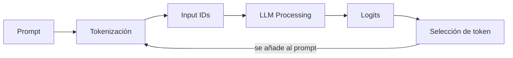

# HANDOFF.md — call me maybe

> [!important] Qué es este archivo
> Subject traducido y estructurado desde `en.subject.pdf`. Solo lectura salvo la sección final de relevo — ver `[[SYSTEM#Relevo de agente]]`.

---

## 🎯 Resumen

> [!info] Objetivo del proyecto
> Construir una herramienta de **function calling**: traduce prompts en lenguaje natural a llamadas de función estructuradas, usando un LLM pequeño (**Qwen/Qwen3-0.6B**, 0.6B parámetros).

Dado `"What is the sum of 40 and 2?"`, la solución **no** devuelve `42`. Devuelve:

```json
{
  "function": "fn_add_numbers",
  "arguments": {"a": 40, "b": 2}
}
```

> [!important] La pieza central: constrained decoding
> Modelos pequeños fallan generando JSON válido con solo prompting (~30% éxito). El proyecto exige **constrained decoding**: modificar los logits del modelo *antes* de elegir cada token, para forzar JSON válido y conforme al schema — no basta con confiar en que el modelo "lo haga bien".

> [!warning] Prohibido explícitamente
> No vale que el modelo genere JSON espontáneamente a partir del prompt. Prompting + esperanza no es la técnica que este proyecto evalúa.

---

## 📐 Restricciones generales

### Lenguaje y estilo

- [ ] **Python 3.10+**
- [ ] Cumple **flake8**
- [ ] Manejo de excepciones con `try-except` — el programa **nunca** debe crashear sin controlar. Un crash en la evaluación = no funcional
- [ ] Context managers para recursos (archivos, conexiones) — sin fugas
- [ ] **Type hints** completos (`typing`) en parámetros, retornos y variables donde aplique
- [ ] Pasa **mypy** sin errores
- [ ] **Docstrings** en funciones y clases, estilo PEP 257 (Google o NumPy)

### Librerías

| Origen | Restricción | Impacto |
|---|---|---|
| Subject | Todas las clases deben usar **pydantic** para validación | Diseño de clases debe apoyarse en modelos pydantic |
| Subject | Permitido: `numpy`, `json` | — |
| Subject | **Prohibido**: `dspy`, `pytorch`, `huggingface`, `transformers`, `outlines`, y similares | No hay atajos de constrained decoding vía librería — se implementa a mano |
| Subject | Prohibido usar métodos o atributos **privados** de `llm_sdk` | Solo la interfaz pública documentada abajo |
| Subject | La elección de función la hace el **LLM**, nunca heurísticas ni "magia medieval" | El enrutado prompt→función no puede ser un `if/else` sobre palabras clave |
| Entorno | Entorno virtual y dependencias (`numpy`, `pydantic`) instaladas con **uv** | `uv sync` es lo único que correrá el revisor/moulinette |
| Entorno | `llm_sdk` se copia en el mismo directorio que `src` | No se instala como paquete externo |

> [!warning] Bloqueo de diseño
> Sin `pydantic` en cada clase, sin constrained decoding manual, sin heurísticas para elegir función. Estos tres son innegociables desde Fase 1.

---

## 🗂️ Estructura del repositorio

> [!warning] Obligatorio en la entrega
> - [ ] `src/` — implementación
> - [ ] `pyproject.toml` + `uv.lock` — gestión de dependencias
> - [ ] `llm_sdk/` — copiado del paquete provisto
> - [ ] `data/input/` — ficheros de test (para demo)
> - [ ] `README.md` — documentación completa
> - [ ] Cualquier archivo adicional necesario para correr la solución

> [!warning] No incluir
> `output/` no se sube al repo — se genera durante el peer review.

### Comando de ejecución

```bash
uv run python -m src [--functions_definition <function_definition_file>] [--input <input_file>] [--output <output_file>]
```

Por defecto lee de `data/input/` y escribe en `data/output/`. Ejemplo completo:

```bash
uv run python -m src \
  --functions_definition data/input/functions_definition.json \
  --input data/input/function_calling_tests.json \
  --output data/output/function_calls.json
```

---

## 📥 Ficheros de entrada

### `function_calling_tests.json`

Array de prompts en lenguaje natural a procesar.

```json
[
  {"prompt": "What is the sum of 2 and 3?"},
  {"prompt": "What is the sum of 265 and 345?"},
  {"prompt": "Greet shrek"},
  {"prompt": "Greet john"},
  {"prompt": "Reverse the string 'hello'"}
]
```

### `functions_definition.json`

Funciones disponibles: nombre, parámetros (nombre + tipo), tipo de retorno, descripción.

```json
[
  {
    "name": "fn_add_numbers",
    "description": "Add two numbers together and return their sum.",
    "parameters": {
      "a": {"type": "number"},
      "b": {"type": "number"}
    },
    "returns": {"type": "number"}
  },
  {
    "name": "fn_greet",
    "description": "Generate a greeting message for a person by name.",
    "parameters": {
      "name": {"type": "string"}
    },
    "returns": {"type": "string"}
  },
  {
    "name": "fn_reverse_string",
    "description": "Reverse a string and return the reversed result.",
    "parameters": {
      "s": {"type": "string"}
    },
    "returns": {"type": "string"}
  }
]
```

> [!warning] No hardcodear contra el ejemplo
> Los prompts y el set de funciones **cambian** en el peer review. Nada de soluciones atadas a estos ejemplos concretos. También hay que manejar JSON inválido o archivos ausentes en ambos ficheros de entrada.

---

## 🤖 Interacción con el LLM

### `llm_sdk` — clase `Small_LLM_Model`

| Método | Firma | Qué hace |
|---|---|---|
| `get_logits_from_input_ids` | `(input_ids: List[int]) -> List[float]` | Logits del modelo dado una lista de token IDs |
| `get_path_to_vocab_file` | `() -> str` | Ruta al fichero de vocabulario (token ↔ ID) |
| `encode` | `(text: str) -> Tensor` | Texto → tensor de token IDs |
| `decode` *(opcional)* | `(token_ids: List[int]) -> str` | Token IDs → texto |

> [!important] Solo interfaz pública
> Nada de atributos o métodos privados de `llm_sdk` — restricción explícita del subject.

### Pipeline de generación



Se repite token a token hasta completar la respuesta. En **Selección de token** es donde entra constrained decoding.

### Constrained decoding — el mecanismo

1. El modelo produce logits para todos los tokens posibles
2. Se identifica qué tokens mantienen **JSON válido y conformidad con el schema esperado**
3. Los tokens inválidos (rompen schema o estructura) → logit a **-infinito**
4. Se muestrea solo entre los tokens válidos que quedan

> [!example] Aplicación concreta
> Si `functions_definition.json` dice que un campo es `number`, el decoder en ese punto de la generación solo permite tokens que continúen un entero o float válido — nunca letras sueltas o comillas fuera de lugar.

> [!tip] Pista del subject
> Usar el fichero de vocabulario (`get_path_to_vocab_file`) para mapear tokens ↔ su representación en string. Ahí se decide, en cada paso, qué tokens son válidos.

---

## 📤 Formato de salida

Archivo único: `data/output/function_calling_results.json`. Un objeto por prompt, con **exactamente** estas claves:

| Clave | Tipo | Contenido |
|---|---|---|
| `prompt` | `string` | El prompt original |
| `name` | `string` | Nombre de la función elegida |
| `parameters` | `object` | Todos los argumentos requeridos, con el tipo correcto |

```json
[
  {
    "prompt": "What is the sum of 2 and 3?",
    "name": "fn_add_numbers",
    "parameters": {"a": 2.0, "b": 3.0}
  },
  {
    "prompt": "Reverse the string 'hello'",
    "name": "fn_reverse_string",
    "parameters": {"s": "hello"}
  }
]
```

### Reglas de validación

- [ ] JSON válido (sin comas colgantes, sin comentarios)
- [ ] Claves y tipos coinciden **exactamente** con `functions_definition.json`
- [ ] Sin claves extra ni prosa en ningún punto de la salida
- [ ] Todos los argumentos requeridos presentes
- [ ] Tipos de argumento correctos (number, string, boolean, etc.)

---

## 🎯 Rendimiento y fiabilidad

| Métrica | Objetivo |
|---|---|
| Precisión | 90%+ función y argumentos correctos |
| Validez JSON | 100% parseable y conforme al schema |
| Velocidad | Todos los prompts de test en menos de 5 minutos, hardware estándar |
| Robustez | Maneja inputs malformados, ficheros ausentes, edge cases sin crashear |

> [!info] Por qué importa
> Qwen3-0.6B es pequeño. El subject remarca que la fiabilidad no sale del tamaño del modelo, sino de la guía estructural — el constrained decoding es lo que cierra la brecha.

### Edge cases a testear

Strings vacíos, números grandes, caracteres especiales, tipos incorrectos, prompts ambiguos, funciones con múltiples parámetros.

---

## 🧪 Testing (según el subject)

- [ ] Programas de test para verificar funcionalidad (no se entregan ni califican) — `pytest` o `unittest`
- [ ] Cubrir edge cases

> [!note] Esto no reemplaza `[[SYSTEM#Testing]]`
> El flujo de tests del sistema (discusión → agente escribe test → estudiante aprueba y ejecuta) aplica igual. Esta sección es lo que el subject exige como mínimo.

---

## 📄 README.md — requisitos

> [!warning] Primera línea obligatoria, en cursiva
> *This project has been created as part of the 42 curriculum by \<login1\>[, \<login2\>[, \<login3\>[...]]].*

Debe incluir, como mínimo:

- [ ] **Description** — qué es el proyecto, objetivo, overview breve
- [ ] **Instructions** — compilación, instalación, ejecución
- [ ] **Resources** — referencias clásicas del tema (docs, artículos, tutoriales) + cómo se usó IA (para qué tareas, qué partes)
- [ ] **Algorithm explanation** — el enfoque de constrained decoding en detalle
- [ ] **Design decisions** — elecciones clave de la implementación
- [ ] **Performance analysis** — precisión, velocidad, fiabilidad
- [ ] **Challenges faced** — dificultades y cómo se resolvieron
- [ ] **Testing strategy** — cómo se validó
- [ ] **Example usage** — ejemplos claros de ejecución

> [!warning] Idioma
> El README se escribe en **inglés**.

---

## ⭐ Bonus (opcional, no requerido para aprobar)

- [ ] Soporte para múltiples modelos LLM además de Qwen/Qwen3-0.6B
- [ ] Recodificar el tokenizer: evitar `encode`/`decode` directos en el código principal, usar `get_logits_from_input_ids` y `get_path_to_vocab_file` en su lugar
- [ ] Mecanismos avanzados de recuperación de errores
- [ ] Optimizaciones de rendimiento (caching, batching)
- [ ] Suite de tests exhaustiva
- [ ] Visualización del proceso de generación
- [ ] Soporte para argumentos de función anidados y complejos
- [ ] Implementación pública de `encode` y `decode` (opcional) del tokenizer
- [ ] Demostración de cómo encoding/decoding se integran con constrained decoding

> [!warning] Deben funcionar
> Los bonus tienen que estar implementados y funcionando — no solo descritos en el README. Puede pedirse demostrarlos en la evaluación.

---

## 📦 Entrega y peer review

- [ ] Todo el trabajo evaluado vive dentro del repositorio Git
- [ ] Verificar nombres de archivo exactos

> [!warning] Modificación en vivo durante evaluación
> Puede pedirse una **modificación breve** del proyecto durante la evaluación: cambio menor de comportamiento, unas líneas de código, una feature fácil de añadir. No aplica siempre, pero hay que estar preparado. Factible en pocos minutos salvo que se indique otro plazo.

---

## 🔄 Contextualización para el siguiente agente

> [!info] Agente 1 — activo
> **Periodo:** Desde `FIRST.md` (contextualización inicial) hasta cierre de esta sesión.
>
> **Qué se hizo:** Chequeo inicial del proyecto (`.gitignore` y `Makefile` no existían → creados vacíos, por decisión explícita del estudiante — no se rellenan todavía). Lectura completa del subject (`en.subject.pdf`, 21 páginas) y traducción/estructuración en este `HANDOFF.md`. Mapa de temas de Fase 0 propuesto (18 temas iniciales) y filtrado con el estudiante sección por sección — quedaron 10 temas pendientes tras descartar 8 ya dominados. `PROJECT.md` actualizado con la tabla de mapa de temas (general + aplicado al proyecto) y el prompt de estudio para NotebookLM. Tres propuestas anotadas en `Posible mejoras al sistema.md`.
>
> **Dónde se quedó:** Fase 0, estudiante terminando de repasar el prompt de NotebookLM. Ningún tema marcado `dominado` todavía en `PROJECT.md`.
>
> **Decisiones tomadas:**
> - `.gitignore` y `Makefile` se crean vacíos por ahora, sin reglas — el estudiante los rellenará más adelante.
> - Ningún archivo de `workflow/` va al `.gitignore`, incluido `PSYCHOLOGY.md` — contradice la plantilla base de `[[SYSTEM]]` (que pide ignorarlo). Se respeta la decisión del estudiante y se anota como propuesta de mejora al sistema en vez de aplicarla en caliente.
> - El sistema (`[[SYSTEM]]`) exige verificar temas con evidencia, no con la sola palabra del estudiante — se anotó como propuesta explícita en `Posible mejoras al sistema.md` para no aplicarla sin pasar por el ciclo de adopción, pero ya es el criterio a seguir en el próximo repaso.
>
> **Callejones sin salida:** ninguno todavía — sesión de solo Fase 0/preparación, sin código.
>
> **Abierto:**
> - Verificar los 10 temas del mapa mediante cuestionario/discusión antes de dar la Fase 0 por cerrada y pasar a Fase 1.
> - Decidir, al cerrar el proyecto, si las 3 propuestas de `Posible mejoras al sistema.md` se adoptan al `SYSTEM.md`/plantilla base.
> - Progreso de estudio con el prompt de NotebookLM: **vistos** el video explicativo y el podcast generados. **Falta** el resto (guía escrita, mapa mental, flashcards u otro material que NotebookLM haya generado) — por ahí arranca la siguiente sesión.
>
> **Sobre el estudiante:** Prefiere revisar listas largas (como el mapa de temas) en bloques pequeños con aprobación explícita sí/no por ítem, en vez de aprobar todo de una vez. Detalle y evidencia en `[[PSYCHOLOGY]]`.
>
> **Siguiente paso:** El cuestionario de verificación de los 10 temas, cuando el estudiante vuelva con dudas o listo para continuar.
