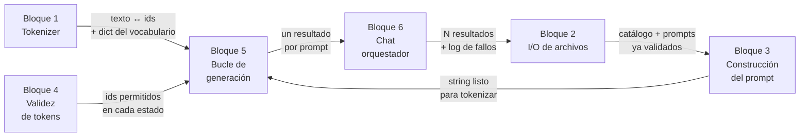

# PROJECT.md

> [!important] Documento vivo
> Aquí se anota **todo** el proyecto: restricciones, conceptos, bloques, clases y progreso.
> Lo rellena el agente conforme se avanza. Es lo que leerá un agente nuevo para saber en qué punto están.

---

## 🗺️ Mapa de flujo

> [!info] Dónde estamos
> **Fase actual:** `FASE 1` — diseño. Arrancada el 2026-08-10
> **Progreso del cuestionario de Fase 0:** **10/10 en `dominado`**, todos cerrados por el estudiante
> **Hecho en Fase 1:** lista de **responsabilidades sueltas completa** (14 obligatorias + 7 de bonus) · **6 bloques identificados y ordenados** por dependencia, sin responsabilidades sueltas
> **Siguiente paso:** abrir el diseño del **Bloque 1 — Tokenizer**: clases, atributos y firmas
> **Bloqueos abiertos:** ninguno
> **Al abrir sesión:** cuestionario de repaso obligatorio — ver `[[PROJECT#🔁 Cuestionarios de repaso de sesión]]`
> **Alcance:** se van a implementar **los 9 bonus** (decisión del estudiante, 2026-08-07) — ver `[[PROJECT#Alcance — bonus]]`
> **Arrastrado a Fase 2:** reforzar los **imports relativos** del Tema 3 en el momento en que aparezca el primero, sin esperar a que él lo pida
> **A reforzar la próxima sesión:** los 3 fallos del repaso del 2026-08-10 — ver `[[PROJECT#Repaso de sesión 2026-08-10 — a reforzar]]`



| Bloque | Descripción | Estado | Qué recibe | Qué entrega |
|---|---|---|---|---|
| 1 — Tokenizer | `encode`/`decode` propios desde `vocab.json` y `merges.txt` | ⚪ | Rutas del SDK | Texto ↔ ids, y el `dict` string → id |
| 2 — I/O de archivos | Leer y validar los JSON de entrada, escribir salida y log | ⚪ | Rutas de los argumentos | Catálogo y prompts validados |
| 3 — Construcción del prompt | Plantilla de chat y tokens especiales del modelo | ⚪ | Catálogo + prompt del usuario | Un string listo para tokenizar |
| 4 — Validez de tokens | FSM/PDA + schema + cache de lista blanca | ⚪ | Estado del JSON y schema | Ids permitidos en ese estado |
| 5 — Bucle de generación | Logits, máscara, `argmax`, parada, validación `pydantic` | ⚪ | Todo lo anterior | Un resultado por prompt |
| 6 — `Chat` orquestador | Recorre los N prompts y junta los resultados. Recibe las piezas hechas | ⚪ | Los bloques ya construidos | N resultados + registro de fallos |

**Estados:** ✅ cerrado · 🔵 en curso · ⚪ pendiente · 🔴 bloqueado

> [!note] Se actualiza al cerrar cada bloque
> Las flechas del diagrama llevan **qué le entrega un bloque al siguiente**. Sin eso el diagrama solo muestra orden; con eso muestra el contrato entre bloques.

---

## 🔁 Cuestionarios de repaso de sesión

> [!important] Obligatorio al abrir sesión — petición del estudiante, 2026-08-10
> Nada más contextualizarse, **antes de abrir tema nuevo**, el agente lanza un cuestionario corto sobre lo aprendido y lo hecho en la sesión anterior.
> · 4–6 preguntas · **una por mensaje** · en **orden de ejecución** del programa
> · Las preguntas salen del registro de la sesión anterior y del `[[NOTEBOOK]]`
> · Un fallo **no se corrige dando la respuesta**: se le pone el caso límite concreto y llega solo. Solo si dice *"no sé"* se responde directo
> · Al terminar, el agente **añade aquí una entrada nueva** con los fallos y sus correcciones. Todos los repasos se acumulan, no se sobrescriben

> [!warning] Para qué sirve el histórico
> El foco de cada repaso es doble: **lo último visto** y **lo que ya falló antes y todavía no está controlado**. Un fallo que aparece en dos repasos seguidos vuelve a preguntarse hasta que resista; si aparece tres veces, el tema baja de ✅ a 🟡 en el `[[PROJECT#Cuestionario de verificación]]`.

### Repaso 2026-08-10 — Fase 0 completa, entrada a Fase 1

**Fallos:**

| # | Fallo | Corrección | Tema |
|---|---|---|---|
| 1 | Sabía que se manda **un prompt por llamada**, pero no la razón: la atribuyó al procesamiento de la respuesta. Ante el caso de 5 objetos con uno repetido y otro sin responder, dijo *"no sé"* | La razón no es el formato — es la **correspondencia prompt↔resultado**. La máscara garantiza estructura (JSON válido, nombres y tipos del schema); que el objeto 3 responda al prompt 3 es **semántica** y no se puede enmascarar. Con un prompt por llamada la correspondencia la garantiza el bucle: un prompt, un resultado, mismo índice | 1, 10 |
| 2 | Dijo **"carácter"** en vez de **token**, dos veces seguidas | Un logit por **entrada del vocabulario**, no por letra. Hay entradas multicarácter (`name`, `{"`, `dd_numbers`): un solo token puede añadir 10 caracteres de golpe. Confundirlos rompe el diseño de la máscara, que compara **strings de token** | 6, 8 |
| 3 | Del bucle al archivo saltó de `decode` directo a `json.dump`. No recordaba qué hace `json.loads` | `decode` devuelve un **string**; pydantic valida un **dict**. Orden real: `decode` → `json.loads` → `dict` → pydantic → guardar en la lista de los N → **un solo** `json.dump` del array al final. Un `dump` sobre el string escribe el JSON escapado entre comillas | 5 |
| 4 | `while deep_counter > 0` con el contador a 0 antes de generar — el bucle no entra nunca | Lo resolvió él: primera llamada **fuera** del `while`, el resto dentro. Antes había propuesto inicializar el contador al número de llaves esperado por función; se descartó al ver que el nombre de la función aún no está escrito cuando toca inicializar | — |
| 5 | Creía que las rutas de los archivos de entrada eran fijas | Salen de `argparse`, con `data/input/` y `data/output/` como defaults. El corrector puede pasar cualquier ruta | 4 |
| 6 | No sabía quién convierte `functions_definition.json` (dict) en el texto que recibe `encode` | Lo hace **tu programa**: es una responsabilidad propia. El SDK solo tokeniza lo que le des. El formato exacto sigue abierto en `[[PROJECT#A analizar en esta fase]]` | 1 |

> [!success] Correcto sin ayuda
> El texto que entra a `encode` (prompt + funciones, después ids acumulados sin re-encodear) · los ~150.000 logits y qué puntúan · la lista blanca por **prefijo** en `{"name": "fn_a` · el contador de profundidad y su valor exacto (1) en `..."b": 2}` · el corte `input_ids[len(prompt_ids):]` antes de `decode` · el bonus 7 necesita **pila (PDA)**, no basta un FSM.

> [!bug] A volver a preguntar en el próximo repaso
> · **Token vs carácter** — falló dos veces en la misma sesión, es el que más riesgo tiene de volver
> · **`loads` / `dumps`** — cuál convierte en qué dirección
> · **Por qué un prompt por llamada** — la razón, no la regla
> · **Determinismo de greedy** — dijo *"puede salir lo mismo o otra cosa"*; sale siempre lo mismo
> · Del contenido nuevo de hoy: qué es **cache de lista blanca** y por qué **batching no aplica** aquí

---

## FASE 0 — COMPRENSIÓN

### Input / Output

**INPUT:**

Tres cosas entran al programa: dos ficheros JSON y el modelo.

| Qué | De dónde | Contenido |
|---|---|---|
| `function_calling_tests.json` | `--input`, por defecto `data/input/` | Array de objetos con **una sola clave**: `{"prompt": "What is the sum of 2 and 3?"}`. Nada más — `name` y `parameters` no existen aquí |
| `functions_definition.json` | `--functions_definition`, por defecto `data/input/` | Catálogo de funciones disponibles: `name`, `description`, `parameters` (cada uno con su `type`) y `returns` |
| El modelo | `llm_sdk.Small_LLM_Model`, por defecto `Qwen/Qwen3-0.6B` | Ver `[[PROJECT#Interfaz real del llm_sdk]]` |

> [!warning] Los dos ficheros cambian en el peer review
> Ni los prompts ni el set de funciones son los del ejemplo. Nada puede quedar atado a `fn_add_numbers`, `fn_greet` o `fn_reverse_string`. Y los dos pueden llegar **ausentes o con JSON inválido** sin que el programa crashee.

**OUTPUT:**

Un único fichero: `data/output/function_calling_results.json` (ver la fila *Subject* de `Restricciones generales` sobre el nombre).

Array con **un objeto por prompt de entrada**, en el mismo orden, con **exactamente** tres claves:

| Clave | Tipo | Contenido |
|---|---|---|
| `prompt` | `string` | El prompt original, copiado tal cual |
| `name` | `string` | Nombre de la función elegida por el modelo |
| `parameters` | `object` | Todos los argumentos que exige esa función, con el tipo del schema |

```json
[
  {"prompt": "What is the sum of 2 and 3?",
   "name": "fn_add_numbers",
   "parameters": {"a": 2.0, "b": 3.0}},
  {"prompt": "Reverse the string 'hello'",
   "name": "fn_reverse_string",
   "parameters": {"s": "hello"}}
]
```

> [!warning] Sin claves extra, sin prosa
> JSON válido al 100%, claves y tipos idénticos a `functions_definition.json`, todos los argumentos requeridos presentes. Un `number` del schema se escribe `2.0`, no `2`.

### Restricciones generales

> [!warning] Todo lo que limita el proyecto
> No solo lo prohibido por el subject. Si aparece una restricción nueva en cualquier fase, se añade aquí en el momento.

| Origen | Restricción | Impacto |
|---|---|---|
| Subject | **El archivo de salida por defecto es `data/output/function_calling_results.json`** — decisión del estudiante, 2026-08-07 | El subject se contradice: el ejemplo del comando (línea 350) dice `function_calls.json`, pero la especificación de salida (582) y la checklist de verificación (662) dicen `function_calling_results.json`. Se elige el que aparece dos veces y en las secciones normativas |
| Subject | **Constrained decoding implementado a mano.** Prohibido que el modelo genere el JSON solo con prompting, y prohibido resolverlo con `dspy`, `pytorch`, `huggingface`, `transformers`, `outlines` o similares | Es lo que el proyecto evalúa. Sin esto no hay proyecto |
| Subject | **La función la elige el LLM**, nunca heurísticas ni `if/else` sobre palabras clave del prompt | El enrutado prompt→función sale de los logits |
| Subject | **Todas las clases usan `pydantic`** para validación | El diseño de Fase 1 se apoya en modelos pydantic |
| Subject | Permitido solo `numpy` y `json`. Prohibido tocar métodos o atributos **privados** de `llm_sdk` (todo lo que empieza por `_`) | Solo los 6 métodos públicos de `[[PROJECT#Interfaz real del llm_sdk]]` |
| Técnica | **Python 3.10+**, type hints completos, docstrings PEP 257, `try-except` en todo lo que pueda fallar, context managers para archivos | Un crash durante la evaluación cuenta como no funcional |
| Técnica | `llm_sdk/` se copia dentro del repositorio, no se instala como paquete externo | Ya está en `llm_sdk/` |
| Entorno | **La máquina de trabajo no tiene GPU** — sin NVIDIA (`nvidia-smi` no devuelve nada) y sin Apple Silicon, así que el SDK cae a `cpu` con `float32` *(verificado 2026-08-07)* | Es el camino más lento de los tres que contempla el SDK. El límite del subject —todos los prompts en menos de 5 minutos— pasa a ser una restricción real de diseño, no un trámite. Cada token generado es una pasada completa por las 28 capas del modelo |
| Estilo | Pasa **flake8** y **mypy** sin errores | `make lint` los ejecuta |
| Estilo | README en **inglés**, primera línea en cursiva con el formato exacto que fija el subject | Ver `[[HANDOFF#📄 README.md — requisitos]]` |
| Diseño | **Selección de token: greedy (`np.argmax`), no sampling** — decisión del estudiante, 2026-08-07 | Salida reproducible: mismo prompt, misma respuesta. Consecuencia directa: **softmax no se calcula nunca** en el bucle, porque `argmax(logits)` y `argmax(softmax(logits))` devuelven el mismo id |
| Alcance | **Rendimiento:** todos los prompts de test en menos de 5 minutos · 100% de JSON válido · 90%+ de acierto en función y argumentos | El 100% lo garantiza la máscara; el 90% depende del modelo |
| Alcance | **Se implementan los 9 bonus del subject** — decisión del estudiante, 2026-08-07 | El diseño de Fase 1 debe contemplarlos desde el principio, no dejarlos para el final. Detalle en `[[PROJECT#Alcance — bonus]]` |

### Interfaz real del `llm_sdk`

> [!important] Leída del código, no del subject — 2026-08-07
> El paquete ya está en el repo: `llm_sdk/llm_sdk/__init__.py`. Expone **6 métodos públicos**, no los 4 que lista el subject. Todo lo que empieza por `_` (`_tokenizer`, `_model`, `_device`, `_dtype`, `_model_name`) está **prohibido** por el subject.

| Método | Firma real | Qué devuelve de verdad |
|---|---|---|
| `encode` | `(text: str) -> torch.Tensor` | Tensor **2-D**: `tensor([[id, id, ...]])`. No una lista plana |
| `decode` | `(ids: torch.Tensor \| list[int]) -> str` | String. Acepta tensor o lista, y aplica `skip_special_tokens=True` |
| `get_logits_from_input_ids` | `(input_ids: list[int]) -> list[float]` | Un `float` por token del vocabulario, del **último** token de la secuencia. Recibe **lista plana**, no tensor |
| `get_path_to_vocab_file` | `() -> str` | Ruta a `vocab.json` — pieza → id |
| `get_path_to_merges_file` | `() -> str` | Ruta a `merges.txt` — las reglas de BPE ordenadas |
| `get_path_to_tokenizer_file` | `() -> str` | Ruta a `tokenizer.json` — vocabulario y merges juntos |

> [!warning] Desajuste de tipos entre los dos métodos que se encadenan
> `encode` devuelve `tensor([[ids]])` y `get_logits_from_input_ids` espera `list[int]` plana. El paso de uno a otro hay que hacerlo explícito en el diseño; no encajan directamente.

> [!success] Dos hallazgos que cambian el alcance de los bonus
> · **Bonus 2, 8 y 9 son viables:** `get_path_to_merges_file()` existe y es pública, así que la tabla de merges está disponible para implementar BPE a mano.
> · **Bonus 1 sale casi gratis:** el constructor ya acepta `model_name` (`Small_LLM_Model(model_name="...")`), con selección automática de dispositivo y dtype. El trabajo no es cargar otro modelo — es que el resto del código no dependa del vocabulario concreto de Qwen.

> [!note] Lección de método
> El subject documenta un subconjunto de la interfaz. Antes de diseñar, se lee el código del SDK entero.

### Mapa de temas

> [!info] Sale del subject
> El agente extrae los temas del enunciado, el estudiante quita lo que ya domina, y con lo que queda se genera el prompt de estudio para NotebookLM.

| Tema | En general | En este proyecto | ¿Ya lo domino? |
|---|---|---|---|
| Function calling | Qué es, por qué existe, cómo estructura la salida de un LLM | Traducir prompt → `{name, parameters}` según `functions_definition.json` | ☐ |
| Tokenización | BPE/SentencePiece — cómo se parte un texto en tokens, tabla de merges, codificación byte-level | `llm_sdk.encode()` y el fichero de vocabulario del modelo. Con los bonus 2 y 8 en alcance, hay que poder **implementar el tokenizer a mano** | ☐ |
| Logits / softmax | Distribución de probabilidad sobre el vocabulario, selección de token | `get_logits_from_input_ids()` — de dónde salen los números que se van a restringir | ☐ |
| Constrained decoding | Restringir logits para forzar estructura válida token a token | Forzar JSON válido y conforme al schema de `functions_definition.json`, sin usar `outlines`/`transformers` | ☐ |
| Vocabulario / token↔ID | Cómo un fichero de vocab mapea tokens a IDs y viceversa | Usar `get_path_to_vocab_file()` para decidir, en cada paso, qué tokens continúan un JSON válido | ☐ |
| `uv` | Gestión de entorno y dependencias — `pyproject.toml`, `uv.lock` | El revisor solo corre `uv sync`; setup del proyecto depende de esto | ☐ |
| `python -m` | Ejecutar un paquete como módulo — estructura `src/`, `__main__.py` | Comando obligatorio: `uv run python -m src [--functions_definition ...]` | ☐ |
| `argparse` | Parseo de argumentos CLI | Flags `--functions_definition`, `--input`, `--output` con defaults a `data/input/` y `data/output/` | ☐ |
| JSON en Python | Parseo/serialización, manejo de JSON inválido | Leer `functions_definition.json` y `function_calling_tests.json` con manejo de errores; escribir `function_calling_results.json` válido | ☐ |
| `numpy` | Manipulación de arrays | Posible uso para manejar el vector de logits al aplicar la máscara de constrained decoding | ☐ |

> [!success]- Prompt para NotebookLM
> *(generado por el agente con la lista final)*

```text
Quiero estudiar a fondo los siguientes temas para un proyecto de la escuela 42 llamado
"call me maybe" (function calling con LLMs pequeños). Para cada tema, dame primero la
explicación general del concepto y luego cómo se aplica específicamente al escenario que
describo debajo. Usa ejemplos concretos, no solo definiciones.

CONTEXTO DEL PROYECTO:
Construyo una herramienta que traduce prompts en lenguaje natural (ej: "What is the sum
of 2 and 3?") en llamadas de función estructuradas (ej: {"name": "fn_add_numbers",
"parameters": {"a": 2, "b": 3}}), usando el modelo Qwen/Qwen3-0.6B a través de un SDK
wrapper (métodos: encode, get_logits_from_input_ids, get_path_to_vocab_file, decode
opcional). La restricción central: NO puedo confiar en que el modelo genere JSON válido
solo con prompting (falla ~70% de las veces en modelos de este tamaño). Debo implementar
constrained decoding manualmente: en cada paso de generación, tomar los logits, poner a
-infinito los que romperían la validez JSON o el schema esperado, y muestrear solo entre
los tokens que quedan válidos. Todo en Python 3.10+, con pydantic para validar las
clases, tipado estricto (mypy), sin librerías de alto nivel como outlines/transformers/
huggingface. Gestión de dependencias con uv. Ejecución vía `python -m src` con argparse
para las rutas de entrada/salida.

TEMAS:

1. Function calling en LLMs — qué es, por qué existe, cómo estructura la salida de un
   modelo que normalmente solo genera texto libre.

2. Tokenización (BPE/SentencePiece) — cómo un string se parte en subunidades (tokens),
   por qué no es un split por palabras, cómo se relaciona con el fichero de vocabulario
   de un modelo.

3. Logits y softmax — qué son los logits que devuelve un modelo antes de elegir el
   siguiente token, cómo se convierten en probabilidades, cómo se elige normalmente el
   siguiente token (greedy, sampling).

4. Constrained decoding — la técnica de modificar logits antes de la selección de token
   para forzar que la salida cumpla una gramática o schema específico (en este caso,
   JSON válido conforme a una definición de función). Cómo se identifican en cada paso
   qué tokens son válidos dado el estado parcial de la generación.

5. Vocabulario / mapeo token↔ID — cómo un fichero de vocabulario relaciona IDs numéricos
   con su representación en texto, y cómo se usa eso para filtrar tokens válidos durante
   constrained decoding.

6. uv — gestión de entornos virtuales y dependencias en Python moderno: pyproject.toml,
   uv.lock, uv sync, uv run.

7. Ejecutar un paquete Python con `python -m` — cómo funciona `__main__.py`, por qué se
   usa esta forma en vez de ejecutar un script suelto.

8. argparse — cómo definir argumentos opcionales con valores por defecto, para un CLI
   tipo `--functions_definition <file> --input <file> --output <file>`.

9. JSON en Python — parseo y serialización con el módulo json, cómo manejar excepciones
   de JSON inválido o archivos faltantes sin crashear el programa.

10. numpy — operaciones básicas sobre arrays, aplicables a manipular un vector de logits
    (por ejemplo, poner posiciones específicas a -infinito).

Al final, dame un resumen de cómo estas piezas encajan entre sí en el flujo completo:
prompt → tokenización → logits → constrained decoding → JSON de salida.
```

### Cuestionario de verificación

> [!important] Cómo se marca `dominado`
> Material estudiado ≠ tema dominado. El estudiante explica cada tema **con sus palabras**, en general y aplicado al proyecto. Solo lo que resiste esa explicación pasa a ✅.
> Iniciado: 2026-08-05. Si se corta a mitad, se reanuda por el primer tema en ⚪ o 🔵.

> [!important] Orden de ejecución, no orden temático
> **Se sigue el orden en que las cosas ocurren cuando corre el programa**, desde el punto 0. Nunca se coge un tema del medio.
> Con sus palabras: *"primero tengo que entender cómo funciona la puerta y cómo se abre, antes de entrar a entender la sala"*.
> Por eso `uv`, `python -m` y `argparse` van **primero** (son el arranque real del programa), no al final por ser "herramienta". La numeración de abajo ya está reordenada así — el Tema 1 se contestó antes de acordar esta regla.

| # | Tema | Estado | Notas de la respuesta |
|---|---|---|---|
| 1 | Function calling *(visión general — se dio antes de fijar el orden)* | ✅ | **No cerrado a petición del estudiante.** Respuestas correctas tras corregir 2 fallos: (a) creía que el modelo *ejecuta* la función — no, solo genera el JSON `{name, parameters}`, nadie ejecuta nada; (b) creía que `functions_definition.json` solo va en el contexto del prompt — también alimenta las reglas del constrained decoder (nombres legales + tipos de parámetro). **Cerrado por él el 2026-08-07**, tras repasar el flujo completo de memoria. Último matiz corregido al cerrar: function calling no es solo que el modelo escriba el **nombre** de la función — es el nombre **y** los argumentos extraídos del prompt, en una estructura que un programa pueda consumir. El nombre solo no se puede llamar. Recorrido completo en `[[PROJECT#Pendiente en el Tema 1]]` |
| 2 | `uv` | ✅ | **2026-08-07.** Partía de *"casi nada"*. Recorrido: el problema que resuelve (reproducir el entorno en la máquina del corrector), el entorno virtual aislado, `pyproject.toml` como declaración floja de lo que necesitas frente a `uv.lock` como registro exacto de lo que se resolvió, y los dos comandos — `uv sync` monta el entorno, `uv run` ejecuta dentro sin activarlo a mano. Comprobación superada: si falta `uv.lock`, `uv sync` **no falla** pero resuelve versiones desde cero, y el fallo aparece en la máquina del corrector. Nota anotada: el `pyproject.toml` del SDK depende de `torch`, `transformers` y `huggingface-hub` — la prohibición del subject es sobre **tu** código, el SDK las necesita instaladas por dentro |
| 3 | `python -m` | ✅ | **2026-08-07.** Recorrido: `-m` busca un **módulo por nombre** (con las reglas de `import`), no una ruta de archivo — ya lo usaba sin saberlo en `python -m venv`; un paquete es una carpeta con `__init__.py`, y `python -m src` ejecuta `src/__main__.py`. **Pendiente de reforzar, dicho por él:** *"entendí parcialmente"* el mecanismo de los **imports relativos** — por qué `python -m src` fija `__package__ = "src"` y hace que `from .decoder import ...` resuelva, mientras que `python src/__main__.py` deja `__package__ = None` y lanza `ImportError: attempted relative import with no known parent package`. **Decisión suya, 2026-08-07: no bloquea Fase 0.** El refuerzo se hace **en el momento en que el tema se toque de verdad** — al crear `src/__main__.py` y aparecer el primer import relativo, en Fase 2. El agente que esté ahí lo explica entonces, sin esperar a que él lo pida |
| 4 | `argparse` | ✅ | **2026-08-07.** Cerrado por él. Recorrido: qué problema resuelve (`sys.argv` llega como lista cruda de strings y habría que recorrerla a mano), `ArgumentParser` + `add_argument(..., default=...)` + `parse_args()`, y lo que da gratis — orden libre de flags, valores por defecto, error claro ante un flag inventado y `--help` generado solo. Matiz anotado: ante un flag mal escrito `argparse` **llama a `sys.exit()`**, no lanza excepción, así que un `try-except` alrededor no lo atrapa |
| 5 | JSON en Python | ✅ | **2026-08-07.** Cerrado por él. Traía `load`/`dump`. Añadido en la sesión: (a) son cuatro — `load`/`dump` con archivo abierto, `loads`/`dumps` con string (lo que sale de `decode` es string → `json.loads`); (b) las dos excepciones a distinguir, `json.JSONDecodeError` y `FileNotFoundError` — dónde van los guards es Fase 1, aquí solo saber que existen y que son distintas; (c) JSON tiene un único `number`, así que un schema `number` se declara `float` en pydantic y el `2.0` sale de ahí; (d) los tres literales que no coinciden con Python — `true`/`false`/`null` frente a `True`/`False`/`None`, relevante porque la máscara trabaja sobre el texto JSON; (e) escritura con context manager, `encoding="utf-8"` y `ensure_ascii=False` para los caracteres especiales |
| 6 | Tokenización | ✅ | **2026-08-07.** Cerrado por él, ya al nivel ampliado. Recorrido: (a) el vocabulario guarda **subwords**, no palabras — `shrek` se parte en piezas, y llegó solo a esa conclusión; (b) **bytes como suelo** — los 256 valores de byte están en el vocabulario, así que ningún texto es intokenizable, y por eso se llama *Byte* Pair Encoding; (c) la **tabla de merges** es una lista ordenada de reglas aprendidas por frecuencia, que se aplican por prioridad sobre los caracteres sueltos hasta que ninguna encaja — determinista, sin logits ni probabilidades; (d) el espacio va **pegado y delante** (` hello`), lo que obliga a que la máscara acepte tanto ` "` como el espacio suelto seguido de `"`. Fallo corregido dos veces: **un byte suelto no se decodifica** — al escribir el `decode` propio hay que acumular bytes y decodificar el bloque entero al final, o `Greet José` revienta con `UnicodeDecodeError`. El prompt construido se convierte en token IDs. **Nivel ampliado el 2026-08-07:** con los bonus 2 y 8 en el alcance, no basta con entender qué es — hay que poder **implementar BPE a mano** desde el fichero de vocabulario (tabla de merges, codificación byte-level, cómo se parte un string sin llamar a `encode`) |
| 7 | Logits / softmax | ✅ | **2026-08-07.** Cerrado por él. Ya traía de la sesión anterior: un logit por token del vocabulario, puntúan el **siguiente** token, no son los pesos, y `-inf` da probabilidad exacta 0 porque $e^{-\infty}=0$. Añadido hoy: **softmax solo cambia de escala** (eleva `e` a cada logit y divide entre la suma; el resultado suma 1), **no reordena** — por eso `argmax(logits)` y `argmax(softmax(logits))` dan el mismo id. Y de ahí la elección entre **greedy** y **sampling**: eligió greedy por reproducibilidad, así que el softmax no se calcula nunca en el bucle |
| 8 | Vocabulario / token↔ID | ✅ | **2026-08-07.** Cerrado por él. Recorrido: (a) un token **no** es un carácter — hay entradas multicarácter (`{"`, `":`, `name`), así que la lista blanca se calcula sobre **strings de token**, no sobre caracteres; (b) el estado que decide la lista blanca es el **texto formado**, no el número de tokens; (c) el diccionario se carga una vez desde `get_path_to_vocab_file()` con el **string como clave** (`{string: id}`) — consulta O(1). Al revés (`{id: string}`) obliga a recorrer 150.000 entradas por token generado. Detalle en `[[PROJECT#Registro de la sesión 2026-08-07]]` |
| 9 | `numpy` | ✅ | **Cerrado el 2026-08-07.** Añadido ese día: por qué numpy y no un `for` (números crudos contiguos, tipo fijado una vez, recorrido en C ya compilado), las tres operaciones que usa el proyecto (`np.full`, indexado con lista, `np.argmax`), y que los `input_ids` que crecen van en lista de Python, no en array. **2026-08-06.** General correcto. Aplicado: llegó solo al enfoque de **lista blanca** partiendo de un `for` con `if in forbidden`. Recorrido el indexado vectorizado — ver `[[PROJECT#Extracto — numpy y la máscara]]`. Sin cerrar: falta que él lo dé por cerrado |
| 10 | Constrained decoding | ✅ | **Cerrado el 2026-08-07** tras recorrer la lista blanca de los valores. Enunciado final suyo: la lista blanca depende de **dónde estás en el JSON** más **qué dice el schema** de ese campo. Al cerrarlo avisó de que no lo siente reforzado del todo y espera afianzarlo en Fase 1 — ver `[[PROJECT#Registro de la sesión 2026-08-07]]`. **2026-08-06.** Lo definió solo y correctamente: *"limitar las respuestas del modelo (enmascarar) para aumentar el acierto dado un formato específico"*. Corregido el matiz: la máscara garantiza el **formato** (100%), no el **acierto** de función y argumentos (90%) — eso sigue siendo del modelo. Se tocó de refilón al recorrer el flujo; no se ha preguntado a fondo |

**Estados:** ✅ dominado · 🟡 parcial (falta matiz anotado) · 🔵 en curso · ⚪ sin preguntar

#### Pendiente en el Tema 1

> [!important] Por aquí arranca el siguiente agente
> El estudiante **contestó bien** el Tema 1, pero pidió **no cerrarlo**. Quiere profundizar antes de seguir con el Tema 2.

Lo que pidió, con sus palabras: *"este es el paso 0-1 del proyecto, quiero profundizar en el flujo de cómo sucede este paso, cuál es su mecánica, etc., para internalizarlo todo"*.

Concretamente, falta recorrer:

- [x] El **flujo completo de un solo prompt**, de principio a fin: qué entra, qué pasa en cada etapa, qué sale. Sin saltarse pasos intermedios. *(2026-08-06 — recorrido hasta `decode`)*
- [x] Qué hace **tu programa** y qué hace **el modelo** en cada etapa — la frontera exacta entre los dos.
- [ ] Cómo se construye el prompt que se le manda al modelo a partir de `functions_definition.json`. *(parcial: sabe que va como texto dentro de `encode`; el formato exacto y la plantilla de chat sin decidir)*
- [x] Qué es exactamente el **bucle de generación** token a token, y por qué es un bucle y no una llamada única.
- [x] Dónde encaja el constrained decoding dentro de ese bucle, y qué pasaría sin él.
- [x] **Qué pasa después de `decode`**: `decode` devuelve un **string**, `json.loads()` lo convierte en `dict`, y `pydantic` valida ese dict contra `functions_definition.json` (función existente, parámetros completos, tipos correctos). *(2026-08-06)*
- [x] Montar la salida: juntar los resultados de los N prompts en un array y escribir `function_calling_results.json`. *(2026-08-07 — el bucle completo corre una vez por prompt; la salida es un array de N objetos con las claves exactas `prompt`, `name`, `parameters`)*

##### Registro de la sesión 2026-08-06

> [!info] Flujo que el estudiante reconstruyó solo, al final de la sesión
> `prompt + funciones` → `encode` → tensor de ~200 ids → `get_logits_from_input_ids` → **150.000** logits → máscara con el `dict` de vocabulario (lo inválido a `-inf`) → se coge el **id** del logit mayor → se añade al tensor (201) → se repite hasta cerrar el JSON → `input_ids[200:]` → `decode`.

Fallos corregidos durante el recorrido, en orden:

| # | Fallo | Corrección |
|---|---|---|
| 1 | Mandar los 5 prompts de golpe al modelo | Uno por uno: la máscara depende del schema de la función elegida, y con 5 mezclados no se sabe qué regla toca en cada momento |
| 2 | Creía que `get_logits_from_input_ids` devuelve los ids que le pasaste | Devuelve **un logit por token del vocabulario** (~150.000), puntuando el **siguiente** token. La entrada mide lo que mida el prompt; la salida es fija |
| 3 | Creía que la máscara se construye **con** softmax | Son cosas distintas: la máscara es lógica sobre strings (`-inf` a lo que rompe el JSON); softmax solo convierte logits en probabilidades. Se usa `-inf` porque $e^{-\infty}=0$ → probabilidad exacta 0 |
| 4 | Usar `decode` para saber qué carácter es cada id durante el bucle | Para eso está el **fichero de vocabulario**, cargado una vez antes del bucle. `decode` es solo para el string final |
| 5 | Creía que los **pesos** del modelo son sus puntuaciones | Pesos = 0.6B, congelados, iguales para cualquier prompt. Logits = 150.000, distintos en cada llamada. Los pesos son la máquina; los logits, lo que produce |
| 6 | Creía que la atención va de palabras que aparecen **juntas o cerca** | Va de **relevancia** según el contexto: en *"el gato que perseguía el perro se subió al…"* atiende a `gato`, no a `perro`, aunque `perro` esté pegado |
| 7 | Pasar el tensor **entero** a `decode` | Solo `input_ids[200:]` — las primeras 200 posiciones son el prompt y las funciones. Y `decode` recibe la lista de golpe, no token a token |

Preguntas suyas que abrieron explicación (modo explicación, respondidas completas):

- Qué es un SDK · qué es un tensor · cómo funciona softmax
- **"¿Cómo sabe el modelo qué parte es su respuesta y cuál mi pregunta?"** → el modelo no lo distingue; solo continúa texto. La estructura viene de los tokens especiales de la plantilla (`<|im_start|>assistant`), que son convención aprendida en el fine-tuning. El programa lo sabe por posición: guardando `len(prompt)`
- **"¿Cómo sabe el modelo qué formato debe seguir?"** → no lo sabe. El prompt solo inclina los logits (~30% de acierto en 0.6B); la garantía del 100% la da la máscara. Es exactamente lo que evalúa el subject
- Cómo ocurre el entrenamiento → pretraining (predecir el siguiente token, ajustar pesos por *backpropagation*) + fine-tuning con conversaciones formateadas
- Qué pasa dentro del modelo en una llamada → embedding → posición → 28 capas (atención + MLP) → proyección del vector del **último** token a los 150.000 logits

> [!warning] En orden de ejecución
> El recorrido empieza en el **punto 0 del programa** (`uv run python -m src ...`) y avanza paso a paso hasta la salida. Nada de empezar por el constrained decoding porque sea lo interesante: si no entiende cómo arranca el programa, no entra a lo de dentro.

> [!warning] Cómo tratarlo
> No es que no lo entienda: es que quiere la **mecánica**, no el resumen. Escenas concretas del propio proyecto (un prompt real, la generación congelada a media respuesta) — esa forma de explicar es la que le hizo llegar solo a los dos fallos del Tema 1. Definiciones abstractas no le sirvieron.

##### Registro de la sesión 2026-08-07

> [!info] Repaso del flujo, contado por el estudiante de memoria
> Reconstruyó el flujo entero sin apoyo. Tres fallos, corregidos en el momento.

| # | Fallo | Corrección |
|---|---|---|
| 1 | *"repito hasta que aparezca `}`"* | El primer `}` cierra `parameters`, no el JSON. Llegó solo a la solución: **contador de profundidad** (+1 por `{`, −1 por `}`), parar en 0 |
| 2 | `input_ids[30:]` para quedarse con lo generado | Al revés: tira los 30 primeros y deja los 200 del prompt. Lo generado son los últimos — `input_ids[len(prompt_ids):]` |
| 3 | Creía que el archivo de entrada trae `prompt`, `name` y `parameters` vacíos, y que la salida lleva un campo `response` | Entrada: solo `{"prompt": ...}`. Salida: array de N objetos con las claves exactas `prompt`, `name`, `parameters` — sin claves extra |

Preguntas suyas respondidas en esta sesión:

- **Lista blanca vs lista negra** (petición del `[[NOTEBOOK]]`). Negra = enumerar lo prohibido (`mascara[prohibidos] = -np.inf`); blanca = tachar todo y revivir lo válido (`mascara = np.full(n, -np.inf)`, `mascara[permitidos] = logits[permitidos]`). En `{"name": ` solo vale `"`: la negra son 149.999 ids que enumerar, la blanca 1.
- **Por qué el diccionario de vocabulario va con el string de clave.** Un `dict` indexa por clave, no por valor: `vocab['"']` es un paso, buscar por valor recorre las 150.000 entradas, y eso se repite ~30 veces por prompt.

Segunda parte de la sesión — `numpy` y lista blanca (Temas 9 y 10, **siguen sin cerrar**):

- **Por qué `numpy` y no un `for`.** Pidió la explicación completa. Lo resumió solo y correctamente: la lista de Python es de punteros dispersos a objetos con tipo, el array de numpy son números crudos contiguos con el tipo fijado una vez, así que el recorrido ocurre en C ya compilado y el procesador puede tocar bloques enteros. Ajuste hecho: el código C viene compilado de antes, no se compila en el momento.
- **Consecuencia práctica que salió de ahí:** los 150.000 logits son de tamaño fijo → array de numpy; los `input_ids`, que crecen de 200 a 201 a 202, → lista de Python, porque hacer crecer un array de numpy obliga a reservar y copiar.
- **`np.argmax` no tiene nada que ver con `argparse`.** Lo preguntó explícitamente. `arg` es *argument of the maximum*.
- **Regla de la lista blanca, con el nombre de la función.** Congelada la generación en `{"name": "fn_a`, llegó a que valen tanto `dd` como `dd_numbers` — un token válido puede completar el nombre entero de golpe. Enunciado: `permitidos` no es "el carácter que toca", es **todo token cuyo texto sea una continuación válida, de la longitud que sea**. El comparador es de prefijo (`nombre.startswith(acumulado + token)`), no de igualdad — él mismo lo asoció a `strcmp`, corregido a `strncmp`. Y la lista blanca se estrecha conforme se escribe, hasta que solo sobrevive una función.

Tercera parte — lista blanca de los **valores** (cierre del Tema 10). Recorrido congelando cuatro momentos:

| Estado de la generación | Qué permitió | Comentario |
|---|---|---|
| `{"a": ` con `a` de tipo `number` | `4`, `40`, `-` | Correcto a la primera. El `.` queda fuera: JSON no acepta `.5`, tiene que ser `0.5` |
| `{"a": 40` | dígitos y `.` | Se le escapó la `,` — `40` ya es un número completo y el schema todavía pide `b`. Lo corrigió al señalárselo |
| `{"a": 40,` | `,`, `,"`, `,"b`… | Aplicó solo la regla de prefijo que había enunciado antes |
| `{"s": "` con `s` de tipo `string` | *"caracteres de str"* | Correcto: fuera solo la `"` sin escapar y los caracteres de control. Casi todo el vocabulario pasa |

> [!success] Lo que cerró el tema
> Con `{"name": "` la lista blanca son 3 nombres; con `{"s": "` son ~150.000 tokens. Preguntado quién decide entonces que salga `hello` y no `banana`, respondió **"puntuación de logit"**. Ahí encaja la frase que ya traía: la máscara garantiza el **formato** al 100%, el **acierto** sigue siendo del modelo — por eso el subject pide 100% de JSON válido pero solo 90% de acierto.

> [!success] Frontera que enunció solo
> *"lo que hace el modelo es devolver logits, el formato lo manipulo yo, pero el nombre de la función y los parámetros los tiene que escoger él con las puntuaciones"*.

#### Extracto — `numpy` y la máscara

> [!important] Por aquí se retoma el Tema 9
> Lo que sigue es el recorrido que el estudiante hizo el **2026-08-06**. Llegó al enfoque final él solo; el agente solo fue cerrando salidas malas. Si hay que retomarlo, se retoma desde aquí, no desde cero.

**Su punto de partida:** un `for` sobre los 150.000 logits con `if logit[n] in forbidden`.

**Cómo llegó al enfoque bueno**, en tres saltos:

| Paso | Qué se le preguntó | A qué llegó |
|---|---|---|
| 1 | ¿Cuántas vueltas son en total? (150.000 × ~30 tokens × N prompts) | *"es demasiado"* |
| 2 | Propuso mirar el mejor logit y saltar al siguiente si está prohibido. Se le puso el peor caso: en `{"name": ` solo vale `"`, y el modelo quiere escribir `Sure` | *"un montón"* de candidatos a revisar |
| 3 | — | **Lista blanca**: calcular qué tokens son válidos y enmascarar todo lo demás. Llegó solo |

**El mecanismo, con el vocabulario reducido a 8 tokens:**

```python
vocab  = ['{', '"', 'name', ':', 'Sure', '40', 'banana', '}']
#  id      0     1      2     3     4      5       6       7
logits = np.array([8.2, 3.1, 5.4, 2.0, 7.9, 1.2, -3.1, 0.5])

# el JSON va por `{"name": ` → solo vale el id 1
mascara = np.full(8, -np.inf)              # 1. tachar todo
mascara[permitidos] = logits[permitidos]   # 2. revivir los válidos
elegido = int(np.argmax(mascara))          # 3. elegir → 1, el `"`
```

Gana `"` con 3.1 aunque `{` tenía 8.2 y `Sure` 7.9: no compiten, valen `-inf`.

> [!important] Lo único que hace falta de `numpy`
> **Indexar un array con una lista de posiciones y asignar de golpe** — `mascara[[1, 5]] = logits[[1, 5]]`. Nada más.
> Es rápido porque los números están pegados en memoria y el recorrido ocurre en C ya compilado, no interpretando 150.000 veces las mismas instrucciones en Python.
> El `for` no desaparece: se paga al calcular `permitidos`. Pero esa lista tiene 1 o 20 elementos, no 150.000.

> [!note] Matices que salieron
> · El id de un token se saca del `dict` de vocabulario cargado al arrancar, **nunca** llamando a `encode` dentro del bucle.
> · La lista blanca no siempre es un token: dentro de `"parameters": {"a": ` valen todos los dígitos, el `-` y el `.`.

### Conceptos a estudiar

#### [Nombre del concepto]

> [!info] Estado
> pendiente / en progreso / **dominado**

**Por qué hace falta:** [qué parte del proyecto lo necesita]

> [!question] Duda
> [reformulada por el agente]

> [!success] Respuesta
> [explicación acordada, con su escena de la vida real]

**Se usa en:** [[Bloque X]]

> [!warning] Bloqueo de fase
> No pasar a Fase 1 hasta que **todos** los conceptos estén en `dominado`.

---

## FASE 1 — DISEÑO

### Alcance — bonus

> [!important] Decisión del estudiante — 2026-08-07
> **Se van a implementar los 9 bonus del subject.** No son opcionales para este proyecto: entran en el alcance desde el diseño.
> El subject no exige ningún mínimo (*"optional, not required for passing"*), pero sí que **funcionen de verdad** — descritos en el README no cuentan, y pueden pedirse en la evaluación.

| # | Bonus | Coste estimado | Cuándo entra en el diseño |
|---|---|---|---|
| 1 | Soporte para varios modelos LLM | **Bajo** *(revisado 2026-08-07)* | El constructor ya acepta `model_name`. El trabajo real es que nada del código quede atado al vocabulario de Qwen |
| 2 | Recodificar el tokenizer (sin `encode`/`decode` del SDK) | Alto — **viable confirmado** | **Fase 1** — `get_path_to_merges_file()` existe, así que hay tabla de merges. Todas las llamadas a `encode`/`decode` viven en una sola clase |
| 3 | Recuperación avanzada de errores | Medio | Después — se añade encima |
| 4 | Optimizaciones (caching, batching) | Medio | Después — cachear la lista blanca por estado del JSON |
| 5 | Suite de tests exhaustiva | Bajo | Continuo — el sistema ya exige tests por bloque |
| 6 | Visualización del proceso de generación | Bajo | Después — imprimir candidatos y elegido en cada paso |
| 7 | Argumentos anidados y complejos | Alto | **Fase 1, innegociable** — la máscara pasa de plana a recursiva. Retrofitearlo obliga a rehacer el núcleo |
| 8 | `encode`/`decode` públicos propios | Alto | Mismo trabajo que el 2 |
| 9 | Demo de encoding/decoding con el constrained decoding | Bajo | Después — se apoya en el 2 y el 8 |

> [!warning] Los tres que condicionan el diseño
> **7** cambia el algoritmo de la máscara: hay que decidirlo antes de diseñarla, no después.
> **1** y **2·8·9** no cambian el algoritmo, pero exigen **dejar la costura** — una clase de por medio para el modelo y otra para el tokenizer. Gratis si el diseño las contempla, caras si hay que retrofitear.

> [!note] 2, 8 y 9 son el mismo trabajo
> Los tres describen escribir el propio `encode`/`decode` a partir del fichero de vocabulario. Se diseñan como un único bloque.

> [!warning] Riesgo anotado por el agente
> Nueve bonus es mucho alcance para un proyecto cuya parte obligatoria (constrained decoding manual) todavía no está diseñada. El orden importa: la parte obligatoria completa y funcionando primero; los bonus de coste bajo (3, 4, 5, 6, 9) se añaden encima sin tocar el núcleo. Si el tiempo aprieta, lo que se recorta son bonus, nunca la parte obligatoria.

### A analizar en esta fase

- [ ] **Campo `reasoning` en el JSON generado** *(propuesto por el estudiante, 2026-08-06)* — dejar que el modelo escriba su razonamiento antes de `name` y `parameters`. Motivo: el modelo solo "piensa" generando tokens; con el razonamiento ya en su contexto, la atención se apoya en él al elegir la función, en vez de acertar en frío al primer token.
  **A resolver:** el output exige exactamente `prompt`, `name`, `parameters` — habría que generarlo y descartarlo antes de escribir. Y cada token de razonamiento es una llamada más al modelo, contra el límite de 5 minutos. Pendiente de medir si compensa.
- [ ] **Formato del texto del prompt** — cómo se convierte `functions_definition.json` (dict) en el string que recibe `encode`. Redacción, orden y si se incluyen las descripciones. Afecta directamente al acierto del modelo.
- [ ] **Mecanismo de recuperación del bonus 3** *(abierto, 2026-08-10)* — qué se hace cuando un resultado no pasa la validación. Nada decidido todavía.
  **Restricción que acota el problema:** con greedy (`np.argmax`) reintentar sin cambiar nada devuelve una copia idéntica, así que un simple contador de intentos no arregla nada — algo tiene que cambiar entre intento e intento.
  **Palancas sobre la mesa, sin elegir:** reformular el prompt · inyectar el error anterior como contexto · pasar a sampling solo en el reintento (se pierde reproducibilidad en ese caso) · registrar el fallo y seguir con el resto de prompts.
  **A resolver también:** qué cuenta como fallo recuperable — el formato ya lo garantiza la máscara al 100%, así que aquí solo caben fallos de **contenido**.
  **Ya decidido (2026-08-10):** hay un **límite de N reintentos** por prompt; agotado el límite **no se aborta** — se sigue con el resto y el fallo va al log de errores. Falta elegir **qué cambia entre intento e intento** y **cuánto vale N**.

### Responsabilidades sueltas

*(todo lo que el subject exige, antes de agruparlo en bloques)*

> [!success] Dada por completa — estudiante, 2026-08-10
> Puede crecer o encoger durante el diseño; se añade aquí en el momento en que aparezca algo nuevo. Siguiente paso: agruparla en bloques y fijar el orden de dependencia.

**Obligatorias:**

- [ ] Parsear los argumentos de línea de comandos (`--functions_definition`, `--input`, `--output`) con sus valores por defecto
- [ ] Comprobar que los archivos de entrada existen
- [ ] Leer y parsear cada JSON de entrada sin crashear si viene ausente, vacío o corrupto
- [ ] Cargar el vocabulario en memoria como `dict` string → id, una sola vez
- [ ] Construir el texto del prompt a partir del catálogo de funciones y el prompt del usuario
- [ ] Convertir texto a token ids
- [ ] Pedir logits al modelo
- [ ] Calcular la lista blanca según el estado del JSON y el schema de la función
- [ ] Aplicar la máscara sobre los logits y elegir el token (`np.argmax`)
- [ ] Llevar el contador de profundidad y decidir cuándo para el bucle
- [ ] Convertir los ids generados a texto
- [ ] Validar el resultado contra el schema de la función con `pydantic`
- [ ] Repetir el ciclo completo una vez por prompt
- [ ] Acumular los N resultados y escribir el array en el archivo de salida

**De los bonus:**

- [ ] Aislar el modelo tras una interfaz propia, para que nada dependa del vocabulario de Qwen *(bonus 1)*
- [ ] Implementar `encode` y `decode` propios desde `vocab.json` y `merges.txt` *(bonus 2, 8, 9)*
- [ ] Recuperar un prompt fallido *(bonus 3)* — **mecanismo sin decidir**, ver `[[PROJECT#A analizar en esta fase]]`
- [ ] Cachear la lista blanca por estado del JSON *(bonus 4)*
- [ ] Suite de tests con `pytest` *(bonus 5)*
- [ ] Trazar cada paso de la generación: cuántos logits, cuántos sobreviven a la máscara, y los 3 mejores con el elegido primero *(bonus 6)*
- [ ] Validar estructuras anidadas — el mecanismo con pila, no solo el plano *(bonus 7)*

> [!note] Decisiones que salieron al listar — 2026-08-10
> · **Paralelizar llamadas al modelo descartado de momento:** una pasada ya satura los núcleos, y cada proceso extra carga su propia copia del modelo (~2.4 GB en `float32`). Si se retoma, se mide antes.
> · **Batching no aplica:** `get_logits_from_input_ids` recibe una única secuencia.
> · **El bonus 3 solo tiene sentido sobre fallos de contenido**, no de formato: el formato ya lo garantiza la máscara al 100%.
> · **Reintentar con greedy sin cambiar nada es un bucle de copias idénticas** — `argmax` es determinista.

### Bloques

*(en orden de dependencia — propuestos por el estudiante, 2026-08-10)*

> [!warning] Sin cerrar
> Los bloques están identificados y ordenados, pero **ninguno tiene todavía clases, atributos ni firmas**. El diseño de cada uno se abre por separado, en este orden.

| # | Bloque | Qué resuelve | Por qué va aquí |
|---|---|---|---|
| 1 | **Tokenizer** | `encode`/`decode` propios desde `vocab.json` y `merges.txt`. Carga el vocabulario en memoria como `dict` string → id | Todo lo demás necesita convertir texto ↔ ids. Con los bonus 2·8·9 dentro, no es una llamada al SDK: es BPE implementado a mano |
| 2 | **I/O de archivos** | Leer y validar los dos JSON de entrada, escribir el JSON de salida y el log de errores. Sin crashear ante archivo ausente, vacío o corrupto | Misma familia: acceso a disco, `try-except` y context managers en un solo sitio |
| 3 | **Construcción del prompt** | Catálogo de funciones + prompt del usuario → un solo string, con la plantilla de chat y los tokens especiales del modelo | Aísla **todo lo específico del modelo**. Es la costura que hace barato el bonus 1: cambiar de modelo toca este bloque y ninguno más |
| 4 | **Validez de tokens** | Dado el estado del JSON y el schema, qué ids son válidos. FSM para lo plano, pila (PDA) para lo anidado. Cache de la lista blanca | Se escribe y se testea **sin llamar al modelo** — esa es la costura que lo separa del bucle |
| 5 | **Bucle de generación** | Pedir logits, aplicar la máscara, `np.argmax`, contador de profundidad, parada. Validar el resultado con `pydantic` | Es el único que necesita el modelo cargado. Depende de los cuatro anteriores |

| 6 | **`Chat` — orquestador** | Recorre los N prompts, llama al bloque 5 una vez por prompt y junta los resultados en orden | No fabrica nada: **recibe las piezas ya construidas** y solo las coordina. Depende de todos los anteriores |

Los argumentos de línea de comandos se parsean en `src/__main__.py`, fuera de los bloques: es el punto de entrada, no una pieza del diseño.

> [!success] Cómo lo enunció él — 2026-08-10
> *"Se crean todas las clases necesarias, como piezas de un carro. Se puede probar el motor independientemente; luego le ponemos el motor al carro, al chat. Chat recibe los objetos funcionales, solo centraliza las piezas construidas independientemente en una sola interfaz, nada más."*
>
> Consecuencia práctica: `Chat` recibe el tokenizer y el generador por parámetro en vez de construirlos dentro. En producción da igual — el vocabulario se carga una vez y el modelo se elige al arrancar. La diferencia está en poder correr el orquestador **sin cargar el modelo**, sustituyendo el generador por una pieza falsa en los tests.

> [!success] Decisiones de esta ronda — 2026-08-10
> · **El tokenizer es bloque propio, no un paso del bloque de entrada.** Con el bonus 2 es el trabajo más caro junto al 7.
> · **La construcción del prompt sale del bloque de I/O**, porque la plantilla de chat es específica del modelo y el bonus 1 obliga a cambiarla sin tocar la lectura de archivos.
> · **`pydantic` valida en el bloque 5, por prompt**, no al final sobre todos.
> · **Nunca se aborta la ejecución:** aunque falle un prompt (o el 60% de ellos), se procesan todos y la salida lleva siempre **N objetos**. Razón: un archivo con 12 objetos donde se esperaban 20 es indistinguible de un programa que se colgó.
> · **Los fallos se registran en un archivo de log aparte**, escrito por el bloque de I/O, con la forma `{índice_del_prompt: "mensaje"}` — la clave es el índice, no el nombre de la función, porque varios prompts fallidos pueden compartir función. El índice es la posición en el array, la misma en entrada y en salida.
> · **Función inexistente no necesita guard:** la máscara solo permite continuaciones de los nombres del catálogo, así que el modelo no tiene tokens con los que escribir una función que no existe. El fallo posible es de **contenido**, no de nombre.

---

### Bloque [N] — [nombre]

> [!info] Estado
> diseño / implementando / testeando / **cerrado**

**Descripción:** [qué resuelve este bloque, breve y directo]

**Depende de:** [[Bloque X]] — porque: 
**Qué recibe:** [datos, estructuras o garantías que le llegan del anterior]
**Qué entrega:** [qué deja listo para el siguiente]

---

#### ==`NombreClase`==

| Campo | Valor |
|---|---|
| Descripción | [qué hace, en una frase directa] |
| Archivo | `src/...` |
| Estado | diseñada / implementada / testeada |

**Atributos:**

| Nombre | Tipo | ¿Argumento? | Descripción | Hecho |
|---|---|---|---|---|
| `name` | `str` | ✅ | [para qué existe] | ☐ |
| `_visits` | `int` | ❌ | [para qué existe] | ☐ |

> [!tip] Por qué cada columna
> **¿Argumento?** — qué entra por el constructor y qué se inicializa dentro.
> **Descripción** — entre diseñar e implementar pueden pasar días. Sin ella vuelves y no recuerdas por qué existe ese atributo.
> **Hecho** — checklist por atributo, no por clase. Así se ve el avance real.

**Métodos:**

| Firma | Descripción | Hecho |
|---|---|---|
| `get_neighbors(self) -> list[Zone]` | [qué hace] | ☐ |
| `drone_in(self) -> None` | [qué hace] | ☐ |

> [!important] Firmas completas
> `self` **siempre** va escrito, aunque el método no reciba nada más: `drone_in(self) -> None`, nunca `drone_in() -> None`.
> Tipo de retorno **siempre** explícito, incluido `-> None`.

> [!note] Una clase = un `####` resaltado, separado por `---`
> El nombre de la clase es el título más visible dentro del bloque: `#### ==\`NombreClase\`==`.
> Con varias clases seguidas hay que ver de un vistazo dónde empieza cada una — por eso van al mismo nivel que *Objeciones de diseño*, resaltadas y con separador delante, no enterradas en un `#####`.

---

#### Objeciones de diseño

> [!note] Cuando agente y estudiante discrepan
> Se hace la versión del estudiante, y la objeción del agente queda anotada aquí. Si el problema aparece después, hay rastro de dónde se decidió y por qué.

- 

---

> [!warning] Bloqueo de fase
> No pasar a Fase 2 hasta que **todos** los bloques y clases estén definidos y aprobados.

---

## FASE 2 — IMPLEMENTACIÓN

### Bloque [N] — [nombre]

- [ ] `NombreClase` — implementación
- [ ] `NombreClase` — tests pasando

> [!warning] Bloqueo de bloque
> No pasar al siguiente bloque sin los tests del actual pasando.

---

## FASE 3 — INTEGRACIÓN Y VALIDACIÓN

### Tests de integración

#### [[Bloque A]] + [[Bloque B]]

- [ ] Implementación
- [ ] Test

### Validación final

- [ ] Checklist del subject línea por línea
- [ ] `make lint` sin errores (`flake8` + `mypy`)
- [ ] README completo
- [ ] Revisión del agente contra todos los requisitos de [[HANDOFF]]
