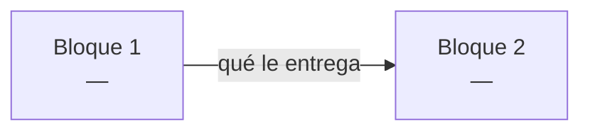

# PROJECT.md

> [!important] Documento vivo
> Aquí se anota **todo** el proyecto: restricciones, conceptos, bloques, clases y progreso.
> Lo rellena el agente conforme se avanza. Es lo que leerá un agente nuevo para saber en qué punto están.

---

## 🗺️ Mapa de flujo

> [!info] Dónde estamos
> **Fase actual:** `FASE 0` — material de estudio terminado, cuestionario de verificación en curso
> **Progreso del cuestionario:** 3/10 temas tocados (1 · Function calling, 9 · `numpy`, 10 · Constrained decoding), **0 en `dominado`**. Los tres están 🔵 a la espera de que el estudiante los dé por cerrados
> **Siguiente paso:** los 7 temas sin tocar — 2 `uv`, 3 `python -m`, 4 `argparse`, 5 JSON en Python, 6 Tokenización, 7 Logits/softmax, 8 Vocabulario
> **Bloqueos abiertos:** 0/10 temas en `dominado` → bloquea el paso a Fase 1



| Bloque | Descripción | Estado | Qué recibe | Qué entrega |
|---|---|---|---|---|
|  |  | ⚪ |  |  |

**Estados:** ✅ cerrado · 🔵 en curso · ⚪ pendiente · 🔴 bloqueado

> [!note] Se actualiza al cerrar cada bloque
> Las flechas del diagrama llevan **qué le entrega un bloque al siguiente**. Sin eso el diagrama solo muestra orden; con eso muestra el contrato entre bloques.

---

## FASE 0 — COMPRENSIÓN

### Input / Output

**INPUT:**
- 

**OUTPUT:**
- 

### Restricciones generales

> [!warning] Todo lo que limita el proyecto
> No solo lo prohibido por el subject. Si aparece una restricción nueva en cualquier fase, se añade aquí en el momento.

| Origen | Restricción | Impacto |
|---|---|---|
| Subject |  |  |
| Técnica |  |  |
| Entorno |  |  |
| Estilo |  |  |
| Diseño |  |  |
| Alcance |  |  |

### Mapa de temas

> [!info] Sale del subject
> El agente extrae los temas del enunciado, el estudiante quita lo que ya domina, y con lo que queda se genera el prompt de estudio para NotebookLM.

| Tema | En general | En este proyecto | ¿Ya lo domino? |
|---|---|---|---|
| Function calling | Qué es, por qué existe, cómo estructura la salida de un LLM | Traducir prompt → `{name, parameters}` según `functions_definition.json` | ☐ |
| Tokenización | BPE/SentencePiece — cómo se parte un texto en tokens | `llm_sdk.encode()` y el fichero de vocabulario del modelo | ☐ |
| Logits / softmax | Distribución de probabilidad sobre el vocabulario, selección de token | `get_logits_from_input_ids()` — de dónde salen los números que se van a restringir | ☐ |
| Constrained decoding | Restringir logits para forzar estructura válida token a token | Forzar JSON válido y conforme al schema de `functions_definition.json`, sin usar `outlines`/`transformers` | ☐ |
| Vocabulario / token↔ID | Cómo un fichero de vocab mapea tokens a IDs y viceversa | Usar `get_path_to_vocab_file()` para decidir, en cada paso, qué tokens continúan un JSON válido | ☐ |
| `uv` | Gestión de entorno y dependencias — `pyproject.toml`, `uv.lock` | El revisor solo corre `uv sync`; setup del proyecto depende de esto | ☐ |
| `python -m` | Ejecutar un paquete como módulo — estructura `src/`, `__main__.py` | Comando obligatorio: `uv run python -m src [--functions_definition ...]` | ☐ |
| `argparse` | Parseo de argumentos CLI | Flags `--functions_definition`, `--input`, `--output` con defaults a `data/input/` y `data/output/` | ☐ |
| JSON en Python | Parseo/serialización, manejo de JSON inválido | Leer `functions_definition.json` y `function_calling_tests.json` con manejo de errores; escribir `function_calling_results.json` válido | ☐ |
| `numpy` | Manipulación de arrays | Posible uso para manejar el vector de logits al aplicar la máscara de constrained decoding | ☐ |

> [!success]- Prompt para NotebookLM
> *(generado por el agente con la lista final)*

```text
Quiero estudiar a fondo los siguientes temas para un proyecto de la escuela 42 llamado
"call me maybe" (function calling con LLMs pequeños). Para cada tema, dame primero la
explicación general del concepto y luego cómo se aplica específicamente al escenario que
describo debajo. Usa ejemplos concretos, no solo definiciones.

CONTEXTO DEL PROYECTO:
Construyo una herramienta que traduce prompts en lenguaje natural (ej: "What is the sum
of 2 and 3?") en llamadas de función estructuradas (ej: {"name": "fn_add_numbers",
"parameters": {"a": 2, "b": 3}}), usando el modelo Qwen/Qwen3-0.6B a través de un SDK
wrapper (métodos: encode, get_logits_from_input_ids, get_path_to_vocab_file, decode
opcional). La restricción central: NO puedo confiar en que el modelo genere JSON válido
solo con prompting (falla ~70% de las veces en modelos de este tamaño). Debo implementar
constrained decoding manualmente: en cada paso de generación, tomar los logits, poner a
-infinito los que romperían la validez JSON o el schema esperado, y muestrear solo entre
los tokens que quedan válidos. Todo en Python 3.10+, con pydantic para validar las
clases, tipado estricto (mypy), sin librerías de alto nivel como outlines/transformers/
huggingface. Gestión de dependencias con uv. Ejecución vía `python -m src` con argparse
para las rutas de entrada/salida.

TEMAS:

1. Function calling en LLMs — qué es, por qué existe, cómo estructura la salida de un
   modelo que normalmente solo genera texto libre.

2. Tokenización (BPE/SentencePiece) — cómo un string se parte en subunidades (tokens),
   por qué no es un split por palabras, cómo se relaciona con el fichero de vocabulario
   de un modelo.

3. Logits y softmax — qué son los logits que devuelve un modelo antes de elegir el
   siguiente token, cómo se convierten en probabilidades, cómo se elige normalmente el
   siguiente token (greedy, sampling).

4. Constrained decoding — la técnica de modificar logits antes de la selección de token
   para forzar que la salida cumpla una gramática o schema específico (en este caso,
   JSON válido conforme a una definición de función). Cómo se identifican en cada paso
   qué tokens son válidos dado el estado parcial de la generación.

5. Vocabulario / mapeo token↔ID — cómo un fichero de vocabulario relaciona IDs numéricos
   con su representación en texto, y cómo se usa eso para filtrar tokens válidos durante
   constrained decoding.

6. uv — gestión de entornos virtuales y dependencias en Python moderno: pyproject.toml,
   uv.lock, uv sync, uv run.

7. Ejecutar un paquete Python con `python -m` — cómo funciona `__main__.py`, por qué se
   usa esta forma en vez de ejecutar un script suelto.

8. argparse — cómo definir argumentos opcionales con valores por defecto, para un CLI
   tipo `--functions_definition <file> --input <file> --output <file>`.

9. JSON en Python — parseo y serialización con el módulo json, cómo manejar excepciones
   de JSON inválido o archivos faltantes sin crashear el programa.

10. numpy — operaciones básicas sobre arrays, aplicables a manipular un vector de logits
    (por ejemplo, poner posiciones específicas a -infinito).

Al final, dame un resumen de cómo estas piezas encajan entre sí en el flujo completo:
prompt → tokenización → logits → constrained decoding → JSON de salida.
```

### Cuestionario de verificación

> [!important] Cómo se marca `dominado`
> Material estudiado ≠ tema dominado. El estudiante explica cada tema **con sus palabras**, en general y aplicado al proyecto. Solo lo que resiste esa explicación pasa a ✅.
> Iniciado: 2026-08-05. Si se corta a mitad, se reanuda por el primer tema en ⚪ o 🔵.

> [!important] Orden de ejecución, no orden temático
> **Se sigue el orden en que las cosas ocurren cuando corre el programa**, desde el punto 0. Nunca se coge un tema del medio.
> Con sus palabras: *"primero tengo que entender cómo funciona la puerta y cómo se abre, antes de entrar a entender la sala"*.
> Por eso `uv`, `python -m` y `argparse` van **primero** (son el arranque real del programa), no al final por ser "herramienta". La numeración de abajo ya está reordenada así — el Tema 1 se contestó antes de acordar esta regla.

| # | Tema | Estado | Notas de la respuesta |
|---|---|---|---|
| 1 | Function calling *(visión general — se dio antes de fijar el orden)* | 🔵 | **No cerrado a petición del estudiante.** Respuestas correctas tras corregir 2 fallos: (a) creía que el modelo *ejecuta* la función — no, solo genera el JSON `{name, parameters}`, nadie ejecuta nada; (b) creía que `functions_definition.json` solo va en el contexto del prompt — también alimenta las reglas del constrained decoder (nombres legales + tipos de parámetro). Pide **profundizar en el flujo y la mecánica paso a paso** antes de darlo por dominado — ver `[[PROJECT#Pendiente en el Tema 1]]` |
| 2 | `uv` | ⚪ | Arranque: cómo se levanta el entorno con el que corre todo |
| 3 | `python -m` | ⚪ | El programa empieza a ejecutarse: `__main__.py`, paquete `src/` |
| 4 | `argparse` | ⚪ | Primera cosa que hace el programa: leer las rutas de entrada/salida |
| 5 | JSON en Python | ⚪ | Segunda cosa: abrir y parsear los dos ficheros de entrada, sin crashear |
| 6 | Tokenización | ⚪ | El prompt construido se convierte en token IDs |
| 7 | Logits / softmax | ⚪ | El modelo devuelve un número por token del vocabulario |
| 8 | Vocabulario / token↔ID | ⚪ | Saber qué texto representa cada ID, para poder filtrarlos |
| 9 | `numpy` | 🔵 | **2026-08-06.** General correcto. Aplicado: llegó solo al enfoque de **lista blanca** partiendo de un `for` con `if in forbidden`. Recorrido el indexado vectorizado — ver `[[PROJECT#Extracto — numpy y la máscara]]`. Sin cerrar: falta que él lo dé por cerrado |
| 10 | Constrained decoding | 🔵 | **2026-08-06.** Lo definió solo y correctamente: *"limitar las respuestas del modelo (enmascarar) para aumentar el acierto dado un formato específico"*. Corregido el matiz: la máscara garantiza el **formato** (100%), no el **acierto** de función y argumentos (90%) — eso sigue siendo del modelo. Se tocó de refilón al recorrer el flujo; no se ha preguntado a fondo |

**Estados:** ✅ dominado · 🟡 parcial (falta matiz anotado) · 🔵 en curso · ⚪ sin preguntar

#### Pendiente en el Tema 1

> [!important] Por aquí arranca el siguiente agente
> El estudiante **contestó bien** el Tema 1, pero pidió **no cerrarlo**. Quiere profundizar antes de seguir con el Tema 2.

Lo que pidió, con sus palabras: *"este es el paso 0-1 del proyecto, quiero profundizar en el flujo de cómo sucede este paso, cuál es su mecánica, etc., para internalizarlo todo"*.

Concretamente, falta recorrer:

- [x] El **flujo completo de un solo prompt**, de principio a fin: qué entra, qué pasa en cada etapa, qué sale. Sin saltarse pasos intermedios. *(2026-08-06 — recorrido hasta `decode`)*
- [x] Qué hace **tu programa** y qué hace **el modelo** en cada etapa — la frontera exacta entre los dos.
- [ ] Cómo se construye el prompt que se le manda al modelo a partir de `functions_definition.json`. *(parcial: sabe que va como texto dentro de `encode`; el formato exacto y la plantilla de chat sin decidir)*
- [x] Qué es exactamente el **bucle de generación** token a token, y por qué es un bucle y no una llamada única.
- [x] Dónde encaja el constrained decoding dentro de ese bucle, y qué pasaría sin él.
- [x] **Qué pasa después de `decode`**: `decode` devuelve un **string**, `json.loads()` lo convierte en `dict`, y `pydantic` valida ese dict contra `functions_definition.json` (función existente, parámetros completos, tipos correctos). *(2026-08-06)*
- [ ] Montar la salida: juntar los resultados de los N prompts en un array y escribir `function_calling_results.json`. *(no recorrido)*

##### Registro de la sesión 2026-08-06

> [!info] Flujo que el estudiante reconstruyó solo, al final de la sesión
> `prompt + funciones` → `encode` → tensor de ~200 ids → `get_logits_from_input_ids` → **150.000** logits → máscara con el `dict` de vocabulario (lo inválido a `-inf`) → se coge el **id** del logit mayor → se añade al tensor (201) → se repite hasta cerrar el JSON → `input_ids[200:]` → `decode`.

Fallos corregidos durante el recorrido, en orden:

| # | Fallo | Corrección |
|---|---|---|
| 1 | Mandar los 5 prompts de golpe al modelo | Uno por uno: la máscara depende del schema de la función elegida, y con 5 mezclados no se sabe qué regla toca en cada momento |
| 2 | Creía que `get_logits_from_input_ids` devuelve los ids que le pasaste | Devuelve **un logit por token del vocabulario** (~150.000), puntuando el **siguiente** token. La entrada mide lo que mida el prompt; la salida es fija |
| 3 | Creía que la máscara se construye **con** softmax | Son cosas distintas: la máscara es lógica sobre strings (`-inf` a lo que rompe el JSON); softmax solo convierte logits en probabilidades. Se usa `-inf` porque $e^{-\infty}=0$ → probabilidad exacta 0 |
| 4 | Usar `decode` para saber qué carácter es cada id durante el bucle | Para eso está el **fichero de vocabulario**, cargado una vez antes del bucle. `decode` es solo para el string final |
| 5 | Creía que los **pesos** del modelo son sus puntuaciones | Pesos = 0.6B, congelados, iguales para cualquier prompt. Logits = 150.000, distintos en cada llamada. Los pesos son la máquina; los logits, lo que produce |
| 6 | Creía que la atención va de palabras que aparecen **juntas o cerca** | Va de **relevancia** según el contexto: en *"el gato que perseguía el perro se subió al…"* atiende a `gato`, no a `perro`, aunque `perro` esté pegado |
| 7 | Pasar el tensor **entero** a `decode` | Solo `input_ids[200:]` — las primeras 200 posiciones son el prompt y las funciones. Y `decode` recibe la lista de golpe, no token a token |

Preguntas suyas que abrieron explicación (modo explicación, respondidas completas):

- Qué es un SDK · qué es un tensor · cómo funciona softmax
- **"¿Cómo sabe el modelo qué parte es su respuesta y cuál mi pregunta?"** → el modelo no lo distingue; solo continúa texto. La estructura viene de los tokens especiales de la plantilla (`<|im_start|>assistant`), que son convención aprendida en el fine-tuning. El programa lo sabe por posición: guardando `len(prompt)`
- **"¿Cómo sabe el modelo qué formato debe seguir?"** → no lo sabe. El prompt solo inclina los logits (~30% de acierto en 0.6B); la garantía del 100% la da la máscara. Es exactamente lo que evalúa el subject
- Cómo ocurre el entrenamiento → pretraining (predecir el siguiente token, ajustar pesos por *backpropagation*) + fine-tuning con conversaciones formateadas
- Qué pasa dentro del modelo en una llamada → embedding → posición → 28 capas (atención + MLP) → proyección del vector del **último** token a los 150.000 logits

> [!warning] En orden de ejecución
> El recorrido empieza en el **punto 0 del programa** (`uv run python -m src ...`) y avanza paso a paso hasta la salida. Nada de empezar por el constrained decoding porque sea lo interesante: si no entiende cómo arranca el programa, no entra a lo de dentro.

> [!warning] Cómo tratarlo
> No es que no lo entienda: es que quiere la **mecánica**, no el resumen. Escenas concretas del propio proyecto (un prompt real, la generación congelada a media respuesta) — esa forma de explicar es la que le hizo llegar solo a los dos fallos del Tema 1. Definiciones abstractas no le sirvieron.

#### Extracto — `numpy` y la máscara

> [!important] Por aquí se retoma el Tema 9
> Lo que sigue es el recorrido que el estudiante hizo el **2026-08-06**. Llegó al enfoque final él solo; el agente solo fue cerrando salidas malas. Si hay que retomarlo, se retoma desde aquí, no desde cero.

**Su punto de partida:** un `for` sobre los 150.000 logits con `if logit[n] in forbidden`.

**Cómo llegó al enfoque bueno**, en tres saltos:

| Paso | Qué se le preguntó | A qué llegó |
|---|---|---|
| 1 | ¿Cuántas vueltas son en total? (150.000 × ~30 tokens × N prompts) | *"es demasiado"* |
| 2 | Propuso mirar el mejor logit y saltar al siguiente si está prohibido. Se le puso el peor caso: en `{"name": ` solo vale `"`, y el modelo quiere escribir `Sure` | *"un montón"* de candidatos a revisar |
| 3 | — | **Lista blanca**: calcular qué tokens son válidos y enmascarar todo lo demás. Llegó solo |

**El mecanismo, con el vocabulario reducido a 8 tokens:**

```python
vocab  = ['{', '"', 'name', ':', 'Sure', '40', 'banana', '}']
#  id      0     1      2     3     4      5       6       7
logits = np.array([8.2, 3.1, 5.4, 2.0, 7.9, 1.2, -3.1, 0.5])

# el JSON va por `{"name": ` → solo vale el id 1
mascara = np.full(8, -np.inf)              # 1. tachar todo
mascara[permitidos] = logits[permitidos]   # 2. revivir los válidos
elegido = int(np.argmax(mascara))          # 3. elegir → 1, el `"`
```

Gana `"` con 3.1 aunque `{` tenía 8.2 y `Sure` 7.9: no compiten, valen `-inf`.

> [!important] Lo único que hace falta de `numpy`
> **Indexar un array con una lista de posiciones y asignar de golpe** — `mascara[[1, 5]] = logits[[1, 5]]`. Nada más.
> Es rápido porque los números están pegados en memoria y el recorrido ocurre en C ya compilado, no interpretando 150.000 veces las mismas instrucciones en Python.
> El `for` no desaparece: se paga al calcular `permitidos`. Pero esa lista tiene 1 o 20 elementos, no 150.000.

> [!note] Matices que salieron
> · El id de un token se saca del `dict` de vocabulario cargado al arrancar, **nunca** llamando a `encode` dentro del bucle.
> · La lista blanca no siempre es un token: dentro de `"parameters": {"a": ` valen todos los dígitos, el `-` y el `.`.

### Conceptos a estudiar

#### [Nombre del concepto]

> [!info] Estado
> pendiente / en progreso / **dominado**

**Por qué hace falta:** [qué parte del proyecto lo necesita]

> [!question] Duda
> [reformulada por el agente]

> [!success] Respuesta
> [explicación acordada, con su escena de la vida real]

**Se usa en:** [[Bloque X]]

> [!warning] Bloqueo de fase
> No pasar a Fase 1 hasta que **todos** los conceptos estén en `dominado`.

---

## FASE 1 — DISEÑO

### A analizar en esta fase

- [ ] **Campo `reasoning` en el JSON generado** *(propuesto por el estudiante, 2026-08-06)* — dejar que el modelo escriba su razonamiento antes de `name` y `parameters`. Motivo: el modelo solo "piensa" generando tokens; con el razonamiento ya en su contexto, la atención se apoya en él al elegir la función, en vez de acertar en frío al primer token.
  **A resolver:** el output exige exactamente `prompt`, `name`, `parameters` — habría que generarlo y descartarlo antes de escribir. Y cada token de razonamiento es una llamada más al modelo, contra el límite de 5 minutos. Pendiente de medir si compensa.
- [ ] **Formato del texto del prompt** — cómo se convierte `functions_definition.json` (dict) en el string que recibe `encode`. Redacción, orden y si se incluyen las descripciones. Afecta directamente al acierto del modelo.

### Responsabilidades sueltas

*(todo lo que el subject exige, antes de agruparlo en bloques)*

- [ ] 

### Bloques

*(en orden de dependencia)*

1. 
2. 

---

### Bloque [N] — [nombre]

> [!info] Estado
> diseño / implementando / testeando / **cerrado**

**Descripción:** [qué resuelve este bloque, breve y directo]

**Depende de:** [[Bloque X]] — porque: 
**Qué recibe:** [datos, estructuras o garantías que le llegan del anterior]
**Qué entrega:** [qué deja listo para el siguiente]

---

#### ==`NombreClase`==

| Campo | Valor |
|---|---|
| Descripción | [qué hace, en una frase directa] |
| Archivo | `src/...` |
| Estado | diseñada / implementada / testeada |

**Atributos:**

| Nombre | Tipo | ¿Argumento? | Descripción | Hecho |
|---|---|---|---|---|
| `name` | `str` | ✅ | [para qué existe] | ☐ |
| `_visits` | `int` | ❌ | [para qué existe] | ☐ |

> [!tip] Por qué cada columna
> **¿Argumento?** — qué entra por el constructor y qué se inicializa dentro.
> **Descripción** — entre diseñar e implementar pueden pasar días. Sin ella vuelves y no recuerdas por qué existe ese atributo.
> **Hecho** — checklist por atributo, no por clase. Así se ve el avance real.

**Métodos:**

| Firma | Descripción | Hecho |
|---|---|---|
| `get_neighbors(self) -> list[Zone]` | [qué hace] | ☐ |
| `drone_in(self) -> None` | [qué hace] | ☐ |

> [!important] Firmas completas
> `self` **siempre** va escrito, aunque el método no reciba nada más: `drone_in(self) -> None`, nunca `drone_in() -> None`.
> Tipo de retorno **siempre** explícito, incluido `-> None`.

> [!note] Una clase = un `####` resaltado, separado por `---`
> El nombre de la clase es el título más visible dentro del bloque: `#### ==\`NombreClase\`==`.
> Con varias clases seguidas hay que ver de un vistazo dónde empieza cada una — por eso van al mismo nivel que *Objeciones de diseño*, resaltadas y con separador delante, no enterradas en un `#####`.

---

#### Objeciones de diseño

> [!note] Cuando agente y estudiante discrepan
> Se hace la versión del estudiante, y la objeción del agente queda anotada aquí. Si el problema aparece después, hay rastro de dónde se decidió y por qué.

- 

---

> [!warning] Bloqueo de fase
> No pasar a Fase 2 hasta que **todos** los bloques y clases estén definidos y aprobados.

---

## FASE 2 — IMPLEMENTACIÓN

### Bloque [N] — [nombre]

- [ ] `NombreClase` — implementación
- [ ] `NombreClase` — tests pasando

> [!warning] Bloqueo de bloque
> No pasar al siguiente bloque sin los tests del actual pasando.

---

## FASE 3 — INTEGRACIÓN Y VALIDACIÓN

### Tests de integración

#### [[Bloque A]] + [[Bloque B]]

- [ ] Implementación
- [ ] Test

### Validación final

- [ ] Checklist del subject línea por línea
- [ ] `make lint` sin errores (`flake8` + `mypy`)
- [ ] README completo
- [ ] Revisión del agente contra todos los requisitos de [[HANDOFF]]
