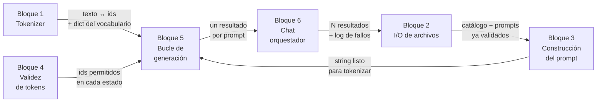

# PROJECT.md

> [!important] Documento vivo
> Aquí se anota **todo** el proyecto: restricciones, conceptos, bloques, clases y progreso.
> Lo rellena el agente conforme se avanza. Es lo que leerá un agente nuevo para saber en qué punto están.

---

## 🗺️ Mapa de flujo

> [!info] Dónde estamos
> **Fase actual:** `FASE 1` — diseño. Arrancada el 2026-08-10
> **Progreso del cuestionario de Fase 0:** **10/10 en `dominado`**, todos cerrados por el estudiante
> **Hecho en Fase 1:** lista de **responsabilidades sueltas completa** (14 obligatorias + 7 de bonus) · **6 bloques identificados y ordenados** por dependencia · ==**Bloques 1, 2 y 3 cerrados**== — `src/tokenizer.py` (08-24), `src/filemanager.py` y `src/promptbuilder.py` (08-25), los tres con `flake8` y `mypy --strict` limpios y **195 tests verdes** en total
> **Siguiente paso:** seguir diseñando el **Bloque 4 — Validez de tokens**, clase `Guardian`. **Sin cuestionario esta vez** — se arranca repasando `[[PROJECT#Abierto en este bloque — cortado aquí el 2026-08-26, sin cuestionario]]`, pedido explícito suyo. ==La pila del bonus 7 se descartó== — el diseño gira a esqueleto+huecos, ver detalle en el bloque
> **Del Bloque 1 no queda nada abierto** — ver `[[PROJECT#Las tres pasadas de revisión — cerradas el 2026-08-24]]`
> **Requisito recuperado del subject el 2026-08-18:** *"All classes must use pydantic for validation"* (IV.3.1, literal). Aplicado ya al `Tokenizer` con `@validate_call` + `FilePath`; **todas las clases siguientes nacen con él**
> **Diferido a la fase de tests:** la **hoja de evaluación** y la estrategia de medición del 90% — decisión suya, 2026-08-17. Razón: el test que zanja el Bloque 1 es `assert mi_ids == sdk_ids`, que no necesita medir acierto. Se retoma al montar los tests, y **ahí se decide qué se mantiene**
> **Vista rápida de los bloques:** `[[FLOW]]`
> **Bloqueos abiertos:** ninguno
> **Al abrir sesión:** lanzar el cuestionario ya escrito en `[[PROJECT#📋 Cuestionario de la próxima sesión]]` — una pregunta por mensaje
> **Alcance:** se van a implementar **los 9 bonus** (decisión del estudiante, 2026-08-07) — ver `[[PROJECT#Alcance — bonus]]`
> **Arrastrado a Fase 2:** reforzar los **imports relativos** del Tema 3 en el momento en que aparezca el primero, sin esperar a que él lo pida
> **A reforzar:** todo lo pendiente está en una sola tabla — `[[PROJECT#🎯 Lista de refuerzo]]`. El histórico de los repasos vive en `[[REVIEWS]]` y **no se lee** salvo que haga falta



| Bloque | Descripción | Estado | Qué recibe | Qué entrega |
|---|---|---|---|---|
| 1 — Tokenizer | `encode`/`decode` propios desde `vocab.json` y `merges.txt` | ✅ | Rutas del SDK | Texto ↔ ids, y el `dict` string → id |
| ↳ | *cerrado el 08-24: las tres pasadas hechas, `flake8` y `mypy --strict` limpios, 129 tests verdes* | | | |
| 2 — I/O de archivos | Leer y validar los JSON de entrada, escribir salida y log | ✅ | Rutas de los argumentos | Catálogo y prompts validados, el archivo de resultados y el log |
| ↳ | *cerrado el 08-25: los seis métodos y los tres getters escritos, 46 tests verdes, `mypy --strict` limpio* | | | |
| 3 — Construcción del prompt | Plantilla de chat y tokens especiales del modelo | ✅ | Catálogo + prompt del usuario | Un string listo para tokenizar |
| ↳ | *cerrado el 08-25: `PromptBuilder` con la plantilla de Qwen y el catálogo en JSON, 20 tests verdes* | | | |
| 4 — Validez de tokens | FSM/PDA + schema + cache de lista blanca | 🔵 | Estado del JSON y schema | Ids permitidos en ese estado |
| 5 — Bucle de generación | Logits, máscara, `argmax`, parada, validación `pydantic` | ⚪ | Todo lo anterior | Un resultado por prompt |
| 6 — `Chat` orquestador | Recorre los N prompts y junta los resultados. Recibe las piezas hechas | ⚪ | Los bloques ya construidos | N resultados + registro de fallos |

**Estados:** ✅ cerrado · 🔵 en curso · ⚪ pendiente · 🔴 bloqueado

> [!note] Se actualiza al cerrar cada bloque
> Las flechas del diagrama llevan **qué le entrega un bloque al siguiente**. Sin eso el diagrama solo muestra orden; con eso muestra el contrato entre bloques.

---

## 🎯 Lista de refuerzo

> [!important] Una sola lista, acumulada — petición del estudiante, 2026-08-11
> Todo lo que hay que reforzar vive **aquí y solo aquí**. No se busca en las entradas de repaso ni en las filas del cuestionario de verificación.
> Una fila por tema. Se añade en el momento en que aparece; se marca ✅ cuando resiste una pregunta sin ayuda, y **no se borra** — el histórico de que costó es lo que evita darlo por sabido demasiado pronto.

**Origen:** 🙋 lo pidió él · ❌ falló en un cuestionario · 🔍 lo propone el agente
**Estado:** 🔴 pendiente · 🟡 explicado, sin verificar · ✅ resiste sin ayuda · ⏸️ diferido a Fase 2 por decisión suya

| Tema | Origen | Estado | Cómo preguntarlo / qué falta |
|---|---|---|---|
| **De qué depende la lista blanca** — las dos cosas: texto ya escrito + schema del campo | ❌ 08-11 · ❌ 08-12 | 🟡 | Segunda vez que falla. El 08-12 contestó *"del catch y de la máscara"* — confunde el **resultado** con la causa. Sacó el **schema** con el par `{"a":` number vs `{"s":` string; el **texto ya escrito** dijo *"no sé"* y se le dio directo (par `{"a":` vs `{"a": 40`, mismo schema). Preguntar siempre con **dos congelados que solo cambien en una de las dos cosas** |
| **Cache de la lista blanca (bonus 4)** — qué va de clave y qué de valor | ❌ 08-11 · 🙋 diferir | ⏸️ | Volvió tres veces al `dict` invertido del tokenizer. Explicado con dos bloques de código; quedó *"medio claro"*. **Se explica de nuevo al implementar el bonus 4**, y se pregunta antes de escribirlo |
| **Por qué el Bloque 4 es bloque propio** | ❌ 08-11 | ✅ 08-17 | Preguntado por el test de la lista blanca: contestó **vocabulario**, y que el modelo no hace falta — *"lo que hace el modelo es predecir en base a vocabulario que yo le permito usar"*. Sin ayuda |
| **Qué es un tensor — una fila es un texto entero, no un token** | 🙋 08-11 · ❌ 08-11 · ❌ 08-12 · 🙋 08-12 | 🟡 | Falló otra vez el 08-12: dijo que cada fila era *"un token id"*, y luego preguntó si las filas eran los turnos (pregunta/respuesta). **Lo que funcionó:** poner dos textos con nombre (`texto_A`, `texto_B`) al lado del tensor de dos filas y preguntar *"¿en qué fila quedó `texto_B`?"* — contestó "segunda" y ahí lo vio. Corregido también: la conversación entera va en **una sola fila**; lo que separa turnos son los tokens especiales (`<\|im_start\|>`), no las filas. Pidió él reforzarlo |
| **Por qué un prompt por llamada** — la razón, no la regla | ❌ 08-10 · ❌ 08-12 · 🙋 08-12 | 🟡 | 08-12: dio tres razones ciertas pero secundarias (contexto, localizar errores, contador de profundidad) y se le escapó la de fondo. **Lo que lo desbloqueó:** pegar los 5 prompts y preguntar *"¿de cuál de los 5 es el token que sale de `argmax`?"* — reaccionó con *"¿pueden mezclarse las respuestas?"*. No se mezclan: solo hay **una** continuación, la del último token; los otros 4 prompts quedan como contexto sucio. Pidió él reforzarlo |
| **Por qué batching no aplica aquí — y paralelizar llamadas no es batching** | 🔍 08-10 · 🙋 08-12 | 🟡 | Explicado el 08-12 con entrada de 2 filas → salida de 2 filas de logits, cada fila aislada. Dos cosas que anotó: (a) `get_logits_from_input_ids` recibe **lista plana**, así que el SDK no admite filas; (b) propuso llamar N veces en paralelo — eso son **N pasadas completas** por las 28 capas, no una compartida, y sin GPU una sola pasada ya reparte el trabajo entre todos los núcleos. Pidió él reforzarlo. Preguntar por la diferencia entre las dos cosas, no por la regla |
| **Tabla byte↔carácter: el desplazamiento es `256 + puesto`, no `256 + byte`** | ❌ 08-11 · 🙋 08-11 | ✅ 08-12 | Costó cuatro intentos y tres *"no entiendo"*. Lo que por fin funcionó: poner los invisibles en fila (`0…32, 127, 128…`) y preguntarle **qué puesto ocupa el 127** — contestó 33 al primer intento. Lo abstracto lo bloquea; contar puestos en una fila concreta lo desbloquea. También falló creyendo que `chr(byte)` valía para los 256, y que ASCII llegaba a 256 (llega a 127; un byte son 256 valores). Preguntar con el 127, nunca con el espacio — con el espacio la regla mala y la buena coinciden |
| **BPE byte-level** — el suelo del vocabulario son los **256 bytes**, no las letras | 🙋 08-11 | ✅ 08-12 | Verificado con el emoji `🜛` nunca visto: *"no es el carácter lo que pasa, se pasa todo a bytes"*. Sin ayuda |
| **Prioridad de merges** — se fusiona la regla de línea más baja, no de izquierda a derecha | 🔍 08-12 | ✅ 08-12 | `l o w` con `o w` en la línea 5 y `l o` en la 900 → contestó `ow` a la primera |
| **Por qué `raise` es salida válida para mypy** — un método que lanza no necesita `Optional` | ❌ 08-12 · ❌ 08-14 · ❌ 08-17 | ✅ 08-18 | **Tercera vez.** El 08-17 lo atribuyó al `try-except` y no al `raise`, y llamó a la excepción *"como hacer un return ERROR"*. Lo que aisló el `raise`: el mismo `except` con `raise` vs con `print`, y que mypy solo se queja en el segundo. Lo que mató el *"return ERROR"*: `t = Tokenizer("no_existe.json"); print(t)` → **`NameError`**, la asignación nunca ocurre; no hay `Tokenizer` con vocabulario vacío, no hay `Tokenizer`. **Preguntar por dónde queda el valor**, no por el tipo. · **08-18, limpio a la cuarta:** *"se ejecuta el raise y no se devuelve nada"*, sin ayuda |
| **Los dos patrones de la clase** — cuál corta por especiales y cuál corta el texto de en medio | ❌ 08-14 · ❌ 08-17 | 🟡 | **08-17: la mitad ya la tiene** — dio los 3 tramos exactos del `split` de especiales. Lo que falló: qué devuelve el `findall`, *"no sé en qué patrones los divide"*. Se **ejecutó** con su patrón sobre `"<|im_start|>user\nGreet<|im_end|>"` → `['<|','im','_start','|>','user','\n','Greet','<|','im','_end','|>']`: despedaza el especial en 4 trozos, que es justo por lo que el `split` va primero. **Preguntar por la salida del `findall`** — la del `split` ya la sabe |
| **Los especiales no están en `vocab.json`** — sus ids salen de `added_tokens` | ❌ 08-14 ×2 | ✅ 08-17 | **08-17, a la primera y sin ayuda:** *"son ids especiales que solo se encuentran definidos en el archivo del tokenizer"*. · El 08-14 dijo *"no entiendo"* dos veces. Lo que lo desbloqueó fue pedirle que mirara bajo qué clave de primer nivel estaba el `<|endoftext|>` que tenía seleccionado: `added_tokens`. Reforzar con las dos búsquedas al lado (`_vocab[...]` → KeyError vs `special_ids[...]` → 151644) |
| **El bucle de merges corre por trozo, no sobre el texto entero** | ❌ 08-14 | ✅ 08-17 | **08-17, sin ayuda:** *"corre 12 veces, una para cada trozo"*, y preguntado qué fusión sería posible con el texto pegado contestó **`40`** — el caso exacto: `'4'` y `'0'` salen como trozos distintos y pegados serían vecinos. · El 08-14 contestó *"corre sobre todo"*. Cuatro explicaciones no lo movieron; lo cerró **hacerle escribir los pares vecinos** de `'Greet'` y `'Ġshrek'` y buscar el par `('t','Ġ')` en sus propias listas — no estaba. El regex pone muros: ninguna fusión los cruza |
| **La regla de pre-tokenización de Qwen** — qué hace el patrón y por qué no se parchea después del split | ❌ 08-14 · 🙋 08-14 · ❌ 08-17 | ✅ 08-18 | **08-17:** la consecuencia la tiene —con ids distintos se cae **el acierto**, no el JSON válido— pero la mecánica no. Ante `"Greet shrek!\n\n"` con las dos salidas al lado dijo *"no sé"* qué le pasa al `!` y al espacio → directo: el `split(" ")` **se come el espacio** (y `Ġshrek` es otra entrada, otro id), y el `!` **queda pegado**, así que el bucle puede fusionar `('k','!')`. · El 08-14 dijo *"no entendí lo del patrón ni sé qué hace ese patrón"*. Ante `'\|>\n'` propuso un parche a posteriori (`if [i] == "\|>" and [i+1] == "\n"`); el caso `"Greet shrek!\n\n"` → `'!\n\n'` lo tumbó y dijo *"no tengo ni idea"*. Se le dio la rama ` ?[^\s\p{L}\p{N}]+[\r\n]*`. **Es el pendiente grande de `encode`** — se retoma entero al escribir el cuerpo. · **08-18, limpio:** con `"Greet shrek!\n\n"` y `split(" ")` contestó *"el espacio desaparece, el ! queda pegado a k!\n"* — las dos mitades, sin ayuda |
| **Orden de los `except`: la subclase antes que la padre** | 🔍 08-14 | 🟡 | Con `JSONDecodeError` (subclase de `ValueError`) cazado por un `except ValueError`, propuso primero reordenar `FileNotFoundError`/`ValueError` — dos ramas que nunca competían. Con la colisión señalada llegó solo: *"tengo que crear un except para json y lo coloco antes de value"*. Preguntar con dos excepciones donde una herede de la otra |
| **`str` vs `bytes`, y la dirección de `encode`/`decode`** | ❌ 08-12 · 🔍 08-12 · ❌ 08-14 · ❌ 08-17 | ✅ 08-18 | **08-17, tercera vez el mismo corolario:** contestó **5** bytes otra vez, y *"quiero 4"*. Se le pidió **contar por carácter** (`J o s à ©`) y dijo *"1"* para todos → se ejecutó: `Ã` = `b'\xc3\x83'` y `©` = `b'\xc2\xa9'`, 2 bytes cada uno por caer fuera de ASCII. Total **7**, quiere **5**. **No preguntar por el total: preguntar cuántos bytes ocupa `Ã` sola.** · **08-14: la dirección ya la tiene** — *"decode solo actúa sobre un byte array"*, limpio y sin repetir `.unicode`. **Lo que sigue fallando es el corolario:** preguntado cuántos bytes da `"José".encode("utf-8")` contestó **5**; son **7**, porque la `Ã` es el disfraz del byte 195 pero como carácter ocupa a su vez 2 bytes (`b'\xc3\x83'`). Se cerró ejecutándolo carácter a carácter. **Preguntar siempre por el número de bytes, no por la dirección** — la dirección ya está. · Dijo `"José".unicode("utf-8")` — inventó el método (`.unicode` no existe) y lo aplicó sobre un `str`. **Un `str` no se decodifica: ya está decodificado.** Se le corrió el caso: `"José".encode("utf-8")` da **7 bytes**, y los que quiere son los **5** que él reconstruye con `_char_byte`. Corolario que no vio: los bytes del bytearray **no** son "los bytes de esa string". Regla fijada: `str --encode--> bytes`, `bytes --decode--> str`. Repitió `unicode` tres veces en la misma sesión — preguntar por el **nombre y la dirección**, no por el concepto |
| **Byte 195 ≠ `chr(195)`** — el carácter del disfraz ocupa a su vez sus propios bytes | 🙋 08-12 | 🟡 | Preguntó *"¿cómo llega la `é` a mi equipo si no tiene ese byte, mi computador tiene más bytes?"*. Un byte es siempre 0–255; la `é` son **dos** bytes (195, 169) que el terminal renderiza como un glifo. Y `chr(195)` = `Ã`, que en UTF-8 son otros dos bytes (195, 131). Llegó él a la analogía que lo cerró: *"mi terminal tiene un render"*. **Sin verificar** |
| **Imports relativos** — por qué `python -m src` fija `__package__` y `python src/__main__.py` no | 🙋 08-07 | ⏸️ | Petición suya: reforzarlo **cuando aparezca el primer import relativo** en el código, sin esperar a que lo pida |
| **Cómo se construye la tabla byte↔carácter** — el algoritmo, las ~10 líneas | 🙋 08-11 | ⏸️ | Sabe *qué* hace en las dos direcciones, que es lo que necesitaba para el diseño. El *cómo* se explica al escribir el tokenizer |
| **Decodificar byte a byte** — acumular y una sola llamada a `.decode("utf-8")` | ❌ ×3 (08-07, 08-10) | ✅ 08-11 | Cuarta vez preguntado, primera limpia, con el caso de `José`. Volver a tocarlo solo si reaparece |
| **Token vs carácter** | ❌ ×2 (08-10) | ✅ 08-11 | `dd_numbers` = una vuelta del bucle, 10 caracteres. Respondido sin dudar |
| **`loads` / `dump`** — cuál convierte en qué dirección | ❌ 08-10 | ✅ 08-11 | — |
| **Determinismo de greedy** | ❌ 08-10 | ✅ 08-11 | — |

| **Qué prueba un test de juguete y qué no** — coherencia interna vs coincidir con Qwen | 🔍 08-17 | ✅ 08-18 | Sin preguntar todavía. Los 40 tests de juguete pasaban con el modelo sin instalar; el `assert mi_ids == sdk_ids` es lo único que dice que los ids son los de Qwen. Preguntar con la escena real: *"esta mañana pasaban 40 tests y el modelo no existía"*. · **08-18, correcto:** *"no estábamos probando directamente contra el modelo, así que no era verídico"* |
| **Por qué un vocabulario de juguete y no el real** | 🔍 08-17 | ✅ 08-25 | Sin preguntar. La razón es que con el de juguete **eliges qué reglas de merge existen**, y sin eso no puedes probar prioridad, fusiones encadenadas ni el muro entre trozos. El coste (1.5 GB, 6 s por carga) es secundario. · **08-18: falló de entrada** — contestó *"validar sobre los 256 bytes"*, que es el suelo que tienen los dos. Lo desbloqueó el caso discriminante: *"quiero probar que se fusiona la regla de línea más baja; con dos líneas `a b` y `b c`, ¿podrías montar ese test con el `merges.txt` real?"* → *"tendría que adaptarse a la tabla del modelo real"*. **Preguntar siempre con una regla de merge concreta que quieras forzar** · **08-24, segunda vez que falla:** *"nada me impide nada, la idea del test es verificar que el código se adapta al formato"*. Lo que por fin lo desbloqueó fue apuntar al **`assert`** y no al test: *"con el de juguete sabes qué resultado esperado poner porque escribiste las dos líneas; con el real, ¿de dónde lo sacas sin ejecutar tu propio `encode`?"* → *"del encode del modelo"*. **Preguntar por el resultado esperado, nunca por el test** · **08-25, tercera vez preguntado y primera limpia:** *"del encode de qwen"*, a la primera y sin ayuda |
| **Las cuatro piezas de `pytest`** — `tmp_path`, `fixture`, `parametrize`, `pytest.raises` | 🙋 08-17 | ⏸️ | Lo pidió él: *"quiero revisar un poco los tests para entender cómo lo testas"*. Es un **repaso guiado** de `tests/test_bloque_1.py`. **Cortado por él el 08-18 a los dos minutos:** *"no me expliques pytest, brevemente dime qué se testea y ya; el objetivo no es aprender pytest sino entender por qué el test valida mi trabajo"*, y después *"no tengo ahorita la capacidad para entender, estoy un poco bloqueado"*. **No se re-ofrece.** Si vuelve, se hace por lo que **prueba** cada sección, nunca por la herramienta |

| **Qué es la caché de Hugging Face** — dónde viven de verdad `vocab.json`, `merges.txt` y `tokenizer.json` | 🙋 08-25 | ✅ 08-26 | **08-26, sin ayuda:** *"se descargan de hugging face, en máquina sin red no arranca"*. **Lo pidió él**: *"al finalizar la sesión me explicas qué es porque no me acuerdo"*. Salió al verificar los `\n` de la plantilla de chat: el `tokenizer_config.json` está **en la caché pero el SDK no expone su ruta** — solo da vocab, merges y tokenizer |
| **Mecánica del `\n` en la plantilla** — qué hace el `findall` distinto con `"system You"` frente a `"system\nYou"` | 🔍 08-26 | 🟡 | Dio la razón general (*"así es como el modelo aprendió a usar las plantillas"*), correcta pero sin el mecanismo — *"no recuerdo"* al pedirle el `findall`. Directo: con espacio, `"You"` sale con `Ġ` pegado; con `\n`, el patrón corta ahí y sale sin `Ġ`, otro id. Engancha con la pre-tokenización del Bloque 1, ya trabajada varias veces — reforzar con el mismo formato que funcionó ahí: dos salidas del `findall` puestas al lado |
| **Las dos familias de fallo del log** — por qué el fichero ausente no puede ir en `prompts` | ❌ 08-24 · ❌ 08-25 | ✅ 08-26 | **08-26, sin ayuda (`[]` en `function_calling_tests.json`):** *"output con `[]` y logs no"* — sabe que sin fallos no hay `logs/logs.json`. Acertó la clave (`files`) y en el porqué dijo *"no sé"* → directo: **no hay índice que poner**, el fichero revienta antes de que exista el array de prompts. Ese nivel de fuera lo añadió él el 08-18 · **08-25, segunda vez:** la clave otra vez bien, el porqué otra vez circular. Con la entrada delante dijo *"ninguno porque no tiene"*, y al preguntarle **en qué momento revienta** lo cerró solo y mejor: *"lanza error en `FileManager` al instanciar, con `validate_call` y `FilePath`"* |
| **`charge_logs` vs `write_logs`** — quién acumula y quién abre el archivo | ❌ 08-24 · ❌ 08-25 | ✅ 08-26 | **08-26, sin ayuda:** distinguió que con `[]` no hay fallos que loguear, así que `write_logs` no se dispara — la asimetría con `write_replies` (que sí escribe siempre) ya la tiene clara · **08-25:** el número de aperturas ya lo tenía — *"1, porque primero se registra todo en el atributo y solo al final, caso existan logs, se abre"*— pero adjudicó el `open` a `Chat`. Lo cerró poner los dos métodos **con la clase delante** (`class FileManager:`) y preguntar quién ejecuta el `open`. **Lo que se le iba era de qué clase es el método, no el mecanismo** |
| **Qué comparten `validate_functions` y `validate_prompts`** — `_load_json` privado | ❌ 08-24 | 🔴 | *"no recuerdo"* → directo: se comparte **leer** (`open` + `json.load` + los dos guards); no se comparten **las reglas**, porque el catálogo mira `name`/`description`/`parameters`/`returns` y los prompts `{"prompt": str}` |

| **`FilePath` vs `Path` vs `str`** — cuál exige que el archivo exista | 🔍 08-24 | 🟡 | Enseñado ejecutando: la misma ruta inexistente pasa por `Path` y la rechaza `FilePath` (`path_not_file`). Y `Path(...).parent` da la carpeta lista para `mkdir`, donde su `split("/")` daba una lista que hay que reunir. Preguntar con la ruta de salida la primera vez que se corre el programa |
| **Qué hace `@validate_call`** — sin él la anotación no comprueba nada, y valida **antes** del cuerpo | 🔍 08-24 · ❌ 08-25 · 🙋 08-25 | ✅ 08-26 | **08-26, sin ayuda:** con la función del `print("ENTRE AL CUERPO")` delante, contestó directo que **no** se imprime — ya tiene el momento, no solo el hecho de que falla · **08-25:** sabía que revienta, pero dijo que revienta **después** de entrar al cuerpo. Se ejecutó y se vio: `ValidationError: path_not_file` y **el `print` no salió** |
| **`TypeSpec` referenciándose a sí mismo** — el campo opcional absorbe la varianza | 🔍 08-24 | ✅ 08-25 | Es lo que sostiene el bonus 7. **08-25, sin ayuda:** *"se llama recursivamente… si anidan más, la estructura deja de ser `None` y crea `TypeSpec` on demand dependiendo de la cantidad de anidaciones"*. Matiz corregido en el momento: dijo *"siguiendo el estándar de JSON"* — `properties` es **convención de JSON Schema**, no dato del subject |

| **Qué valida `pydantic` y qué no** — tipo y forma sí; contenido del archivo no | 🔍 08-18 | ✅ 08-24 | **08-24, sin ayuda:** con el `vocab.json` que existe y contiene `{}` fue directo a su propio `except ValueError: raise ValueError("Vocabulary's file empty")`. `FilePath` cubre existencia; *vocab vacío*, *JSON corrupto* y *falta la clave del patrón* siguen siendo de sus guards |

> [!warning] Regla de reincidencia
> Un tema que falla **tres veces** baja de ✅ a 🟡 en el `[[PROJECT#Cuestionario de verificación]]`, y la explicación que se usó las veces anteriores se busca en `[[REVIEWS]]` — para no repetir la que ya no funcionó.

---

## 📋 Cuestionario de la próxima sesión

> [!important] Se escribe al **cerrar** la sesión, no al abrirla — petición del estudiante, 2026-08-11
> El agente saliente deja aquí las preguntas ya redactadas. Así el agente entrante no tiene que deducirlas, y el estudiante se pone al día con lo de ayer y refuerza lo que le cuesta, en el mismo cuestionario.
>
> **Y se escribe al final de todo, nunca a mitad de sesión.** Si se redacta antes de terminar, deja fuera lo trabajado después — que es lo más reciente y lo que más riesgo tiene de olvidarse. Pasó el 2026-08-11: se escribió a media tarde y hubo que rehacerlo al cerrar.
>
> **Cómo se construye:** mitad de la `[[PROJECT#🎯 Lista de refuerzo]]` (lo que está en 🔴), mitad de lo trabajado en la sesión que se cierra.
> **Cómo se lanza:** 4–6 preguntas · **una por mensaje** · en orden de ejecución del programa · un fallo **no se corrige dando la respuesta**, se le pone el caso límite concreto — solo si dice *"no sé"* se responde directo.
> **Al terminar:** la entrada del repaso va a `[[REVIEWS]]`, y la `Lista de refuerzo` se actualiza (nuevas filas, estados que cambian).

### Para la sesión siguiente al 2026-08-25

> [!info] Seis preguntas — dos pedidas por él, cuatro de lo de hoy
> Las dos primeras las **pidió él** al final de la sesión. Las otras cuatro son de lo trabajado hoy: el cierre del Bloque 2 y el Bloque 3 entero.
> Cada pregunta lleva su escenario escrito: sin encuadre se pierde.

1. Tienes esta función delante y le pasas una ruta que no existe:

```python
@validate_call
def crear(output_path: FilePath) -> None:
    print("ENTRE AL CUERPO")
```

   ¿Se imprime `ENTRE AL CUERPO`? *(pedida por él el 08-25 · refuerzo 🔴 — el 08-25 contestó que el error salta **después** de entrar al cuerpo. **Preguntar por el momento, nunca por si falla**: que falla ya lo sabe)*

2. `vocab.json` y `merges.txt` no están en el repositorio y aun así tus 129 tests del Bloque 1 corren contra los archivos reales de Qwen. ¿De dónde salen esos archivos y qué pasaría la primera vez en una máquina sin red? *(pedida por él el 08-25: "al finalizar la sesión me explicas qué es porque no me acuerdo" — se le explicó al cerrar; esto comprueba que quedó)*

3. Corres el programa con `function_calling_tests.json` conteniendo `[]`. Al terminar, ¿qué archivos existen en disco y qué hay dentro de cada uno? *(lo de hoy — es la asimetría que decidió: `write_logs` lleva guard y `write_replies` no)*

4. Tu `PromptBuilder` recibe la lista de funciones en el `__init__` y tiene un `get_prompt` que llamas 11 veces. ¿Qué parte del texto se construye una sola vez, y qué pasaría si la armaras dentro de `get_prompt`? *(lo de hoy — la decisión que sostiene el diseño del bloque)*

5. Escribiste la plantilla con **espacios** entre los tramos (`<|im_start|>system You have...`) y se cambió a `\n`. El texto se lee igual. ¿Por qué le importa al modelo? *(lo de hoy — engancha con la pre-tokenización del Bloque 1, que ya trabajó. Si se atasca: preguntarle qué le hace el `findall` a `"system You"` frente a `"system\nYou"`)*

6. Este archivo corre bien con `python -m src` y revienta con `python src/promptbuilder.py`:

```python
from .filemanager import Function
```

   ¿Qué es lo que Python no sabe en el segundo caso? *(lo de hoy — el tema que él aplazó el 08-07 y se reforzó al aparecer el primer import relativo. La respuesta es `__package__`)*

> [!note] Banco para la sesión siguiente
> Por qué `exclude_none=True` al serializar el catálogo · por qué las marcas de chat se escriben en vez de sacarlas de `added_tokens` · qué aporta `@validate_call` en el `PromptBuilder` si `mypy` ya caza el tipo · por qué la salida es un array y no un dict por índice · por qué `batching` no aplica y en qué se diferencia de paralelizar llamadas · qué es la caché de Hugging Face.

> [!important] Orden de la próxima sesión
> | # | Qué | Por qué |
> |---|---|---|
> | 1 | **Cuestionario de repaso** | Regla suya: *"cuestionarios siempre primero"* |
> | 2 | **Bloque 4 — Validez de tokens** | Siguiente en orden de dependencia. Su diseño lo propone él, y es donde nace la **máscara con pila** del bonus 7 |
>
> ==Los Bloques 1, 2 y 3 están cerrados.== Fuera de los bloques siguen sin existir `src/__main__.py`, el `pyproject.toml` de la raíz y la regla `lint` del `Makefile`.
> **El repaso guiado de `pytest` no se re-ofrece.**

---

### Para la sesión siguiente al 2026-08-24

> [!success] Lanzado y cerrado el 2026-08-25 — entrada en `[[REVIEWS]]`
> **3 limpias de 6.** Lo escrito ayer en `src/` resistió (`TypeSpec`, `validate_python([])`); los tres 🔴 heredados necesitaron el caso concreto otra vez.

> [!info] Seis preguntas — tres de refuerzo, tres de lo de hoy
> Los tres 🔴 vienen del repaso de hoy, que salió 1 de 5. Los tres de hoy son del `FileManager` y de `pydantic`, y se preguntan ahora **porque ayer los conoció por primera vez** — preguntarlos el mismo día no habría medido nada.
> Cada pregunta lleva su escenario escrito: sin encuadre se pierde.

1. Estás corriendo el programa y `functions_definition.json` no existe. El error acaba en `logs/logs.json`. ¿Bajo qué clave de primer nivel, y por qué no puede ir bajo la otra? *(refuerzo 🔴 — falló el 08-24; la clave la acertó, el porqué fue "no sé". Si se atasca: enseñarle una entrada de `prompts`, `{"3": "mensaje"}`, y preguntar qué número le pondría al fichero que falta)*

2. Fallan el prompt 3 y el prompt 7. ¿Cuántas veces se abre `logs/logs.json` durante toda la ejecución, y qué clase lo abre? *(refuerzo 🔴 — el 08-24 contestó "dos veces, y lo abre `Chat`". Lo que lo cerró: ponerle sus dos métodos delante —`charge_logs` carga en el dict, `write_logs` escribe al final— y preguntar para qué serviría `charge_logs` entonces)*

3. Los tests fabrican un `merges.txt` de dos líneas para comprobar que se fusiona la regla de línea más baja. Si en vez de eso usaras el `merges.txt` real de Qwen, ¿de dónde sacarías el resultado esperado que va en el `assert`, sin ejecutar tu propio `encode`? *(refuerzo 🔴 — falló el 08-18 y el 08-24. **Preguntar por el resultado esperado, nunca por "qué te impide escribir el test"** — eso le pide escribir tests, que no son suyos)*

4. En `FileManager` las dos rutas de entrada van anotadas `FilePath` y la de salida `Path`. Es la primera vez que corres el programa y `data/output/` no existe. ¿Qué pasaría si a `output_path` le pusieras `FilePath`? *(lo de ayer)*

5. Tu `TypeSpec` tiene `properties: Optional[Dict[str, "TypeSpec"]] = None`. En `functions_definition.json` no hay ni un parámetro anidado. ¿Por qué el mismo modelo vale igual para el catálogo plano que tienes y para uno anidado de tres niveles? *(lo de ayer — el bonus 7 se apoya entero en esto)*

6. Le pasas al `FileManager` un `function_calling_tests.json` que contiene exactamente `[]`. ¿Lo corta `TypeAdapter(List[Prompt]).validate_python(...)` o pasa? ¿Y por qué decidiste no ponerle guard? *(lo de ayer — dónde acaba pydantic y dónde empiezan sus guards)*

> [!note] Banco para la sesión siguiente
> Por qué `raise ValidationError("mensaje")` no se puede escribir · qué hace `extra="forbid"` y qué pasa sin él · por qué `Chat` atrapa y `FileManager` escribe · su propio argumento de por qué **no** se comprueba la coherencia de `vocab.json` y `merges.txt` en `__init__` · por qué `parameters` no puede atarse a un solo nivel · por qué `batching` no aplica y en qué se diferencia de paralelizar llamadas.

> [!important] Orden de la próxima sesión
> | # | Qué | Por qué |
> |---|---|---|
> | 1 | **Cuestionario de repaso** | Regla suya: *"cuestionarios siempre primero"* |
> | 2 | **Seguir el Bloque 2** | `charge_logs`, `write_logs`, `write_replies`, y decidir qué queda de los dos `validate_*` |
>
> ==El Bloque 1 está cerrado del todo.== Del Bloque 2 sigue abierto renombrar `src/validator.py` y `logs/` al `.gitignore`.
> **El repaso guiado de `pytest` no se re-ofrece.**

---

### Para la sesión siguiente al 2026-08-18

> [!info] Cinco preguntas — tres del Bloque 2 de hoy, dos de refuerzo
> Los cuatro 🔴 que quedaban de la lista **cayeron limpios hoy**, así que el peso se va a lo trabajado: el diseño del Bloque 2 y el requisito de `pydantic`.
> El único fallo del repaso de hoy (vocabulario de juguete) vuelve, con la forma que sí lo desbloqueó.

1. Le pasas al `Tokenizer` un `vocab.json` que **existe** y contiene `{}`. ¿Lo corta `pydantic` o llega a tu guard? *(refuerzo 🟡 — es la frontera entre lo que valida `FilePath` y lo que sigue siendo suyo)*

2. Los tests fabrican un `merges.txt` de dos líneas para probar la prioridad. Con el `merges.txt` real de Qwen, ¿qué te impide escribir **ese mismo test**? *(refuerzo 🟡 — el 08-18 contestó "los 256 bytes"; lo desbloqueó pedirle montar el test de la regla de línea más baja con la tabla real)*

3. `functions_definition.json` no existe. Con lo diseñado ayer, ¿en qué clave de `logs/logs.json` acaba ese error, y por qué no puede ir en la otra? *(lo de ayer — las dos familias de fallo, la que tiene índice y la que no)*

4. El prompt 3 revienta dentro del tokenizer. Recorre el camino del mensaje desde donde se lanza hasta que queda escrito en el archivo, nombrando qué clase hace cada paso. *(lo de ayer — el `Tokenizer` lanza, `Chat` atrapa, `FileManager` carga y escribe. Es la decisión que costó más discusión)*

5. `validate_functions` y `validate_prompts` van a leer un JSON cada uno. ¿Qué parte se comparte y qué parte no, y cómo quedó repartido? *(lo de ayer — `_load_json` privado; las validaciones separadas porque sus reglas no se parecen)*

> [!note] Banco para la sesión siguiente
> Qué devuelven `validate_functions` y `validate_prompts` · por qué `parameters` no puede atarse a un solo nivel (bonus 7) · de dónde salen las cadenas vacías de `split` · por qué `regex.escape` es obligatorio en el patrón de especiales · por qué la clave de los merges es una **tupla** · por qué `batching` no aplica y en qué se diferencia de paralelizar llamadas.

> [!important] Orden de la próxima sesión
> | # | Qué | Por qué |
> |---|---|---|
> | 1 | **Cuestionario de repaso** | Regla suya: *"cuestionarios siempre primero"* |
> | 2 | **Cerrar el diseño del Bloque 2** | Faltan atributos, firmas y los modelos `pydantic` — los propone él. Ver `[[PROJECT#Abierto en este bloque]]` del Bloque 2 |
>
> Del Bloque 1 siguen abiertas las dos pasadas: **guards** y **`flake8`/`mypy`** (con `flake8` y `mypy` sin instalar en el venv).
> **El repaso guiado de `pytest` no se re-ofrece** — lo cortó él el 08-18.

---

### Para la sesión siguiente al 2026-08-17

> [!success] Lanzado y cerrado el 2026-08-18 — entrada en `[[REVIEWS]]`
> 4 limpias de 5. El repaso guiado de los tests lo cortó él a los dos minutos.

> [!info] Cinco preguntas + un repaso guiado — corto a propósito
> Aprobado por él al cerrar: *"no aprendimos mucho… necesito no perder mucho tiempo en eso"*. Tres preguntas son de los 🔴 que **fallaron hoy** (dos de ellos por tercera vez) y dos de lo que sí se hizo: los tests.
> **El repaso guiado lo pidió él:** *"quiero incluir el revisar un poco los tests para entender como lo testas"*. Va **dentro de la fase de cuestionario**, al final, y son 10 minutos — no es una pregunta.

1. Tienes `_load_vocab` delante y le pasas una ruta que no existe. La firma promete `Dict[str, int]`. ¿Dónde queda el diccionario que el método iba a devolver? *(refuerzo 🔴 — **tercera vez**: 08-12, 08-14, 08-17. Lo que funcionó el 08-17 fue el `NameError` de `print(t)` dentro del `except`; lo que **no** funciona es preguntar por el tipo en abstracto)*

2. ¿Cuántos bytes ocupa **`Ã` sola** en UTF-8? *(refuerzo 🔴 — **tercera vez**. Preguntar por `Ã`, nunca por el total de `"José"`: con el total contesta 5 contando caracteres y parece que lo tiene)*

3. Partes `"Greet shrek!\n\n"` con `split(" ")` en vez de con el patrón. Qué le pasa **al espacio** y qué **al `!`**. *(refuerzo 🔴 — el 08-17 dio la consecuencia correcta, "el acierto disminuye", pero la mecánica fue *"no sé"*)*

4. Esta mañana los **40 tests de juguete** pasaban y el modelo no estaba ni instalado. ¿Por qué eso no demostraba que tu `encode` fuera correcto, y qué añade el `assert mi_ids == sdk_ids`? *(lo de hoy — es la diferencia entre coherencia interna y coincidir con Qwen)*

5. Los tests fabrican un `vocab.json` de **256 entradas** aunque el real de 150.000 ya está descargado. ¿Qué te permite el de juguete que el real no? *(lo de hoy — forzar qué reglas de merge existen, para poder probar prioridad, fusiones encadenadas y el muro entre trozos)*

**Repaso guiado (10 min, al final):** recorrer `tests/test_bloque_1.py` de arriba abajo — las cuatro piezas de pytest que usa (`tmp_path`, `fixture`, `parametrize`, `pytest.raises`), por qué está partido en 8 secciones, y qué caso cubre cada una de las 5 obligatorias de `[[SYSTEM#Casos obligatorios por clase]]`.

> [!note] Banco para la sesión siguiente
> De dónde salen las cadenas vacías de `split` · por qué `regex.escape` es obligatorio al construir el patrón de especiales · por qué la clave de los merges es una **tupla** · por qué `batching` no aplica y en qué se diferencia de paralizar llamadas · por qué `[0].tolist()` sobre lo que devuelve `model.encode` · por qué `-e` en la instalación del SDK.

> [!important] Orden de la próxima sesión — fijado por él, 2026-08-17
> | # | Qué | Por qué |
> |---|---|---|
> | 1 | **Cuestionario de repaso** | Regla suya del 08-17: *"cuestionarios siempre primero"*. Las 5 preguntas + el repaso guiado de los tests |
> | 2 | **Fase de tests** | La abrió él al cerrar. El Bloque 1 ya tiene los suyos; queda entender cómo están hechos y con qué criterio |
> | 3 | **Bloque 2 — I/O de archivos** | Siguiente en orden de dependencia. Su diseño no está abierto todavía: lo propone él |
>
> Del Bloque 1 quedan las dos pasadas pendientes: **guards** y **`flake8`/`mypy`**.

---

### Para la sesión siguiente al 2026-08-14

> [!success] Lanzado y cerrado el 2026-08-17 — entrada en `[[REVIEWS]]`
> 4 fallos y 6 aciertos sin ayuda. **Regla nueva suya, dicha al arrancar:** *"cuestionarios siempre primero"* — el repaso va antes del trabajo del día, gane lo que gane el orden escrito en la tabla de abajo.

> [!info] Siete preguntas, en orden de ejecución del programa
> Tres de la `Lista de refuerzo` y cuatro de lo trabajado el 2026-08-14. **Pesan lo que le costó ese día**, sobre todo los tres *"no sé"* / *"no tengo ni idea"*.
> La **6 la pidió él** al cerrar la sesión.

1. Estás escribiendo `_load_vocab`. La firma dice `-> Dict[str, int]` y dentro solo hay un `return` y varios `raise`. Si el archivo no existe, el método no devuelve ningún diccionario. ¿Por qué `mypy --strict` no te obliga a poner `Optional`? *(refuerzo 🔴 — **falló dos veces**, 08-12 y 08-14, la segunda con un "no sé" directo. Preguntar con el método delante, nunca en abstracto)*

2. Tu `Tokenizer` ya construido. Corres estas dos líneas:

```python
self._vocab["<|im_start|>"]        # → KeyError
self.special_ids["<|im_start|>"]   # → 151644
```

   El mismo texto, dos resultados. ¿Por qué el primero no lo encuentra? *(lo del 08-14 — dijo "no entiendo" dos veces aquí. Lo que lo desbloqueó fue señalar bajo qué clave del `tokenizer.json` estaba: `added_tokens`, no `model.vocab`)*

3. Tienes dos patrones compilados en `__init__`. Le pasas este texto a **cada uno por separado**:

```python
"<|im_start|>user\nGreet<|im_end|>"
```

   ¿Qué devuelve cada uno, y en qué orden se usan? *(lo del 08-14 — confundió los dos patrones: creía que el del `tokenizer.json` servía para cortar por los especiales)*

4. `"What is the sum of 40 and 2?"` te da 12 trozos del `findall`. ¿Cuántas veces corre el bucle de fusiones de BPE, y qué pasaría si corriera una sola vez sobre el texto entero pegado? *(lo del 08-14 — contestó "corre sobre todo". Lo que lo cerró fue hacerle escribir los pares vecinos de dos trozos y buscar el par `('t','Ġ')` en sus propias listas)*

5. Dentro de tu `decode` tienes armada la string `"José"` con `_reversed_vocab`. ¿Cuántos bytes te da `"José".encode("utf-8")`, y cuántos son los que de verdad quieres? *(refuerzo 🟡 — el 08-14 contestó **5**; son **7** y quiere **5**. La dirección `str`/`bytes` ya la tiene limpia; lo que falla es este corolario)*

6. Alguien te dice: *"¿por qué no partes el texto por espacios y ya? ese patrón de regex es un lío"*. Dos partes: **(a)** ¿qué se rompe si partes con `split(" ")` en vez de con el patrón del `tokenizer.json`? **(b)** ¿por qué eso le importa al **modelo** — qué relación tiene con acertar la función y los argumentos? *(pedida por él al cerrar el 08-14: "no entendí lo del patrón, esto lo tengo que reforzar un montón". La clave de (b): el modelo aprendió con un partido concreto; si le llegan ids distintos a los que vio en el entrenamiento, ve un texto que no reconoce y los logits empeoran — ahí se cae el 90%, no el 100% de JSON válido, que lo garantiza la máscara)*

7. Quieres escribir un test que compruebe que en `{"a": ` con `a` de tipo `number` solo se permiten dígitos y el `-`. ¿Qué necesitas tener cargado para correr ese test? *(refuerzo 🔴 desde el 08-11, sin volver a preguntar. Va al final porque es del Bloque 4)*

> [!note] Banco para la sesión siguiente
> De dónde salen las cadenas vacías de `split` · por qué `regex.escape` es obligatorio al construir el patrón de especiales · por qué `batching` no aplica y en qué se diferencia de paralelizar llamadas · por qué la clave de los merges es una **tupla** · qué es la caché de Hugging Face y por qué la primera ejecución necesita red.

> [!important] Orden de la próxima sesión
> | # | Qué | Por qué |
> |---|---|---|
> | 1 | **El bucle de fusiones de BPE** | Es donde se paró: *"lo que no sé es cómo pasarlo por la tabla de merge"*. Dejó un comentario en `encode` marcando el punto. **No hay bugs pendientes** — `encode` quedó limpio hasta ahí |
> | 2 | **Cuestionario de repaso** | Las 7 preguntas de arriba |
>
> **La hoja de evaluación queda diferida a la fase de tests** — decisión suya, 2026-08-17: *"ahora no nos suma demasiado porque la decisión fue hacer el encode y decode y probar"*. Deja de arrastrarse como pendiente de apertura de sesión.

---

### Para la sesión siguiente al 2026-08-12

> [!info] Seis preguntas, en orden de ejecución del programa
> Tres de la `Lista de refuerzo` (🟡 sin verificar) y tres de lo trabajado el 2026-08-12.

1. Te llega este código y quieres saber si `merges.txt` existe de verdad. ¿Qué te impide fiarte del mensaje de error? *(lo de hoy — el `except:` pelado que relanza todo como `FileNotFoundError`)*

```python
except:
    raise FileNotFoundError(f"This route {path} doesn't take to an existing file")
```

2. Estás escribiendo `_load_vocab` y quieres que devuelva `Dict[str, int]`, sin `Optional`. Si el archivo no existe, no hay nada que devolver. ¿Por qué mypy no se queja? *(lo de hoy — `raise` es una salida válida; se le corrió `--strict` delante)*
3. `"José"` entra a tu `encode`. ¿Cuántos símbolos tiene la lista **antes** de aplicar ninguna fusión, y por qué? *(lo de hoy — 5, la `é` va partida en `Ã` + `©`)*
4. Tienes la string `"José"` armada con `_reversed_vocab`. ¿Por qué no puedes llamarle `.decode("utf-8")` y devolverla? *(refuerzo 🟡 — dijo `.unicode()` tres veces; `str` no se decodifica, y esos bytes no son los que quieres)*
5. Tu `encode` parte `"user\nGreet"` en dos trozos por el `\n`. Qwen lo parte igual. Pero con `"<|im_end|>\n"` Qwen devuelve **un solo trozo**. ¿Qué regla te falta? *(lo de hoy — la rama de puntuación se traga los saltos de línea que vengan detrás)*
6. Congelada la generación en `{"a": ` con `a` de tipo `number`, y el modelo quiere escribir `40`. ¿Cuántos tokens necesita? *(lo de hoy — los dígitos se parten uno a uno; enlaza con la lista blanca del Bloque 4)*

> [!note] Banco para la sesión siguiente
> Por qué la clave de los merges es una **tupla** y no las piezas pegadas · qué se rompía si el `Tokenizer` pidiera las rutas al SDK · por qué `get_vocab()` no debe devolver `Optional` · por qué **batching no aplica** y en qué se diferencia de paralelizar llamadas · qué es la caché de Hugging Face y por qué la primera ejecución necesita red.

> [!important] Orden de la próxima sesión — fijado por él, 2026-08-12
> | # | Qué | Por qué |
> |---|---|---|
> | 1 | **Corregir los 4 fallos de `src/tokenizer.py`** | *"lo primero mañana es corregir esos errores"*. El `Tokenizer` no construye — ver `[[PROJECT#Abierto en este bloque]]` |
> | 2 | **Hoja de evaluación y estrategia de medición** | La trae él de Slack. `function_calling_tests.json` solo tiene prompts, sin resultados esperados, así que hoy no hay con qué comparar automáticamente. Con 5 prompts, un fallo son 20 puntos |
> | 3 | **Cuestionario de repaso** | Las 6 preguntas de arriba |
>
> Después: los cuerpos de `encode` y `decode`.

---

## 🔁 Cómo funcionan los repasos

> [!important] El ciclo completo — tres archivos, cada uno con su papel
> | Archivo | Qué guarda | Cuándo se toca |
> |---|---|---|
> | `[[PROJECT#🎯 Lista de refuerzo]]` | **Lo vivo:** qué falta reforzar, de dónde salió y en qué estado está | Se actualiza al terminar cada repaso y en cuanto aparece algo nuevo |
> | `[[PROJECT#📋 Cuestionario de la próxima sesión]]` | Las preguntas **ya redactadas** para la sesión siguiente | Las escribe el agente **saliente**, al cerrar |
> | `[[REVIEWS]]` | **El histórico:** cómo fue cada repaso, con fallos y correcciones | Se le añade una entrada al terminar el repaso. **No se lee al contextualizarse** |

> [!warning] Por qué el cuestionario se escribe al cerrar y no al abrir
> El agente que cierra tiene la sesión entera en la cabeza: sabe qué costó, qué quedó a medias y qué se dio por entendido sin comprobar. El que abre solo tiene los archivos. Redactar las preguntas al cerrar es lo que hace que el repaso del día siguiente cubra **lo de ayer y lo que cuesta**, en vez de lo que se deduzca de un documento.

> [!warning] Regla del histórico
> `[[REVIEWS]]` **no entra en la ruta de lectura**: son miles de palabras que no cambian lo que toca hacer hoy. Se abre solo cuando un tema falla por tercera vez y hay que ver **cómo** se explicó antes, para no repetir la explicación que no funcionó.

---

## FASE 0 — COMPRENSIÓN

### Input / Output

**INPUT:**

Tres cosas entran al programa: dos ficheros JSON y el modelo.

| Qué | De dónde | Contenido |
|---|---|---|
| `function_calling_tests.json` | `--input`, por defecto `data/input/` | Array de objetos con **una sola clave**: `{"prompt": "What is the sum of 2 and 3?"}`. Nada más — `name` y `parameters` no existen aquí |
| `functions_definition.json` | `--functions_definition`, por defecto `data/input/` | Catálogo de funciones disponibles: `name`, `description`, `parameters` (cada uno con su `type`) y `returns` |
| El modelo | `llm_sdk.Small_LLM_Model`, por defecto `Qwen/Qwen3-0.6B` | Ver `[[PROJECT#Interfaz real del llm_sdk]]` |

> [!warning] Los dos ficheros cambian en el peer review
> Ni los prompts ni el set de funciones son los del ejemplo. Nada puede quedar atado a `fn_add_numbers`, `fn_greet` o `fn_reverse_string`. Y los dos pueden llegar **ausentes o con JSON inválido** sin que el programa crashee.

**OUTPUT:**

Un único fichero: `data/output/function_calling_results.json` (ver la fila *Subject* de `Restricciones generales` sobre el nombre).

Array con **un objeto por prompt de entrada**, en el mismo orden, con **exactamente** tres claves:

| Clave | Tipo | Contenido |
|---|---|---|
| `prompt` | `string` | El prompt original, copiado tal cual |
| `name` | `string` | Nombre de la función elegida por el modelo |
| `parameters` | `object` | Todos los argumentos que exige esa función, con el tipo del schema |

```json
[
  {"prompt": "What is the sum of 2 and 3?",
   "name": "fn_add_numbers",
   "parameters": {"a": 2.0, "b": 3.0}},
  {"prompt": "Reverse the string 'hello'",
   "name": "fn_reverse_string",
   "parameters": {"s": "hello"}}
]
```

> [!warning] Sin claves extra, sin prosa
> JSON válido al 100%, claves y tipos idénticos a `functions_definition.json`, todos los argumentos requeridos presentes. Un `number` del schema se escribe `2.0`, no `2`.

### Restricciones generales

> [!warning] Todo lo que limita el proyecto
> No solo lo prohibido por el subject. Si aparece una restricción nueva en cualquier fase, se añade aquí en el momento.

| Origen | Restricción | Impacto |
|---|---|---|
| Subject | **El archivo de salida por defecto es `data/output/function_calling_results.json`** — decisión del estudiante, 2026-08-07 | El subject se contradice: el ejemplo del comando (línea 350) dice `function_calls.json`, pero la especificación de salida (582) y la checklist de verificación (662) dicen `function_calling_results.json`. Se elige el que aparece dos veces y en las secciones normativas |
| Subject | **Constrained decoding implementado a mano.** Prohibido que el modelo genere el JSON solo con prompting, y prohibido resolverlo con `dspy`, `pytorch`, `huggingface`, `transformers`, `outlines` o similares | Es lo que el proyecto evalúa. Sin esto no hay proyecto |
| Subject | **La función la elige el LLM**, nunca heurísticas ni `if/else` sobre palabras clave del prompt | El enrutado prompt→función sale de los logits |
| Subject | **Todas las clases usan `pydantic`** para validación | El diseño de Fase 1 se apoya en modelos pydantic |
| Subject | Permitido solo `numpy` y `json`. Prohibido tocar métodos o atributos **privados** de `llm_sdk` (todo lo que empieza por `_`) | Solo los 6 métodos públicos de `[[PROJECT#Interfaz real del llm_sdk]]` |
| Técnica | **Se permite la librería `regex`** — decisión del estudiante, 2026-08-14 | El subject (IV.3.1) dice *"You can use the numpy and json packages"* y prohíbe *"dspy (or any similar package) … pytorch, huggingface, transformers, outlines"*. `regex` **no está en la lista prohibida**, que son librerías de LLM y de constrained decoding. Su razonamiento: *"no dice que las librerías prohibidas son todas, sino solo estas"*, y prefiere discutirlo con el evaluador antes que gastar tiempo reimplementando. **Ventaja concreta:** con `regex` se copia el patrón literal del `pre_tokenizer` de `tokenizer.json` y no hay traducción de `\p{L}`/`\p{N}` que verificar — que es donde se cuelan los fallos silenciosos. **Riesgo asumido:** un corrector puede leer la frase del subject como lista cerrada |
| Técnica | **Python 3.10+**, type hints completos, docstrings PEP 257, `try-except` en todo lo que pueda fallar, context managers para archivos | Un crash durante la evaluación cuenta como no funcional |
| Técnica | `llm_sdk/` se copia dentro del repositorio, no se instala como paquete externo | Ya está en `llm_sdk/` |
| Entorno | **`vocab.json` y `merges.txt` no están en el repo** *(verificado 2026-08-11)*. `get_path_to_vocab_file()` y `get_path_to_merges_file()` llaman a `hf_hub_download`, que los **descarga de Hugging Face** la primera vez y devuelve la ruta dentro de `~/.cache/huggingface/hub` | **La primera ejecución necesita red.** Con la caché vacía y sin conexión, el programa no arranca — ni en tu máquina ni en la del corrector. **En esta máquina ya está descargado** *(2026-08-17)*: el SDK se instaló con `pip install -e llm_sdk` y el modelo bajó solo al construir `Small_LLM_Model()` — 1.5 GB en `~/.cache/huggingface`, 63 s la primera carga y 6 s las siguientes |
| Entorno | **La máquina de trabajo no tiene GPU** — sin NVIDIA (`nvidia-smi` no devuelve nada) y sin Apple Silicon, así que el SDK cae a `cpu` con `float32` *(verificado 2026-08-07)* | Es el camino más lento de los tres que contempla el SDK. El límite del subject —todos los prompts en menos de 5 minutos— pasa a ser una restricción real de diseño, no un trámite. Cada token generado es una pasada completa por las 28 capas del modelo |
| Estilo | Pasa **flake8** y **mypy** sin errores | `make lint` los ejecuta |
| Estilo | README en **inglés**, primera línea en cursiva con el formato exacto que fija el subject | Ver `[[HANDOFF#📄 README.md — requisitos]]` |
| Diseño | **Selección de token: greedy (`np.argmax`), no sampling** — decisión del estudiante, 2026-08-07 | Salida reproducible: mismo prompt, misma respuesta. Consecuencia directa: **softmax no se calcula nunca** en el bucle, porque `argmax(logits)` y `argmax(softmax(logits))` devuelven el mismo id |
| Alcance | **Rendimiento:** todos los prompts de test en menos de 5 minutos · 100% de JSON válido · 90%+ de acierto en función y argumentos | El 100% lo garantiza la máscara; el 90% depende del modelo |
| Alcance | **Se implementan los 9 bonus del subject** — decisión del estudiante, 2026-08-07 | El diseño de Fase 1 debe contemplarlos desde el principio, no dejarlos para el final. Detalle en `[[PROJECT#Alcance — bonus]]` |

### Interfaz real del `llm_sdk`

> [!important] Leída del código, no del subject — 2026-08-07
> El paquete ya está en el repo: `llm_sdk/llm_sdk/__init__.py`. Expone **6 métodos públicos**, no los 4 que lista el subject. Todo lo que empieza por `_` (`_tokenizer`, `_model`, `_device`, `_dtype`, `_model_name`) está **prohibido** por el subject.

| Método | Firma real | Qué devuelve de verdad |
|---|---|---|
| `encode` | `(text: str) -> torch.Tensor` | Tensor **2-D**: `tensor([[id, id, ...]])`. No una lista plana |
| `decode` | `(ids: torch.Tensor \| list[int]) -> str` | String. Acepta tensor o lista, y aplica `skip_special_tokens=True` |
| `get_logits_from_input_ids` | `(input_ids: list[int]) -> list[float]` | Un `float` por token del vocabulario, del **último** token de la secuencia. Recibe **lista plana**, no tensor |
| `get_path_to_vocab_file` | `() -> str` | Ruta a `vocab.json` — pieza → id |
| `get_path_to_merges_file` | `() -> str` | Ruta a `merges.txt` — las reglas de BPE ordenadas |
| `get_path_to_tokenizer_file` | `() -> str` | Ruta a `tokenizer.json` — vocabulario y merges juntos |

> [!warning] Desajuste de tipos entre los dos métodos que se encadenan
> `encode` devuelve `tensor([[ids]])` y `get_logits_from_input_ids` espera `list[int]` plana. El paso de uno a otro hay que hacerlo explícito en el diseño; no encajan directamente.

> [!success] Dos hallazgos que cambian el alcance de los bonus
> · **Bonus 2, 8 y 9 son viables:** `get_path_to_merges_file()` existe y es pública, así que la tabla de merges está disponible para implementar BPE a mano.
> · **Bonus 1 sale casi gratis:** el constructor ya acepta `model_name` (`Small_LLM_Model(model_name="...")`), con selección automática de dispositivo y dtype. El trabajo no es cargar otro modelo — es que el resto del código no dependa del vocabulario concreto de Qwen.

> [!note] Lección de método
> El subject documenta un subconjunto de la interfaz. Antes de diseñar, se lee el código del SDK entero.

### Mapa de temas

> [!info] Sale del subject
> El agente extrae los temas del enunciado, el estudiante quita lo que ya domina, y con lo que queda se genera el prompt de estudio para NotebookLM.

| Tema | En general | En este proyecto | ¿Ya lo domino? |
|---|---|---|---|
| Function calling | Qué es, por qué existe, cómo estructura la salida de un LLM | Traducir prompt → `{name, parameters}` según `functions_definition.json` | ☐ |
| Tokenización | BPE/SentencePiece — cómo se parte un texto en tokens, tabla de merges, codificación byte-level | `llm_sdk.encode()` y el fichero de vocabulario del modelo. Con los bonus 2 y 8 en alcance, hay que poder **implementar el tokenizer a mano** | ☐ |
| Logits / softmax | Distribución de probabilidad sobre el vocabulario, selección de token | `get_logits_from_input_ids()` — de dónde salen los números que se van a restringir | ☐ |
| Constrained decoding | Restringir logits para forzar estructura válida token a token | Forzar JSON válido y conforme al schema de `functions_definition.json`, sin usar `outlines`/`transformers` | ☐ |
| Vocabulario / token↔ID | Cómo un fichero de vocab mapea tokens a IDs y viceversa | Usar `get_path_to_vocab_file()` para decidir, en cada paso, qué tokens continúan un JSON válido | ☐ |
| `uv` | Gestión de entorno y dependencias — `pyproject.toml`, `uv.lock` | El revisor solo corre `uv sync`; setup del proyecto depende de esto | ☐ |
| `python -m` | Ejecutar un paquete como módulo — estructura `src/`, `__main__.py` | Comando obligatorio: `uv run python -m src [--functions_definition ...]` | ☐ |
| `argparse` | Parseo de argumentos CLI | Flags `--functions_definition`, `--input`, `--output` con defaults a `data/input/` y `data/output/` | ☐ |
| JSON en Python | Parseo/serialización, manejo de JSON inválido | Leer `functions_definition.json` y `function_calling_tests.json` con manejo de errores; escribir `function_calling_results.json` válido | ☐ |
| `numpy` | Manipulación de arrays | Posible uso para manejar el vector de logits al aplicar la máscara de constrained decoding | ☐ |

> [!success]- Prompt para NotebookLM
> *(generado por el agente con la lista final)*

```text
Quiero estudiar a fondo los siguientes temas para un proyecto de la escuela 42 llamado
"call me maybe" (function calling con LLMs pequeños). Para cada tema, dame primero la
explicación general del concepto y luego cómo se aplica específicamente al escenario que
describo debajo. Usa ejemplos concretos, no solo definiciones.

CONTEXTO DEL PROYECTO:
Construyo una herramienta que traduce prompts en lenguaje natural (ej: "What is the sum
of 2 and 3?") en llamadas de función estructuradas (ej: {"name": "fn_add_numbers",
"parameters": {"a": 2, "b": 3}}), usando el modelo Qwen/Qwen3-0.6B a través de un SDK
wrapper (métodos: encode, get_logits_from_input_ids, get_path_to_vocab_file, decode
opcional). La restricción central: NO puedo confiar en que el modelo genere JSON válido
solo con prompting (falla ~70% de las veces en modelos de este tamaño). Debo implementar
constrained decoding manualmente: en cada paso de generación, tomar los logits, poner a
-infinito los que romperían la validez JSON o el schema esperado, y muestrear solo entre
los tokens que quedan válidos. Todo en Python 3.10+, con pydantic para validar las
clases, tipado estricto (mypy), sin librerías de alto nivel como outlines/transformers/
huggingface. Gestión de dependencias con uv. Ejecución vía `python -m src` con argparse
para las rutas de entrada/salida.

TEMAS:

1. Function calling en LLMs — qué es, por qué existe, cómo estructura la salida de un
   modelo que normalmente solo genera texto libre.

2. Tokenización (BPE/SentencePiece) — cómo un string se parte en subunidades (tokens),
   por qué no es un split por palabras, cómo se relaciona con el fichero de vocabulario
   de un modelo.

3. Logits y softmax — qué son los logits que devuelve un modelo antes de elegir el
   siguiente token, cómo se convierten en probabilidades, cómo se elige normalmente el
   siguiente token (greedy, sampling).

4. Constrained decoding — la técnica de modificar logits antes de la selección de token
   para forzar que la salida cumpla una gramática o schema específico (en este caso,
   JSON válido conforme a una definición de función). Cómo se identifican en cada paso
   qué tokens son válidos dado el estado parcial de la generación.

5. Vocabulario / mapeo token↔ID — cómo un fichero de vocabulario relaciona IDs numéricos
   con su representación en texto, y cómo se usa eso para filtrar tokens válidos durante
   constrained decoding.

6. uv — gestión de entornos virtuales y dependencias en Python moderno: pyproject.toml,
   uv.lock, uv sync, uv run.

7. Ejecutar un paquete Python con `python -m` — cómo funciona `__main__.py`, por qué se
   usa esta forma en vez de ejecutar un script suelto.

8. argparse — cómo definir argumentos opcionales con valores por defecto, para un CLI
   tipo `--functions_definition <file> --input <file> --output <file>`.

9. JSON en Python — parseo y serialización con el módulo json, cómo manejar excepciones
   de JSON inválido o archivos faltantes sin crashear el programa.

10. numpy — operaciones básicas sobre arrays, aplicables a manipular un vector de logits
    (por ejemplo, poner posiciones específicas a -infinito).

Al final, dame un resumen de cómo estas piezas encajan entre sí en el flujo completo:
prompt → tokenización → logits → constrained decoding → JSON de salida.
```

### Cuestionario de verificación

> [!important] Cómo se marca `dominado`
> Material estudiado ≠ tema dominado. El estudiante explica cada tema **con sus palabras**, en general y aplicado al proyecto. Solo lo que resiste esa explicación pasa a ✅.
> Iniciado: 2026-08-05. Si se corta a mitad, se reanuda por el primer tema en ⚪ o 🔵.

> [!important] Orden de ejecución, no orden temático
> **Se sigue el orden en que las cosas ocurren cuando corre el programa**, desde el punto 0. Nunca se coge un tema del medio.
> Con sus palabras: *"primero tengo que entender cómo funciona la puerta y cómo se abre, antes de entrar a entender la sala"*.
> Por eso `uv`, `python -m` y `argparse` van **primero** (son el arranque real del programa), no al final por ser "herramienta". La numeración de abajo ya está reordenada así — el Tema 1 se contestó antes de acordar esta regla.

| # | Tema | Estado | Notas de la respuesta |
|---|---|---|---|
| 1 | Function calling *(visión general — se dio antes de fijar el orden)* | ✅ | **No cerrado a petición del estudiante.** Respuestas correctas tras corregir 2 fallos: (a) creía que el modelo *ejecuta* la función — no, solo genera el JSON `{name, parameters}`, nadie ejecuta nada; (b) creía que `functions_definition.json` solo va en el contexto del prompt — también alimenta las reglas del constrained decoder (nombres legales + tipos de parámetro). **Cerrado por él el 2026-08-07**, tras repasar el flujo completo de memoria. Último matiz corregido al cerrar: function calling no es solo que el modelo escriba el **nombre** de la función — es el nombre **y** los argumentos extraídos del prompt, en una estructura que un programa pueda consumir. El nombre solo no se puede llamar. Recorrido completo en `[[PROJECT#Pendiente en el Tema 1]]` |
| 2 | `uv` | ✅ | **2026-08-07.** Partía de *"casi nada"*. Recorrido: el problema que resuelve (reproducir el entorno en la máquina del corrector), el entorno virtual aislado, `pyproject.toml` como declaración floja de lo que necesitas frente a `uv.lock` como registro exacto de lo que se resolvió, y los dos comandos — `uv sync` monta el entorno, `uv run` ejecuta dentro sin activarlo a mano. Comprobación superada: si falta `uv.lock`, `uv sync` **no falla** pero resuelve versiones desde cero, y el fallo aparece en la máquina del corrector. Nota anotada: el `pyproject.toml` del SDK depende de `torch`, `transformers` y `huggingface-hub` — la prohibición del subject es sobre **tu** código, el SDK las necesita instaladas por dentro |
| 3 | `python -m` | ✅ | **2026-08-07.** Recorrido: `-m` busca un **módulo por nombre** (con las reglas de `import`), no una ruta de archivo — ya lo usaba sin saberlo en `python -m venv`; un paquete es una carpeta con `__init__.py`, y `python -m src` ejecuta `src/__main__.py`. **Pendiente de reforzar, dicho por él:** *"entendí parcialmente"* el mecanismo de los **imports relativos** — por qué `python -m src` fija `__package__ = "src"` y hace que `from .decoder import ...` resuelva, mientras que `python src/__main__.py` deja `__package__ = None` y lanza `ImportError: attempted relative import with no known parent package`. **Decisión suya, 2026-08-07: no bloquea Fase 0.** El refuerzo se hace **en el momento en que el tema se toque de verdad** — al crear `src/__main__.py` y aparecer el primer import relativo, en Fase 2. El agente que esté ahí lo explica entonces, sin esperar a que él lo pida |
| 4 | `argparse` | ✅ | **2026-08-07.** Cerrado por él. Recorrido: qué problema resuelve (`sys.argv` llega como lista cruda de strings y habría que recorrerla a mano), `ArgumentParser` + `add_argument(..., default=...)` + `parse_args()`, y lo que da gratis — orden libre de flags, valores por defecto, error claro ante un flag inventado y `--help` generado solo. Matiz anotado: ante un flag mal escrito `argparse` **llama a `sys.exit()`**, no lanza excepción, así que un `try-except` alrededor no lo atrapa |
| 5 | JSON en Python | ✅ | **2026-08-07.** Cerrado por él. Traía `load`/`dump`. Añadido en la sesión: (a) son cuatro — `load`/`dump` con archivo abierto, `loads`/`dumps` con string (lo que sale de `decode` es string → `json.loads`); (b) las dos excepciones a distinguir, `json.JSONDecodeError` y `FileNotFoundError` — dónde van los guards es Fase 1, aquí solo saber que existen y que son distintas; (c) JSON tiene un único `number`, así que un schema `number` se declara `float` en pydantic y el `2.0` sale de ahí; (d) los tres literales que no coinciden con Python — `true`/`false`/`null` frente a `True`/`False`/`None`, relevante porque la máscara trabaja sobre el texto JSON; (e) escritura con context manager, `encoding="utf-8"` y `ensure_ascii=False` para los caracteres especiales |
| 6 | Tokenización | ✅ | **2026-08-07.** Cerrado por él, ya al nivel ampliado. Recorrido: (a) el vocabulario guarda **subwords**, no palabras — `shrek` se parte en piezas, y llegó solo a esa conclusión; (b) **bytes como suelo** — los 256 valores de byte están en el vocabulario, así que ningún texto es intokenizable, y por eso se llama *Byte* Pair Encoding; (c) la **tabla de merges** es una lista ordenada de reglas aprendidas por frecuencia, que se aplican por prioridad sobre los caracteres sueltos hasta que ninguna encaja — determinista, sin logits ni probabilidades; (d) el espacio va **pegado y delante** (` hello`), lo que obliga a que la máscara acepte tanto ` "` como el espacio suelto seguido de `"`. Fallo corregido dos veces: **un byte suelto no se decodifica** — al escribir el `decode` propio hay que acumular bytes y decodificar el bloque entero al final, o `Greet José` revienta con `UnicodeDecodeError`. El prompt construido se convierte en token IDs. **Nivel ampliado el 2026-08-07:** con los bonus 2 y 8 en el alcance, no basta con entender qué es — hay que poder **implementar BPE a mano** desde el fichero de vocabulario (tabla de merges, codificación byte-level, cómo se parte un string sin llamar a `encode`) |
| 7 | Logits / softmax | ✅ | **2026-08-07.** Cerrado por él. Ya traía de la sesión anterior: un logit por token del vocabulario, puntúan el **siguiente** token, no son los pesos, y `-inf` da probabilidad exacta 0 porque $e^{-\infty}=0$. Añadido hoy: **softmax solo cambia de escala** (eleva `e` a cada logit y divide entre la suma; el resultado suma 1), **no reordena** — por eso `argmax(logits)` y `argmax(softmax(logits))` dan el mismo id. Y de ahí la elección entre **greedy** y **sampling**: eligió greedy por reproducibilidad, así que el softmax no se calcula nunca en el bucle |
| 8 | Vocabulario / token↔ID | ✅ | **2026-08-07.** Cerrado por él. Recorrido: (a) un token **no** es un carácter — hay entradas multicarácter (`{"`, `":`, `name`), así que la lista blanca se calcula sobre **strings de token**, no sobre caracteres; (b) el estado que decide la lista blanca es el **texto formado**, no el número de tokens; (c) el diccionario se carga una vez desde `get_path_to_vocab_file()` con el **string como clave** (`{string: id}`) — consulta O(1). Al revés (`{id: string}`) obliga a recorrer 150.000 entradas por token generado. Detalle en `[[PROJECT#Registro de la sesión 2026-08-07]]` |
| 9 | `numpy` | ✅ | **Cerrado el 2026-08-07.** Añadido ese día: por qué numpy y no un `for` (números crudos contiguos, tipo fijado una vez, recorrido en C ya compilado), las tres operaciones que usa el proyecto (`np.full`, indexado con lista, `np.argmax`), y que los `input_ids` que crecen van en lista de Python, no en array. **2026-08-06.** General correcto. Aplicado: llegó solo al enfoque de **lista blanca** partiendo de un `for` con `if in forbidden`. Recorrido el indexado vectorizado — ver `[[PROJECT#Extracto — numpy y la máscara]]`. Sin cerrar: falta que él lo dé por cerrado |
| 10 | Constrained decoding | ✅ | **Cerrado el 2026-08-07** tras recorrer la lista blanca de los valores. Enunciado final suyo: la lista blanca depende de **dónde estás en el JSON** más **qué dice el schema** de ese campo. Al cerrarlo avisó de que no lo siente reforzado del todo y espera afianzarlo en Fase 1 — ver `[[PROJECT#Registro de la sesión 2026-08-07]]`. **2026-08-06.** Lo definió solo y correctamente: *"limitar las respuestas del modelo (enmascarar) para aumentar el acierto dado un formato específico"*. Corregido el matiz: la máscara garantiza el **formato** (100%), no el **acierto** de función y argumentos (90%) — eso sigue siendo del modelo. Se tocó de refilón al recorrer el flujo; no se ha preguntado a fondo |

**Estados:** ✅ dominado · 🟡 parcial (falta matiz anotado) · 🔵 en curso · ⚪ sin preguntar

#### Pendiente en el Tema 1

> [!important] Por aquí arranca el siguiente agente
> El estudiante **contestó bien** el Tema 1, pero pidió **no cerrarlo**. Quiere profundizar antes de seguir con el Tema 2.

Lo que pidió, con sus palabras: *"este es el paso 0-1 del proyecto, quiero profundizar en el flujo de cómo sucede este paso, cuál es su mecánica, etc., para internalizarlo todo"*.

Concretamente, falta recorrer:

- [x] El **flujo completo de un solo prompt**, de principio a fin: qué entra, qué pasa en cada etapa, qué sale. Sin saltarse pasos intermedios. *(2026-08-06 — recorrido hasta `decode`)*
- [x] Qué hace **tu programa** y qué hace **el modelo** en cada etapa — la frontera exacta entre los dos.
- [ ] Cómo se construye el prompt que se le manda al modelo a partir de `functions_definition.json`. *(parcial: sabe que va como texto dentro de `encode`; el formato exacto y la plantilla de chat sin decidir)*
- [x] Qué es exactamente el **bucle de generación** token a token, y por qué es un bucle y no una llamada única.
- [x] Dónde encaja el constrained decoding dentro de ese bucle, y qué pasaría sin él.
- [x] **Qué pasa después de `decode`**: `decode` devuelve un **string**, `json.loads()` lo convierte en `dict`, y `pydantic` valida ese dict contra `functions_definition.json` (función existente, parámetros completos, tipos correctos). *(2026-08-06)*
- [x] Montar la salida: juntar los resultados de los N prompts en un array y escribir `function_calling_results.json`. *(2026-08-07 — el bucle completo corre una vez por prompt; la salida es un array de N objetos con las claves exactas `prompt`, `name`, `parameters`)*

##### Registro de la sesión 2026-08-06

> [!info] Flujo que el estudiante reconstruyó solo, al final de la sesión
> `prompt + funciones` → `encode` → tensor de ~200 ids → `get_logits_from_input_ids` → **150.000** logits → máscara con el `dict` de vocabulario (lo inválido a `-inf`) → se coge el **id** del logit mayor → se añade al tensor (201) → se repite hasta cerrar el JSON → `input_ids[200:]` → `decode`.

Fallos corregidos durante el recorrido, en orden:

| # | Fallo | Corrección |
|---|---|---|
| 1 | Mandar los 5 prompts de golpe al modelo | Uno por uno: la máscara depende del schema de la función elegida, y con 5 mezclados no se sabe qué regla toca en cada momento |
| 2 | Creía que `get_logits_from_input_ids` devuelve los ids que le pasaste | Devuelve **un logit por token del vocabulario** (~150.000), puntuando el **siguiente** token. La entrada mide lo que mida el prompt; la salida es fija |
| 3 | Creía que la máscara se construye **con** softmax | Son cosas distintas: la máscara es lógica sobre strings (`-inf` a lo que rompe el JSON); softmax solo convierte logits en probabilidades. Se usa `-inf` porque $e^{-\infty}=0$ → probabilidad exacta 0 |
| 4 | Usar `decode` para saber qué carácter es cada id durante el bucle | Para eso está el **fichero de vocabulario**, cargado una vez antes del bucle. `decode` es solo para el string final |
| 5 | Creía que los **pesos** del modelo son sus puntuaciones | Pesos = 0.6B, congelados, iguales para cualquier prompt. Logits = 150.000, distintos en cada llamada. Los pesos son la máquina; los logits, lo que produce |
| 6 | Creía que la atención va de palabras que aparecen **juntas o cerca** | Va de **relevancia** según el contexto: en *"el gato que perseguía el perro se subió al…"* atiende a `gato`, no a `perro`, aunque `perro` esté pegado |
| 7 | Pasar el tensor **entero** a `decode` | Solo `input_ids[200:]` — las primeras 200 posiciones son el prompt y las funciones. Y `decode` recibe la lista de golpe, no token a token |

Preguntas suyas que abrieron explicación (modo explicación, respondidas completas):

- Qué es un SDK · qué es un tensor · cómo funciona softmax
- **"¿Cómo sabe el modelo qué parte es su respuesta y cuál mi pregunta?"** → el modelo no lo distingue; solo continúa texto. La estructura viene de los tokens especiales de la plantilla (`<|im_start|>assistant`), que son convención aprendida en el fine-tuning. El programa lo sabe por posición: guardando `len(prompt)`
- **"¿Cómo sabe el modelo qué formato debe seguir?"** → no lo sabe. El prompt solo inclina los logits (~30% de acierto en 0.6B); la garantía del 100% la da la máscara. Es exactamente lo que evalúa el subject
- Cómo ocurre el entrenamiento → pretraining (predecir el siguiente token, ajustar pesos por *backpropagation*) + fine-tuning con conversaciones formateadas
- Qué pasa dentro del modelo en una llamada → embedding → posición → 28 capas (atención + MLP) → proyección del vector del **último** token a los 150.000 logits

> [!warning] En orden de ejecución
> El recorrido empieza en el **punto 0 del programa** (`uv run python -m src ...`) y avanza paso a paso hasta la salida. Nada de empezar por el constrained decoding porque sea lo interesante: si no entiende cómo arranca el programa, no entra a lo de dentro.

> [!warning] Cómo tratarlo
> No es que no lo entienda: es que quiere la **mecánica**, no el resumen. Escenas concretas del propio proyecto (un prompt real, la generación congelada a media respuesta) — esa forma de explicar es la que le hizo llegar solo a los dos fallos del Tema 1. Definiciones abstractas no le sirvieron.

##### Registro de la sesión 2026-08-07

> [!info] Repaso del flujo, contado por el estudiante de memoria
> Reconstruyó el flujo entero sin apoyo. Tres fallos, corregidos en el momento.

| # | Fallo | Corrección |
|---|---|---|
| 1 | *"repito hasta que aparezca `}`"* | El primer `}` cierra `parameters`, no el JSON. Llegó solo a la solución: **contador de profundidad** (+1 por `{`, −1 por `}`), parar en 0 |
| 2 | `input_ids[30:]` para quedarse con lo generado | Al revés: tira los 30 primeros y deja los 200 del prompt. Lo generado son los últimos — `input_ids[len(prompt_ids):]` |
| 3 | Creía que el archivo de entrada trae `prompt`, `name` y `parameters` vacíos, y que la salida lleva un campo `response` | Entrada: solo `{"prompt": ...}`. Salida: array de N objetos con las claves exactas `prompt`, `name`, `parameters` — sin claves extra |

Preguntas suyas respondidas en esta sesión:

- **Lista blanca vs lista negra** (petición del `[[NOTEBOOK]]`). Negra = enumerar lo prohibido (`mascara[prohibidos] = -np.inf`); blanca = tachar todo y revivir lo válido (`mascara = np.full(n, -np.inf)`, `mascara[permitidos] = logits[permitidos]`). En `{"name": ` solo vale `"`: la negra son 149.999 ids que enumerar, la blanca 1.
- **Por qué el diccionario de vocabulario va con el string de clave.** Un `dict` indexa por clave, no por valor: `vocab['"']` es un paso, buscar por valor recorre las 150.000 entradas, y eso se repite ~30 veces por prompt.

Segunda parte de la sesión — `numpy` y lista blanca (Temas 9 y 10, **siguen sin cerrar**):

- **Por qué `numpy` y no un `for`.** Pidió la explicación completa. Lo resumió solo y correctamente: la lista de Python es de punteros dispersos a objetos con tipo, el array de numpy son números crudos contiguos con el tipo fijado una vez, así que el recorrido ocurre en C ya compilado y el procesador puede tocar bloques enteros. Ajuste hecho: el código C viene compilado de antes, no se compila en el momento.
- **Consecuencia práctica que salió de ahí:** los 150.000 logits son de tamaño fijo → array de numpy; los `input_ids`, que crecen de 200 a 201 a 202, → lista de Python, porque hacer crecer un array de numpy obliga a reservar y copiar.
- **`np.argmax` no tiene nada que ver con `argparse`.** Lo preguntó explícitamente. `arg` es *argument of the maximum*.
- **Regla de la lista blanca, con el nombre de la función.** Congelada la generación en `{"name": "fn_a`, llegó a que valen tanto `dd` como `dd_numbers` — un token válido puede completar el nombre entero de golpe. Enunciado: `permitidos` no es "el carácter que toca", es **todo token cuyo texto sea una continuación válida, de la longitud que sea**. El comparador es de prefijo (`nombre.startswith(acumulado + token)`), no de igualdad — él mismo lo asoció a `strcmp`, corregido a `strncmp`. Y la lista blanca se estrecha conforme se escribe, hasta que solo sobrevive una función.

Tercera parte — lista blanca de los **valores** (cierre del Tema 10). Recorrido congelando cuatro momentos:

| Estado de la generación | Qué permitió | Comentario |
|---|---|---|
| `{"a": ` con `a` de tipo `number` | `4`, `40`, `-` | Correcto a la primera. El `.` queda fuera: JSON no acepta `.5`, tiene que ser `0.5` |
| `{"a": 40` | dígitos y `.` | Se le escapó la `,` — `40` ya es un número completo y el schema todavía pide `b`. Lo corrigió al señalárselo |
| `{"a": 40,` | `,`, `,"`, `,"b`… | Aplicó solo la regla de prefijo que había enunciado antes |
| `{"s": "` con `s` de tipo `string` | *"caracteres de str"* | Correcto: fuera solo la `"` sin escapar y los caracteres de control. Casi todo el vocabulario pasa |

> [!success] Lo que cerró el tema
> Con `{"name": "` la lista blanca son 3 nombres; con `{"s": "` son ~150.000 tokens. Preguntado quién decide entonces que salga `hello` y no `banana`, respondió **"puntuación de logit"**. Ahí encaja la frase que ya traía: la máscara garantiza el **formato** al 100%, el **acierto** sigue siendo del modelo — por eso el subject pide 100% de JSON válido pero solo 90% de acierto.

> [!success] Frontera que enunció solo
> *"lo que hace el modelo es devolver logits, el formato lo manipulo yo, pero el nombre de la función y los parámetros los tiene que escoger él con las puntuaciones"*.

#### Extracto — `numpy` y la máscara

> [!important] Por aquí se retoma el Tema 9
> Lo que sigue es el recorrido que el estudiante hizo el **2026-08-06**. Llegó al enfoque final él solo; el agente solo fue cerrando salidas malas. Si hay que retomarlo, se retoma desde aquí, no desde cero.

**Su punto de partida:** un `for` sobre los 150.000 logits con `if logit[n] in forbidden`.

**Cómo llegó al enfoque bueno**, en tres saltos:

| Paso | Qué se le preguntó | A qué llegó |
|---|---|---|
| 1 | ¿Cuántas vueltas son en total? (150.000 × ~30 tokens × N prompts) | *"es demasiado"* |
| 2 | Propuso mirar el mejor logit y saltar al siguiente si está prohibido. Se le puso el peor caso: en `{"name": ` solo vale `"`, y el modelo quiere escribir `Sure` | *"un montón"* de candidatos a revisar |
| 3 | — | **Lista blanca**: calcular qué tokens son válidos y enmascarar todo lo demás. Llegó solo |

**El mecanismo, con el vocabulario reducido a 8 tokens:**

```python
vocab  = ['{', '"', 'name', ':', 'Sure', '40', 'banana', '}']
#  id      0     1      2     3     4      5       6       7
logits = np.array([8.2, 3.1, 5.4, 2.0, 7.9, 1.2, -3.1, 0.5])

# el JSON va por `{"name": ` → solo vale el id 1
mascara = np.full(8, -np.inf)              # 1. tachar todo
mascara[permitidos] = logits[permitidos]   # 2. revivir los válidos
elegido = int(np.argmax(mascara))          # 3. elegir → 1, el `"`
```

Gana `"` con 3.1 aunque `{` tenía 8.2 y `Sure` 7.9: no compiten, valen `-inf`.

> [!important] Lo único que hace falta de `numpy`
> **Indexar un array con una lista de posiciones y asignar de golpe** — `mascara[[1, 5]] = logits[[1, 5]]`. Nada más.
> Es rápido porque los números están pegados en memoria y el recorrido ocurre en C ya compilado, no interpretando 150.000 veces las mismas instrucciones en Python.
> El `for` no desaparece: se paga al calcular `permitidos`. Pero esa lista tiene 1 o 20 elementos, no 150.000.

> [!note] Matices que salieron
> · El id de un token se saca del `dict` de vocabulario cargado al arrancar, **nunca** llamando a `encode` dentro del bucle.
> · La lista blanca no siempre es un token: dentro de `"parameters": {"a": ` valen todos los dígitos, el `-` y el `.`.

### Conceptos a estudiar

#### [Nombre del concepto]

> [!info] Estado
> pendiente / en progreso / **dominado**

**Por qué hace falta:** [qué parte del proyecto lo necesita]

> [!question] Duda
> [reformulada por el agente]

> [!success] Respuesta
> [explicación acordada, con su escena de la vida real]

**Se usa en:** [[Bloque X]]

> [!warning] Bloqueo de fase
> No pasar a Fase 1 hasta que **todos** los conceptos estén en `dominado`.

---

## FASE 1 — DISEÑO

### Alcance — bonus

> [!important] Decisión del estudiante — 2026-08-07
> **Se van a implementar los 9 bonus del subject.** No son opcionales para este proyecto: entran en el alcance desde el diseño.
> El subject no exige ningún mínimo (*"optional, not required for passing"*), pero sí que **funcionen de verdad** — descritos en el README no cuentan, y pueden pedirse en la evaluación.

| # | Bonus | Coste estimado | Cuándo entra en el diseño |
|---|---|---|---|
| 1 | Soporte para varios modelos LLM | **Bajo** *(revisado 2026-08-07)* | El constructor ya acepta `model_name`. El trabajo real es que nada del código quede atado al vocabulario de Qwen |
| 2 | Recodificar el tokenizer (sin `encode`/`decode` del SDK) | Alto — **viable confirmado** | **Fase 1** — `get_path_to_merges_file()` existe, así que hay tabla de merges. Todas las llamadas a `encode`/`decode` viven en una sola clase |
| 3 | Recuperación avanzada de errores | Medio | Después — se añade encima |
| 4 | Optimizaciones (caching, batching) | Medio | Después — cachear la lista blanca por estado del JSON |
| 5 | Suite de tests exhaustiva | Bajo | Continuo — el sistema ya exige tests por bloque |
| 6 | Visualización del proceso de generación | Bajo | Después — imprimir candidatos y elegido en cada paso |
| 7 | Argumentos anidados y complejos | Alto | **Fase 1, innegociable** — la máscara pasa de plana a recursiva. Retrofitearlo obliga a rehacer el núcleo |
| 8 | `encode`/`decode` públicos propios | Alto | Mismo trabajo que el 2 |
| 9 | Demo de encoding/decoding con el constrained decoding | Bajo | Después — se apoya en el 2 y el 8 |

> [!warning] Los tres que condicionan el diseño
> **7** cambia el algoritmo de la máscara: hay que decidirlo antes de diseñarla, no después.
> **Precisado el 2026-08-17** (preguntó él si eso obligaba a decidirlo ya): *hacer* el bonus 7 está decidido desde el 08-07. Lo innegociable es que **la máscara nazca con pila cuando se diseñe el Bloque 4** — ese es el momento, no antes. Lo único que se adelanta al **Bloque 2** es no atar la forma de `parameters` a un solo nivel; ver la fila de aviso en `[[PROJECT#Bloques]]`.
> **1** y **2·8·9** no cambian el algoritmo, pero exigen **dejar la costura** — una clase de por medio para el modelo y otra para el tokenizer. Gratis si el diseño las contempla, caras si hay que retrofitear.

> [!note] 2, 8 y 9 son el mismo trabajo
> Los tres describen escribir el propio `encode`/`decode` a partir del fichero de vocabulario. Se diseñan como un único bloque.

> [!warning] Riesgo anotado por el agente
> Nueve bonus es mucho alcance para un proyecto cuya parte obligatoria (constrained decoding manual) todavía no está diseñada. El orden importa: la parte obligatoria completa y funcionando primero; los bonus de coste bajo (3, 4, 5, 6, 9) se añaden encima sin tocar el núcleo. Si el tiempo aprieta, lo que se recorta son bonus, nunca la parte obligatoria.

### A analizar en esta fase

- [ ] **Campo `reasoning` en el JSON generado** *(propuesto por el estudiante, 2026-08-06)* — dejar que el modelo escriba su razonamiento antes de `name` y `parameters`. Motivo: el modelo solo "piensa" generando tokens; con el razonamiento ya en su contexto, la atención se apoya en él al elegir la función, en vez de acertar en frío al primer token.
  **A resolver:** el output exige exactamente `prompt`, `name`, `parameters` — habría que generarlo y descartarlo antes de escribir. Y cada token de razonamiento es una llamada más al modelo, contra el límite de 5 minutos. Pendiente de medir si compensa.
- [x] **Formato del texto del prompt** — ==decidido el 2026-08-25: el catálogo va como **JSON tal cual**==, sin reescribirlo en prosa, precedido de una descripción en la parte de sistema.
  **Por qué:** Qwen fue entrenado con las herramientas en JSON; cuanto más se parezca el texto a lo que vio en el entrenamiento, mejores logits. Se descartó la prosa (`fn_add_numbers(a: number, b: number) — Add two numbers...`), que había elegido antes, al aparecer ese dato.
  **Ventaja que salió después:** pasando el JSON tal cual **no hay nada que redactar**, así que un catálogo anidado del bonus 7 se copia igual y este bloque no se toca.
  **Queda como perilla, no como decisión cerrada:** *"si no conseguimos alcanzar el porcentaje de acierto, ahí hacemos backtracking"*. El formato **se mide**, no se discute — 11 prompts y dos formatos, gana el que acierte más. Medir necesita el bucle del `[[PROJECT#Bloques|Bloque 5]]`.
  **Ya cerrado también:** el catálogo se monta **una sola vez** y se le pega la línea del usuario en cada vuelta — es idéntico en los 11 prompts.
  **El texto de sistema, redactado por él el 08-25:**
  > You have access to the following functions: {Functions} and must answer to the prompt in the user section, in json format with the keys "name" for function's name and "parameters" for the expected parameters to execute the function
  
  Llegó ahí en dos vueltas. La primera decía solo *"must answer in json format"*, y lo que la movió fue el caso de las **dos formas habituales de function calling** — `{"function":..., "arguments":...}` frente a `{"name":..., "parameters":...}`: las dos son JSON válido, y sin nombrar las claves los logits del modelo pueden venir apuntando a la equivocada. **La máscara lo forzaría igual, pero entonces eliges entre lo que sobrevive en vez de entre lo que el modelo quería escribir.**
  Descartado darle un **rol** elaborado (*"eres un asistente experto que..."*): suposición del agente, no dato — en 0.6B gasta contexto sin añadir capacidad.
- [ ] **Mecanismo de recuperación del bonus 3** *(abierto, 2026-08-10)* — qué se hace cuando un resultado no pasa la validación. Nada decidido todavía.
  **Restricción que acota el problema:** con greedy (`np.argmax`) reintentar sin cambiar nada devuelve una copia idéntica, así que un simple contador de intentos no arregla nada — algo tiene que cambiar entre intento e intento.
  **Palancas sobre la mesa, sin elegir:** reformular el prompt · inyectar el error anterior como contexto · pasar a sampling solo en el reintento (se pierde reproducibilidad en ese caso) · registrar el fallo y seguir con el resto de prompts.
  **A resolver también:** qué cuenta como fallo recuperable — el formato ya lo garantiza la máscara al 100%, así que aquí solo caben fallos de **contenido**.
  **Ya decidido (2026-08-10):** hay un **límite de N reintentos** por prompt; agotado el límite **no se aborta** — se sigue con el resto y el fallo va al log de errores. Falta elegir **qué cambia entre intento e intento** y **cuánto vale N**.

### Responsabilidades sueltas

*(todo lo que el subject exige, antes de agruparlo en bloques)*

> [!success] Dada por completa — estudiante, 2026-08-10
> Puede crecer o encoger durante el diseño; se añade aquí en el momento en que aparezca algo nuevo. Siguiente paso: agruparla en bloques y fijar el orden de dependencia.

**Obligatorias:**

- [ ] Parsear los argumentos de línea de comandos (`--functions_definition`, `--input`, `--output`) con sus valores por defecto
- [ ] Comprobar que los archivos de entrada existen
- [ ] Leer y parsear cada JSON de entrada sin crashear si viene ausente, vacío o corrupto
- [ ] Cargar el vocabulario en memoria como `dict` string → id, una sola vez
- [ ] Construir el texto del prompt a partir del catálogo de funciones y el prompt del usuario
- [ ] Convertir texto a token ids
- [ ] Pedir logits al modelo
- [ ] Calcular la lista blanca según el estado del JSON y el schema de la función
- [ ] Aplicar la máscara sobre los logits y elegir el token (`np.argmax`)
- [ ] Llevar el contador de profundidad y decidir cuándo para el bucle
- [ ] Convertir los ids generados a texto
- [ ] Validar el resultado contra el schema de la función con `pydantic`
- [ ] Repetir el ciclo completo una vez por prompt
- [ ] Acumular los N resultados y escribir el array en el archivo de salida

**De los bonus:**

- [ ] Aislar el modelo tras una interfaz propia, para que nada dependa del vocabulario de Qwen *(bonus 1)*
- [ ] Implementar `encode` y `decode` propios desde `vocab.json` y `merges.txt` *(bonus 2, 8, 9)*
- [ ] Recuperar un prompt fallido *(bonus 3)* — **mecanismo sin decidir**, ver `[[PROJECT#A analizar en esta fase]]`
- [ ] Cachear la lista blanca por estado del JSON *(bonus 4)*
- [ ] Suite de tests con `pytest` *(bonus 5)*
- [ ] Trazar cada paso de la generación: cuántos logits, cuántos sobreviven a la máscara, y los 3 mejores con el elegido primero *(bonus 6)*
- [ ] Validar estructuras anidadas — el mecanismo con pila, no solo el plano *(bonus 7)*

> [!note] Decisiones que salieron al listar — 2026-08-10
> · **Paralelizar llamadas al modelo descartado de momento:** una pasada ya satura los núcleos, y cada proceso extra carga su propia copia del modelo (~2.4 GB en `float32`). Si se retoma, se mide antes.
> · **Batching no aplica:** `get_logits_from_input_ids` recibe una única secuencia.
> · **El bonus 3 solo tiene sentido sobre fallos de contenido**, no de formato: el formato ya lo garantiza la máscara al 100%.
> · **Reintentar con greedy sin cambiar nada es un bucle de copias idénticas** — `argmax` es determinista.

### Bloques

*(en orden de dependencia — propuestos por el estudiante, 2026-08-10)*

> [!warning] Sin cerrar
> Los bloques están identificados y ordenados, pero **ninguno tiene todavía clases, atributos ni firmas**. El diseño de cada uno se abre por separado, en este orden.

| # | Bloque | Qué resuelve | Por qué va aquí |
|---|---|---|---|
| 1 | **Tokenizer** | `encode`/`decode` propios desde `vocab.json` y `merges.txt`. Carga el vocabulario en memoria como `dict` string → id | Todo lo demás necesita convertir texto ↔ ids. Con los bonus 2·8·9 dentro, no es una llamada al SDK: es BPE implementado a mano |
| 2 | **I/O de archivos** | Leer y validar los dos JSON de entrada, escribir el JSON de salida y el log de errores. Sin crashear ante archivo ausente, vacío o corrupto | Misma familia: acceso a disco, `try-except` y context managers en un solo sitio |
| ⚠️ | **Al diseñar el Bloque 2, no atar `parameters` a un solo nivel** *(anotado 2026-08-17)* | Con el **bonus 7** dentro, un parámetro puede ser un objeto con campos dentro. Si la estructura validada que el Bloque 2 entrega solo sabe representar `{"a": {"type": "number"}}`, el Bloque 4 no puede construir la máscara con pila y hay que rehacer hacia atrás. **La pila en sí se decide al diseñar el Bloque 4, no antes** — lo único que se adelanta es no cerrar la forma del catálogo |
| 3 | **Construcción del prompt** | Catálogo de funciones + prompt del usuario → un solo string, con la plantilla de chat y los tokens especiales del modelo | Aísla **todo lo específico del modelo**. Es la costura que hace barato el bonus 1: cambiar de modelo toca este bloque y ninguno más |
| 4 | **Validez de tokens** | Dado el estado del JSON y el schema, qué ids son válidos. FSM para lo plano, pila (PDA) para lo anidado. Cache de la lista blanca | Se escribe y se testea **sin llamar al modelo** — esa es la costura que lo separa del bucle |
| 5 | **Bucle de generación** | Pedir logits, aplicar la máscara, `np.argmax`, contador de profundidad, parada. Validar el resultado con `pydantic` | Es el único que necesita el modelo cargado. Depende de los cuatro anteriores |

| 6 | **`Chat` — orquestador** | Recorre los N prompts, llama al bloque 5 una vez por prompt y junta los resultados en orden | No fabrica nada: **recibe las piezas ya construidas** y solo las coordina. Depende de todos los anteriores |

Los argumentos de línea de comandos se parsean en `src/__main__.py`, fuera de los bloques: es el punto de entrada, no una pieza del diseño.

> [!success] Cómo lo enunció él — 2026-08-10
> *"Se crean todas las clases necesarias, como piezas de un carro. Se puede probar el motor independientemente; luego le ponemos el motor al carro, al chat. Chat recibe los objetos funcionales, solo centraliza las piezas construidas independientemente en una sola interfaz, nada más."*
>
> Consecuencia práctica: `Chat` recibe el tokenizer y el generador por parámetro en vez de construirlos dentro. En producción da igual — el vocabulario se carga una vez y el modelo se elige al arrancar. La diferencia está en poder correr el orquestador **sin cargar el modelo**, sustituyendo el generador por una pieza falsa en los tests.

> [!success] Decisiones de esta ronda — 2026-08-10
> · **El tokenizer es bloque propio, no un paso del bloque de entrada.** Con el bonus 2 es el trabajo más caro junto al 7.
> · **La construcción del prompt sale del bloque de I/O**, porque la plantilla de chat es específica del modelo y el bonus 1 obliga a cambiarla sin tocar la lectura de archivos.
> · **`pydantic` valida en el bloque 5, por prompt**, no al final sobre todos.
> · **Nunca se aborta la ejecución:** aunque falle un prompt (o el 60% de ellos), se procesan todos y la salida lleva siempre **N objetos**. Razón: un archivo con 12 objetos donde se esperaban 20 es indistinguible de un programa que se colgó.
> · **Los fallos se registran en un archivo de log aparte**, escrito por el bloque de I/O, con la forma `{índice_del_prompt: "mensaje"}` — la clave es el índice, no el nombre de la función, porque varios prompts fallidos pueden compartir función. El índice es la posición en el array, la misma en entrada y en salida.
> · **Función inexistente no necesita guard:** la máscara solo permite continuaciones de los nombres del catálogo, así que el modelo no tiene tokens con los que escribir una función que no existe. El fallo posible es de **contenido**, no de nombre.
> · **El cálculo de la lista blanca del Bloque 4 tiene que ser una función que recibe el estado y devuelve los ids** *(2026-08-11)*. Si queda enterrado dentro del bucle de generación, meter el cache del bonus 4 después obliga a rehacerlo. Con la función aislada, el cache se pone encima sin tocar nada.

---

### Bloque 1 — Tokenizer

> [!success] Estado — 2026-08-24 · ==bloque cerrado: las tres pasadas hechas==
> **Diseño cerrado** el 2026-08-11. **Construcción dada por cerrada por él** el 2026-08-17.
> **Completo y verificado:** las dos tablas byte↔carácter · vocabulario invertido · `_load_vocab`, `_load_mergeboard` y `_load_tokenizer` con sus guards · los dos patrones compilados · `get_special_id` · **`encode` entero** (split de especiales → `findall` → bytes → chars → bucle de fusiones → ids) · **`decode` entero** (id → pieza → byte por `_char_byte` → `bytearray` → un solo `.decode("utf-8")`, tirando los especiales).
> **El test que zanja el bloque pasa:** `assert mi_ids == sdk_ids` con los archivos reales de Qwen, en **43 textos**. Total **129 tests verdes** en `tests/test_bloque_1.py`.
> **Consecuencia:** el **bonus 2 sigue vivo** — no hace falta el plan B de usar el `encode` del SDK.
> **Pendiente:** nada del bloque. Las tres pasadas cerradas el 08-24 — ver `[[PROJECT#Las tres pasadas de revisión — cerradas el 2026-08-24]]`. Fuera del bloque sigue abierto el `pyproject.toml` de la raíz.
> **Herramientas:** venv `callme/` (Python 3.14) con `regex`, `pytest` y el SDK instalado en editable (`pip install -e llm_sdk`, que arrastra `torch`, `transformers` y `huggingface-hub`). **El modelo ya está descargado** en `~/.cache/huggingface` — la caché dejó de estar vacía el 08-17.

#### `pydantic` en el `Tokenizer` — 2026-08-18

> [!important] El requisito, literal del subject (IV.3.1)
> > **All classes must use pydantic for validation.**
>
> Dice *todas*, sin excepción. Lo levantó él al diseñar el Bloque 2: *"si pide eso para cada clase, en tokenizer no se puede"*.

**Cómo quedó:**

```python
from pydantic import validate_call, FilePath

@validate_call
def __init__(self, vocab_path: FilePath, merges_path: FilePath,
             tokenizer_path: FilePath):
```

| Qué valida pydantic | Qué sigue siendo de sus guards |
|---|---|
| Tipo de los tres argumentos, y que la ruta **exista y sea un archivo** (`FilePath`) | Vocabulario vacío · `merges.txt` sin reglas · JSON corrupto · falta la clave del patrón |

> [!warning] Consecuencia registrada
> Un archivo ausente ya **no** lanza su `FileNotFoundError`: lo corta pydantic antes de entrar al método, con `ValidationError: path_not_file`. Los tres tests de archivo ausente se adaptaron ese mismo día y **los 129 siguen en verde**.
> Las tres ramas `except FileNotFoundError` de los métodos de carga quedan **inalcanzables desde `__init__`**. Decisión suya: **se quedan**, porque los métodos pueden llamarse por separado. Anotado para la pasada de guards, no para borrar.
> Segunda consecuencia: el mensaje que llega al log ante un archivo ausente lo escribe **pydantic**, no él.

> [!note] Para las clases que vienen
> En el `Tokenizer` es decorador + anotaciones, porque lo único que entra son rutas. Donde entra una **estructura de datos** (catálogo, prompts, resultado generado) se definen modelos `BaseModel` de verdad — ahí pydantic hace el trabajo, no cumple el trámite.

#### Dónde viven los tests

> [!important] `tests/test_bloque_1.py` — 129 tests, escrito por el agente el 2026-08-17
> Se corre con `make test` (todos) o `make testN test=1` (solo este bloque). Reglas añadidas por él al `Makefile` ese día.
>
> | Grupo | Cuántos | Con qué corre |
> |---|---|---|
> | Construcción, tabla de bytes, entradas inválidas, `encode`/`decode` | **40** | `vocab.json`/`merges.txt`/`tokenizer.json` **de juguete** en `tmp_path`: 256 entradas y las reglas de merge que el test elige. Sin modelo ni red |
> | `assert mi_ids == sdk_ids` | **43** | Los archivos **reales** del SDK. Un test por texto (`parametrize`) |
> | Ida y vuelta `decode(encode(t)) == t` | **43** | Los archivos reales |
> | Vocabulario real, 26 especiales, ids dentro del vocabulario | **3** | Los archivos reales |
>
> **Los 43 textos** cubren: los 5 prompts del subject · el JSON de salida y dos congelados (`{"a": `, `{"a": 40,`) · números (`0`, `40`, `1234567890`, `-3`, `0.5`, `-0.001`, 40 nueves) · multibyte (`José`, `ñandú`, `Straße`, `Ω≈ç√`, `🜛`, emoji con ZWJ) · las ramas del patrón que se resistieron (`" "`, `"\n\n"`, `"\t"`, `"Greet shrek!\n\n"`, `"Hi!!!"`, comillas escapadas, contracciones `'s 't 're`) · plantilla de chat de 3 turnos · cadena vacía y un texto de 650 caracteres.
>
> **Por qué los dos grupos y no solo el real:** los de juguete permiten **forzar una regla de merge concreta** para probar la prioridad, las fusiones encadenadas o el muro entre trozos — con el vocabulario real no eliges qué reglas existen. Y corren sin cargar 1.5 GB. Pero **no prueban que los ids sean los de Qwen**: eso solo lo dice el grupo real.

**Descripción:** convertir texto a token ids y token ids a texto, sin usar `encode`/`decode` del SDK. Implementa BPE byte-level a mano desde `vocab.json` y `merges.txt`.

**Depende de:** nada — es el primero en orden de dependencia.
**Qué recibe:** las rutas de `get_path_to_vocab_file()` y `get_path_to_merges_file()`.
**Qué entrega:** `encode(str) -> list[int]`, `decode(list[int]) -> str`, y el `dict` del vocabulario que necesita el `[[PROJECT#Bloques|Bloque 4]]` para calcular la lista blanca.

#### Lo acordado el 2026-08-10

**Estructuras que se cargan una sola vez al arrancar:**

| Estructura | Forma | Para qué |
|---|---|---|
| Vocabulario directo | `{string: id}` | `encode` — buscar el id de cada pieza. Consulta O(1) |
| Vocabulario invertido | `{id: string}` | `decode` — buscar la pieza de cada id. Sin él habría que recorrer 150.000 entradas por token |
| Tabla de merges | lista ordenada de pares | El orden **es** la prioridad: la línea 1 es la fusión más prioritaria |
| Tabla byte↔carácter | 256 entradas, en los dos sentidos | Traducir entre bytes reales y los caracteres visibles con que `vocab.json` los escribe |

**El bucle de fusiones de BPE, tal como se acordó:**

```
1. Partir el texto en símbolos sueltos (bytes)
2. Repetir:
     a. Listar todos los pares vecinos actuales
     b. Quedarse con el que aparece más arriba en merges.txt
     c. Si ninguno está en la tabla → parar
     d. Fusionar ese par en un solo símbolo
3. Los símbolos que quedan son los tokens
```

> [!important] El matiz del paso 2b
> No se aplica la primera regla que encaje, sino la de **prioridad más alta** entre las que encajan. Por eso cada vuelta hay que volver a mirar todos los pares vecinos.

**La tabla byte↔carácter:**

`vocab.json` es un archivo de texto y no puede contener bytes crudos (el 0, el salto de línea, el espacio). Por eso cada uno de los 256 bytes tiene asignado un carácter imprimible que lo representa.

| Byte | Qué es | Carácter |
|---|---|---|
| 32 | espacio | `Ġ` |
| 10 | salto de línea | `Ċ` |
| 65 | `A` | `A` — se representa a sí mismo |
| 195 | primer byte de `é` | `Ã` |
| 169 | segundo byte de `é` | `©` |

Regla: los bytes que ya son caracteres imprimibles se representan a sí mismos; los que no, se desplazan 256 posiciones a una zona visible sin usar. **Esa tabla no está en ningún archivo** — se construye en código, ~10 líneas. Se usa en las dos direcciones: en `encode` bytes → caracteres, en `decode` caracteres → bytes.

> [!warning] Los cuatro pasos de `decode`, en este orden
> ```
> 1. id → pieza                    con el dict invertido
> 2. pieza → bytes                 con la tabla byte↔carácter
> 3. acumular los bytes            en un bytearray, sin tocarlos
> 4. bytearray.decode("utf-8")     ← una sola vez, fuera del bucle
> ```
> El paso 4 es de **Python**, no se implementa. Lo prohibido es el `decode` del SDK, no el de `bytes`.
> Decodificar pieza a pieza lanza `UnicodeDecodeError` en cuanto un carácter multibyte cae partido — ver `"Greet José"`.

#### Dónde vive el diseño

> [!important] Las firmas están en el código, no aquí — decisión suya, 2026-08-11
> `src/tokenizer.py` — clase `Tokenizer`, esqueleto sin cuerpo.
> `PROJECT.md` guarda la descripción, las decisiones y las objeciones; las firmas viven en el archivo. Propuesta de sistema anotada en `Posible mejoras al sistema.md`.
> **Decidido, 2026-08-11:** se trabaja **directamente en `src/`**, que es la carpeta que exige el subject. Se descartó una carpeta `clases/` de borrador para no tener que mover archivos y rehacer imports después. Un módulo por bloque, plano dentro de `src/`.

#### Decisiones cerradas el 2026-08-11

| Decisión | Por qué |
|---|---|
| **Tabla de merges: `dict[tuple[str, str], int]`** — clave el par, valor el número de línea | Resuelve la pregunta de rendimiento del bloque: una consulta O(1) por par vecino, en vez de recorrer las ~150.000 reglas. La **tupla** conserva la frontera: con la clave concatenada, `('lo','w')` y `('l','ow')` dan las dos `"low"` y una pisa a la otra |
| **`__init__` recibe `vocab_path` y `merges_path`** | Llegó él tras retirar la opción contraria: *"eso no la hace reusable"*. Si el `Tokenizer` pidiera las rutas al SDK por dentro, necesitaría una instancia del modelo (2.4 GB) para existir, y el test con un vocabulario de juguete sería imposible |
| **El guard va en `__init__`, con `raise`, no en el getter** | Si existe un `Tokenizer`, su vocabulario es válido **por construcción**. Con el guard en `get_vocab()`, el `Optional` se propaga al Bloque 4 y obliga a comprobar `None` en cada uso. El `raise` lo atrapa quien lo construye: no rompe la restricción de no crashear |
| **Nunca devolver un valor falso de relleno** | Descartado `return {"empty": 0}` con el vocabulario vacío: el Bloque 4 calcularía la lista blanca sobre un vocabulario inventado, sin error y sin aviso |
| **La tabla byte↔carácter vive dentro del `Tokenizer`** | Solo `encode` y `decode` traducen bytes. El Bloque 4 pide el `dict` del vocabulario; el Bloque 5, `encode`/`decode`. Nadie más toca bytes |
| **Al Bloque 4 se le entrega con `get_vocab() -> dict[str, int]`** | — |
| **Cinco atributos:** `vocab` `{str: int}` · `reversed_vocab` `{int: str}` · `merge_board` `{(str,str): int}` · `byte_char` `{int: str}` · `char_byte` `{str: int}` | El invertido del vocabulario se construye en una línea dentro de `__init__`; no necesita método propio |

| **Un método privado por estructura, llamado desde `__init__`** — decisión suya, 2026-08-11 | `__init__` solo coloca; cada método hace una cosa, devuelve su estructura y se testea por separado. Cubre la carga de `vocab.json` y `merges.txt` (con `try-except` y context manager) y la construcción de las tablas de bytes |

#### Pre-tokenización — cómo parte Qwen de verdad

> [!success] Resuelto en código el 2026-08-14 — ==la pre-tokenización funciona==
> `_load_tokenizer` extrae el patrón de `["pre_tokenizer"]["pretokenizers"][0]["pattern"]["Regex"]` y se compila con `regex.compile` en `__init__`. Verificado en ejecución:
> ```
> findall("What is the sum of 40 and 2?")
> → ['What',' is',' the',' sum',' of',' ','4','0',' and',' ','2','?']
> ```
> Idéntico al partido real de Qwen anotado abajo, dígitos sueltos incluidos. **No hizo falta traducir `\p{L}`/`\p{N}`** — se usa la librería `regex`.

> [!important] Los tokens especiales van **antes** del patrón — descubierto el 2026-08-14
> `<|im_start|>`, `<|im_end|>` y `<|endoftext|>` **no están en `vocab.json`** (verificado: `'<|im_start|>' in model.vocab → False`). Viven en `added_tokens` del `tokenizer.json`, con ids 151643–151668, que empiezan justo donde acaba el vocabulario (0–151642).
> Por eso `encode` corta primero por ellos, con un **segundo patrón** que se construye a mano:
> ```python
> self._specials_pattern_compiler = regex.compile(
>     '(' + '|'.join(regex.escape(t) for t in self.special_ids) + ')')
> ```
> Los paréntesis hacen que `split` **conserve** los separadores; `regex.escape` es obligatorio porque `|` y `<` son sintaxis de patrón.
> **Si el patrón del `tokenizer.json` los viera**, despedazaría `<|im_start|>` en `<|`, `im`, `start`, `|>` — cuatro tokens en vez de uno. Eso invalida la prueba del 08-12 de abajo, que corrió solo el patrón sin este paso previo.
> **Consecuencia para el `[[PROJECT#Bloques\|Bloque 4]]`:** el vector de logits tiene más posiciones que entradas tiene `_vocab`. Esos ids de más son los especiales y no tienen string en el diccionario — la máscara debe dejarlos fuera, o el modelo puede meter un `<|im_end|>` en mitad del JSON. Comprobar con `len(logits)` vs `len(self._vocab)` cuando corra el modelo.

> [!important] Leído del `tokenizer.json` real — 2026-08-12
> Salió al discutir si el bucle de merges se aplica al texto entero o por trozos. **Se aplica por trozos**, y la regla de partido no la inventas: viene en el `pre_tokenizer` de `tokenizer.json`, que expone `get_path_to_tokenizer_file()`.

```json
"pre_tokenizer": {
  "type": "Sequence",
  "pretokenizers": [
    { "type": "Split",
      "pattern": { "Regex": "(?i:'s|'t|'re|'ve|'m|'ll|'d)|[^\\r\\n\\p{L}\\p{N}]?\\p{L}+|\\p{N}| ?[^\\s\\p{L}\\p{N}]+[\\r\\n]*|\\s*[\\r\\n]+|\\s+(?!\\S)|\\s+" },
      "behavior": "Isolated" },
    { "type": "ByteLevel", "add_prefix_space": false, "use_regex": false }
  ]
}
```

Aplicado a los dos textos reales del proyecto:

```python
"<|im_start|>user\nGreet shrek<|im_end|>\n"
→ ['<|', 'im', 'start', '|>', 'user', '\n', 'Greet', ' shrek', '<|', 'im', 'end', '|>\n']

"What is the sum of 40 and 2?"
→ ['What', ' is', ' the', ' sum', ' of', ' ', '4', '0', ' and', ' ', '2', '?']
```

| Hallazgo | Consecuencia |
|---|---|
| El `\n` es **trozo propio**, y la puntuación se separa de la palabra | Descarta `split(" ")` + reañadir espacios, que era la propuesta del estudiante. Reconstruye el texto pero no reproduce el partido de Qwen |
| **Los números se parten dígito a dígito** — el patrón lleva `\p{N}` **sin `+`** | Afecta al `[[PROJECT#Bloques\|Bloque 4]]`: la lista blanca de un campo `number` nunca verá un token `40`, solo dígitos sueltos |
| El espacio antes de un número queda **solo** (`' '`), antes de una palabra viaja **pegado** (`' shrek'`) | Son ramas distintas del patrón; no vale una regla única |
| `\p{L}` y `\p{N}` **no existen en el `re` de la stdlib**, y el paquete `regex` es de terceros y no está instalado | Hay que traducir el patrón (`\p{L}` → `[^\W\d_]`, `\p{N}` → `\d`). La traducción usada para la prueba es **aproximada** — el guion bajo no se comporta igual. Verificarla contra el `encode` del SDK antes de darla por buena |

> [!important] El test que zanja el bloque
> ```python
> mi_ids  = tokenizer.encode(texto)
> sdk_ids = modelo.encode(texto)[0].tolist()
> assert mi_ids == sdk_ids
> ```
> Es **binario**: o los ids son idénticos o no. No hay zona gris. Y llega mucho antes que medir acierto, porque no necesita el bucle de generación.

> [!success] Plan B acordado — estudiante, 2026-08-12
> Se implementan `encode`/`decode` propios y se comparan con los del SDK. **Si no coinciden y el acierto cae**, se usan los del SDK en el flujo principal y se sigue adelante — la costura ya está puesta, cambiar de clase es barato.
> **Coste asumido:** se pierde el **bonus 2** y el **9** se queda cojo; el **8** (que existan y sean públicos) se conserva. Coherente con el riesgo ya anotado: si algo se recorta, se recortan bonus, nunca la parte obligatoria.
> **Por qué no peligra el 100% de JSON válido:** lo garantiza la máscara, que trabaja sobre ids del vocabulario. Un tokenizer malo degrada el **90% de acierto**, no la validez.

#### Abierto en este bloque

> [!success] Cerrado el 2026-08-12
> · El `counter` ya subía — el fallo estaba mal anotado el 08-11.
> · El `tokens[1]` con línea corta, resuelto con `if len(tokens) == 2`. Falló primero con `len(line)`, que mide el string entero, no las piezas.
> · Las dos cargas ya están en `_load_vocab` y `_load_mergeboard`, ambos `@staticmethod` y recibiendo la ruta por parámetro — así se prueban con archivos de juguete sin construir un `Tokenizer`.

> [!success] Los cuatro fallos, cerrados el 2026-08-14 — ==el `Tokenizer` ya construye==
> Corregidos por él, uno a uno, verificando en ejecución después de cada arreglo. `mypy --strict` limpio y `flake8` limpio.
>
> | # | Fallo | Cómo quedó |
> |---|---|---|
> | 1 | Guard invertido en `_load_mergeboard` | Pasó por `and not len(merge_board)` —que seguía muerto— antes de llegar a `if not merge_board:`. Lo que lo cerró fue evaluar la primera mitad de la condición con `{}` delante |
> | 2 | `except:` pelado en los dos métodos de carga | Partido en `except FileNotFoundError` / `except json.JSONDecodeError as error: raise ValueError(...) from error` / `except ValueError`. El catch-all final **lo borró él** en vez de tiparlo: *"simplemente elimino el except pelado"* — así un `PermissionError` llega al log con su mensaje real en vez de con un `"Unexpected error"` que no dice nada |
> | 3 | Guard muerto en `_load_vocab` | `if not vocab:` |
> | 4 | `Optional` de vuelta + `_reversed_vocab` dentro de un `if` | `get_vocab() -> Dict[str, int]` con un solo `return self._vocab`. Los dos guards de `__init__` borrados — **la carga ya garantiza el dato**. Ese razonamiento lo generalizó él: señaló por su cuenta que el `if not self._merge_board` de `__init__` también sobraba |
>
> **Quinto fallo, encontrado durante la corrección:** un `vocab.json` corrupto (no vacío) salía como `ValueError: Vocabulary's file empty`. Causa: `json.JSONDecodeError` **es subclase de `ValueError`**, así que el `except ValueError` lo cazaba antes de que nadie lo distinguiera. Cerrado con la regla general — **la subclase siempre antes que la padre**.
>
> **Los 6 casos verificados con archivos de juguete:** todo bien → construye · vocab vacío → `ValueError: Vocabulary's file empty` · vocab corrupto → `ValueError: Corrupt JSON in ...` · vocab ausente → `FileNotFoundError` · merges vacío → `ValueError: Merge board is empty` · merges ausente → `FileNotFoundError`.
- [x] `self._in_visible` es un `lambda` guardado como atributo. **Revisado el 08-24 y se queda**: decisión suya, *"no causa problemas"*
- [x] **El cuerpo de `decode`** — *escrito el 2026-08-17*. Tira los especiales (vuelta limpia, decidido por él) porque lo que va detrás es `json.loads`: un `<|im_end|>` restituido en el string reventaría el parseo. Un fallo por el camino: `token_id in self._special_ids` buscaba sobre las **claves**, que son texto — corregido con `_reversed_special_ids`, que subió a `__init__` por coherencia con `_reversed_vocab`

> [!success] `encode` sin bugs abiertos — 2026-08-14
> Los dos que se anotaron al cerrar quedaron resueltos en el momento:
> · **`bytes_to_char` no se reiniciaba** — corregido por él, ahora se vacía al empezar cada trozo. Hacía falta porque las fusiones no cruzan de un trozo a otro; si llegan pegados desaparece el muro que pone la pre-tokenización.
> · **El `get_special_id` no era un bug** — se anotó que lanzaba `ValueError` y reventaba el walrus, pero él ya lo había cambiado a `return 0`. Sin colisión posible: los ids de `special_ids` empiezan en 151643, nunca valen 0.
>
> Menor, sin urgencia: `id` pisa el nombre de la función interna de Python, y `pattern` se usa como variable de un trozo cuando en esta clase *patrón* ya significa otra cosa (hay dos patrones compilados).

> [!success] El bucle de fusiones, escrito el 2026-08-17
> Lo planteó él entero antes de escribirlo: *"tengo que pasar todos los pares y guardar el que tenga la regla con mayor prioridad… fusiono, continúo while haya fusión"*. Una fusión por pasada, la de línea más baja, y vuelta a mirar desde el principio.
> **Tres fallos de lógica, cerrados el mismo día:**
> · `self._merge_board[(a, b)]` con corchetes → `KeyError` en el primer par que no esté en la tabla, que es el caso normal. Resuelto con `.get(par, centinela)`.
> · La fusión se aplicaba **fuera del `if`**, así que corría también sin par encontrado, usando el `index_2_merge` viejo — con el inicial `(0, 0)` borraba el primer carácter del trozo.
> · `priority_bpe` vivía fuera del `for` de trozos y salía valiendo el centinela: **solo el primer trozo se fusionaba**. Resuelto reiniciándolo al cerrar cada trozo.
> Después de esos, cambió las dos condiciones a `priority_eval < priority_bpe`, que nunca se cumple (el mínimo no puede ser menor que el último evaluado) — habría dejado un bucle infinito. Llegó él a `if priority_bpe != no_merge_found` y detectó **por su cuenta** que el segundo `if` sobraba entero: los ids se acumulan haya fusión o no.

> [!note] Los dos centinelas — refactor del 2026-08-17
> Los números crudos (`999999999999` y `9999999999999`, 12 y 13 nueves) eran deliberados: *"fue un poco un guiño de ojo para que visualmente pareciera confuso, pero que la lógica funcionara"*. Se le propuso **A** (un solo centinela + `break`) y **B** (los dos con nombre); eligió **B**, y luego pidió que fueran **locales de `encode`**, no constantes de clase.
> **Verificado antes y después con 12.480 llamadas a `encode`** (40 tablas de merges × 312 textos, incluidos los casos que lanzan `KeyError`): **0 diferencias**. El script quedó en el scratchpad, no en el repo.
> Objeción del agente, retirada: dijo que 12 y 13 nueves no se distinguen sin contarlos. Él respondió que cambiar el número es tan deliberado como cambiar un `True` por un `False`, y tiene razón — es legibilidad, no acoplamiento, así que va a la pasada de estilo.
- [x] Los guards de lectura: **quién atrapa** `FileNotFoundError` y `JSONDecodeError` — *resuelto 2026-08-12*: los métodos de carga atrapan y **relanzan con mensaje propio** (`raise ... from error`), y quien construye el `Tokenizer` es quien decide qué hacer. Razón: el error acaba en el log de fallos, y al log solo llega `str(error)` sin traza — **el mensaje es lo único que sobrevive**. Corolario: un `try-except` que solo hace `raise` pelado no aporta nada y se borra
> [!success] Las tres pasadas de revisión — cerradas el 2026-08-24
> Regla suya del 08-17: **lógica → guards → estilo**, una por vez.
>
> | Pasada | Cómo quedó |
> |---|---|
> | **Lógica** | Cerrada el 08-17 con `assert mi_ids == sdk_ids` en 43 textos |
> | **Guards** | Los tres puntos anotados, resueltos ↓ |
> | **Estilo** | `flake8` limpio y `mypy --strict` limpio. `regex.Pattern` → `regex.Pattern[str]` en los dos atributos compilados; seis líneas largas y dos corchetes colgando, reflujados sin tocar instrucciones; `chunck` → `chunk`; `List[...]` unificado. **Se quedan** los dos centinelas, `id`/`pattern` y el `lambda` — decisión suya: *"no causan problemas"* |
>
> **Los tres guards:**
>
> | # | Caso | Cómo quedó |
> |---|---|---|
> | 1 | `encode` lanzaba `KeyError` pelado si una pieza fusionada no está en el vocabulario | Guard propio: `if self._vocab.get(token) is None: raise ValueError(f"Text: {token} is not a valid token id")`. **Al log ya no llega `"'Ġlow'"`, llega una frase** |
> | 2 | `decode([])` lanzaba y `encode("")` devolvía `[]` | `decode([])` devuelve `""`. **Verificado contra el SDK:** `encode("") -> []` y `decode([]) -> ''`, los dos coinciden |
> | 3 | Las tres ramas `except FileNotFoundError`, inalcanzables desde `__init__` desde que entró `FilePath` | **Se quedan**, decisión suya del 08-18: los métodos de carga pueden llamarse por separado |
>
> **Cómo se llegó al guard 1** — él descartó comprobar la coherencia de `vocab.json` y `merges.txt` en `__init__` con un argumento propio: recorrer las ~151.000 reglas **rechazaría el `Tokenizer` por una regla que ese texto quizá nunca pisa**. El `try/except` perezoso solo falla por lo que de verdad se usa. Antes había retirado la idea de que validara quien llama, al ver que las dos estructuras solo las tiene cargadas el `Tokenizer`.
>
> **Un guard que se probó y se quitó:** `encode("")` lanzando `ValueError`. Tumbó 3 tests, uno de ellos `test_ids_identicos_a_los_del_sdk[""]` — el SDK devuelve `[]`. Lo retiró él: *"la prioridad es que devuelva lo mismo que el modelo"*.
>
> **El `flake8` del venv `callme/` está roto con Python 3.14** (arranca y revienta en `EntryPoints.get`). El `mypy` que corrió primero era el de Homebrew, que no ve el venv y por eso no encontraba `pydantic`. Los dos ya reparados por él.

- [x] **La regla de pre-tokenización** — *cerrada el 2026-08-17*: el patrón se usa tal cual y los 43 textos coinciden con Qwen, así que la regla es correcta en ejecución. Sigue en la `[[PROJECT#🎯 Lista de refuerzo]]` como tema a reforzar, no como trabajo pendiente. Detalle en `[[PROJECT#Pre-tokenización — cómo parte Qwen de verdad]]`. **Decidido el 2026-08-14: se usa la librería `regex`** (ver la fila en `[[PROJECT#Restricciones generales]]`), así que **no hay traducción de `\p{L}`/`\p{N}` que hacer** — el patrón se lee tal cual de `get_path_to_tokenizer_file()` y se compila. Ventaja extra: otro modelo trae su propio patrón y el **bonus 1** sale casi gratis. **Sigue abierto:** él no entendió qué hace el patrón (*"no entendí nada"*) — se explica entero al escribir el cuerpo de `encode`, está en la `[[PROJECT#🎯 Lista de refuerzo]]`
- [ ] **No hay `pyproject.toml` en la raíz del repo** *(detectado 2026-08-14)* — solo existe el del `llm_sdk`. El subject lo exige junto con `uv.lock`. Es por donde entra la dependencia `regex`

---

### Bloque 2 — I/O de archivos

> [!success] Estado — 2026-08-25 · ==bloque cerrado==
> **Cerrado el 08-18:** nombre de la clase, los métodos, la forma del log y quién lo alimenta.
> **Cerrado el 08-24:** los **atributos**, los **tres modelos `pydantic`** y la **lectura de los dos archivos**.
> **Cerrado el 08-25:** `charge_logs`, `write_logs`, `charge_replies`, `write_replies`, los **tres getters**, el guard de la ruta de salida y el renombrado del archivo.
> **Completo y verificado:** `src/filemanager.py` construye con los archivos reales (5 funciones, 11 prompts, ya como objetos del modelo) · **46 tests** en `tests/test_bloque_2.py`, todos verdes · **`mypy --strict` limpio** · `flake8` limpio.
> **Pendiente fuera del bloque:** el `pyproject.toml` de la raíz.

> [!warning] Llamar a las herramientas con el intérprete del venv
> `mypy --strict filemanager.py` a secas usa el `mypy` del sistema, que **no ve el venv** y por tanto no encuentra `pydantic`: `BaseModel` le queda como `Any` y salen 5 errores falsos (tres clases que "no pueden heredar" y el decorador "untyped").
> Con `./callme/bin/python -m mypy --strict src/filemanager.py` → *Success*. Mismo enredo que el 08-24 con `flake8`.

**Descripción:** leer y validar los dos JSON de entrada, escribir el JSON de resultados y el log de errores. Sin crashear ante archivo ausente, vacío o corrupto.

**Depende de:** nada del código propio — es el segundo en orden de dependencia.
**Qué recibe:** las **tres rutas ya resueltas**.
**Qué entrega:** catálogo y prompts validados, el archivo de resultados y el log.
**Dónde vive:** `src/filemanager.py` — clase `FileManager`. *(Renombrado el 08-25; hasta entonces conservaba el nombre viejo `validator.py`.)*

#### Atributos — cerrados el 2026-08-24

| Nombre | Tipo | ¿Argumento? | Descripción | Hecho |
|---|---|---|---|---|
| `functions_path` | `FilePath` | ✅ | Ruta del catálogo. `FilePath` porque **tiene que existir** | ☑ |
| `prompts_path` | `FilePath` | ✅ | Ruta de los prompts. Igual | ☑ |
| `output_path` | `Path` | ✅ | Ruta de salida. **`Path` y no `FilePath`**: la primera vez **no existe**, y `FilePath` la rechazaría | ☑ |
| `_logs` | `Dict[str, Dict[str, str]]` | ❌ | Arranca `{"prompts": {}, "files": {}}`. Dos niveles porque el de fuera separa las dos familias de fallo | ☑ |
| ruta del log | `Path` fija | ❌ | `logs/logs.json`. No viene de ninguna flag: la crea la clase | ☐ |

> [!tip] Por qué `Path` y no `str` en la salida
> Propuso `str` y sacar la carpeta con `split("/")`. Ejecutado al lado: `"data/output/f.json".split("/")[:-1]` da `['data','output']` —una lista que hay que reunir— y `Path(...).parent` da `data/output`, listo para `mkdir(parents=True, exist_ok=True)`. Es de la librería estándar (`pathlib`), no lo escribe él.

#### Los modelos `pydantic` — escritos a mano por él el 2026-08-24

```python
class Prompt(BaseModel):
    model_config = ConfigDict(extra="forbid")
    prompt: str

class TypeSpec(BaseModel):
    type: str
    properties: Optional[Dict[str, "TypeSpec"]] = None   # se referencia a sí mismo

class Function(BaseModel):
    name: str
    description: str
    parameters: Dict[str, TypeSpec]
    returns: TypeSpec
```

> [!success] Lo que resuelve `TypeSpec` referenciándose a sí mismo
> El campo **opcional con `None` por defecto** absorbe la varianza: si no hay `properties`, queda `None`; si la hay, se valida con el mismo modelo otra vez. Un solo modelo traga el catálogo plano y uno anidado de dos niveles, a cualquier profundidad. **Es lo que hace posible el bonus 7 sin rehacer nada.**
> Con un campo mal escrito, el error da la ruta exacta: `('parameters', 'a', 'type') Field required`.
> Sin comillas funciona en su Python 3.14; en versiones anteriores hay que escribir `"TypeSpec"`.

#### `_load_json` — cómo quedó, y la duda que abre

Es **un solo método** con un `flag` (`"prompts"` / `"functions"`) que elige qué `TypeAdapter` aplicar, llamado dos veces desde `__init__`. Los dos archivos quedan leídos y validados **al construir**.

> [!question] Entonces, ¿qué hacen `validate_functions` y `validate_prompts`?
> El diseño del 08-18 los tenía como los dos métodos públicos que llaman a `_load_json` y validan cada uno lo suyo. Con la validación hecha por los modelos dentro de `_load_json`, **puede que sobren o se conviertan en getters**. Sin decidir.

#### ==`FileManager`==

> [!note] El nombre
> Propuso `Validator`, y después `Monitor`. Se le señaló que la clase hace cuatro cosas y todas son de disco —lee los dos JSON, valida, escribe resultados y escribe el log—, así que *validar* y *vigilar* nombran solo un trozo. Eligió **`FileManager`**.

**Métodos acordados:**

| Método | Qué hace |
|---|---|
| `_load_json` | **Privado.** `open` + `json.load` + los dos guards (`FileNotFoundError`, `JSONDecodeError`). Existe porque las dos lecturas son idénticas y las dos validaciones no |
| `validate_functions` | Llama a `_load_json` y valida el **catálogo** (`name`, `description`, `parameters`, `returns`) |
| `validate_prompts` | Llama a `_load_json` y valida los **prompts** (`{"prompt": str}`) |
| `charge_logs` | Recibe el índice (o el nombre del archivo), el mensaje y la categoría, y los añade a `self._logs[categoria]` |
| `write_logs` | Al final, **si hay datos**, escribe `logs/logs.json`. Una sola vez, con el guard `_n_logs` |
| `charge_replies` | Recibe un resultado ya montado y lo añade a `self._replies`. **Sin guards**, decisión suya: quien valida el contenido es el constrained decoding y el Bloque 5 |
| `write_replies` | Escribe el array de N resultados en la ruta de salida. **Siempre**, con o sin datos. Una sola vez, con el guard `_n_replies` |
| `get_logs` · `get_functions` · `get_prompts` | Los tres getters, uno por estructura, cada uno con su tipo real |

#### Decisiones cerradas el 2026-08-18

| Decisión | Por qué |
|---|---|
| **A la clase le llegan rutas, no flags** | `argparse` vive en `src/__main__.py`, fuera de los bloques. Cuando preguntó por dónde entraba la tercera ruta (`--output`), la respuesta fue: ya resuelta desde el punto de entrada |
| **Un solo archivo de log: `logs/logs.json`** | Propuesta suya. El método lo escribe solo **si el dict tiene datos**. La carpeta hay que crearla (`mkdir(exist_ok=True)`) o el `open` en escritura falla con `FileNotFoundError` |
| **Forma del log: `{"prompts": {"3": msg}, "files": {"vocab.json": msg}}`** | Llegó él en tres pasos. Primero propuso `{naturaleza: mensaje}` → se le puso el caso de **dos prompts que fallan por lo mismo**, y vio que el segundo pisa al primero. Pasó a `{naturaleza: [mensajes]}`, y con la pregunta *"el objeto 3 salió mal, ¿cuál te contesta antes?"* llegó al **índice como clave**. El nivel de fuera lo añadió él para separar las **dos familias de fallo**: los que tienen índice (por prompt) y los que no (archivos) |
| **La clave del prompt es `str`** | En JSON las claves son string siempre; declararlo desde el principio evita la sorpresa al releer el archivo |
| **`Chat` atrapa el fallo; `FileManager` escribe** | Su primera propuesta fue que el bucle de generación llamara al `FileManager` directamente. Preguntado qué tendría que construir para testear el Bloque 5 aislado, lo vio. Después propuso **un log por bloque** y lo defendió (*"¿cuál es el problema de mirar los dos?"*): se retiró con dos costes concretos — el `Tokenizer` pasaría de *convierte texto ↔ ids* a *convierte y además abre archivos*, y contradice su propia regla del 08-12 (el que falla **relanza con mensaje propio**; decide quien lo construye). Forma final: `except Exception as error: self._io.charge_logs(indice, str(error))` dentro del bucle de `Chat` |
| **`pydantic` valida la entrada aquí; el resultado generado se valida en el Bloque 5** | Preguntó dónde se validaban las respuestas. Sigue en pie la decisión del 08-10 |

#### Decisiones cerradas el 2026-08-24

| Decisión | Por qué |
|---|---|
| **`output_path` es `Path`, no `FilePath` ni `str`** | `FilePath` exige que el archivo exista y la salida no existe la primera vez. `str` obligaría a partir la ruta a mano para crear la carpeta |
| **Un solo `_load_json` con `flag`**, llamado dos veces desde `__init__` | Su primera versión eran `_load_functions` y `_load_prompts`, idénticos línea a línea salvo el nombre de la variable y el texto del mensaje. Puestos uno al lado del otro lo vio |
| **La validación de contenido la hacen los modelos, no guards a mano** | La anotación larga de `Union` que había escrito no comprueba nada en ejecución: `json.load` devuelve lo que traiga el archivo. Lo vio con el mismo caso que ya conocía del `Tokenizer` — `FilePath` sin `@validate_call` deja pasar cualquier ruta |
| **Sin guard de archivo vacío en los prompts** | 0 prompts entran, 0 resultados salen, y encaja con su regla de que la salida lleve siempre N objetos. **Sí puso uno en el catálogo** (`"Function's file is empty"`): sin funciones no hay nada que elegir |
| **`write_logs` conserva el guard: escribe solo si hay datos** | Propuso escribir siempre, *"más unificado y fijo"*. Pidió recomendación y se le dio la contraria con su razón: **la existencia del archivo es la señal** — se ve si hubo fallos sin abrir nada, y en el peer review un `logs.json` presente se lee como *"aquí falló algo"*. Cuesta un `if`. Consecuencia: el guard no puede ser `if self._logs:` (el dict arranca con dos claves y siempre es verdadero), tiene que mirar **los dos valores** |
| **`extra="forbid"` en `Prompt`** | Salió de la prueba: `[{'prompt': 'ok', 'extra': 1}]` **pasa** por defecto. Con `ConfigDict(extra="forbid")` da `('extra',) Extra inputs are not permitted` |

#### Decisiones cerradas el 2026-08-25

| Decisión | Por qué |
|---|---|
| **Los `validate_*` mueren; nacen tres getters** — `get_logs`, `get_functions`, `get_prompts` | Leer, validar y el guard de catálogo vacío ya ocurren en `_load_json`, que corre en el `__init__`. Lo único que quedaba de esos métodos era entregar la estructura. Coherente con `Tokenizer.get_vocab()` |
| **Un getter por estructura, no uno con `flag`** | Su primera versión era `get_function(name: str)` con un `match` y `-> Any`. Dos costes: el `case _` **devolvía un string** donde el que llama espera una lista — con una errata en la flag, `for p in get_function("promts")` recorre el mensaje carácter a carácter y le pasa `"T"`, `"h"`, `"e"` al tokenizer, que es su propia regla del 08-11 (*nunca devolver un valor de relleno*) — y el `-> Any` dejaba al Bloque 3 sin tipo. Llegó él: *"voy a crear un get por cada uno y ya"* |
| **El guard de la salida mira `suffix`, no el `bool`** | `if output_path:` no puede ser falso nunca: `Path` no define `__bool__`, y `Path("")` no es vacío — es `PosixPath('.')`. Ejecutado delante: las cuatro rutas probadas dan `bool=True`. Descartó también `parent != "."`, al ver que `--output resultados.json` es una ruta válida cuyo `parent` **es** `.`. Quedó `if output_path.suffix == ".json"` |
| **La salida es un array, no un dict por índice** | Propuso `{índice: respuesta}` creyendo que el formato era opcional. El subject fija array de N objetos con **exactamente** `prompt`, `name`, `parameters`. Dentro de la clase puede acumular como quiera; lo que no cambia es lo que acaba en el archivo |
| **`charge_replies` + `write_replies`, no una sola llamada con la lista hecha** | Eligió el par para **mantener el estilo de los logs**: acumular en memoria y una sola apertura al final |
| **`write_replies` escribe siempre; `write_logs` solo si hay datos** | No son simétricos a propósito. En los logs **la existencia del archivo es la señal**. En la salida, su regla de que se escriban siempre N objetos obliga a escribir incluso con `[]`: si el archivo no existe, el corrector no encuentra la entrega |
| **`charge_replies` sin guards** | Decisión suya: *"el guard será el constrained decoding y el modelo que evalúa la respuesta"*. Sigue en pie que el resultado generado se valide con `pydantic` en el Bloque 5 |
| **El archivo pasa a `src/filemanager.py`** | Arrastraba el nombre viejo `validator.py` con la clase `FileManager` dentro |

> [!bug] Los dos fallos de la primera pasada, cerrados el mismo día
> · `self._load_json(prompts_path, "functions")` — pasaba **la ruta de prompts dos veces**, así que el catálogo no se leía nunca y el archivo de prompts se validaba contra `List[Function]`.
> · `raise ValidationError("...")` — no se puede construir a mano: `TypeError: ValidationError.__new__() missing 1 required positional argument: 'line_errors'`. La lanza pydantic con la lista de errores dentro. Quedó relanzando un `ValueError` con mensaje propio, como en el resto de la clase.

#### Abierto en este bloque

- [x] **Atributos** — cerrados el 08-24, con tipos, en `src/filemanager.py`
- [x] **Los modelos `pydantic`** — `Prompt`, `TypeSpec` y `Function`, escritos a mano por él el 08-24. `parameters` **no queda atado a un nivel**: `TypeSpec` se referencia a sí mismo
- [x] **Los métodos que faltaban** — `charge_logs`, `write_logs`, `charge_replies` y `write_replies`, escritos por él el 08-25
- [x] **Los dos `validate_*` desaparecen** — la validación ya la hacen los modelos dentro de `_load_json`, así que lo único que quedaba era entregar la estructura. Quedaron como **`get_logs`, `get_functions` y `get_prompts`**, un getter por estructura, cada uno con su tipo real
- [x] **Renombrado a `src/filemanager.py`** — 08-25
> [!warning] `properties` es una **suposición**, no un dato del subject — 2026-08-24
> El subject dice exactamente esto, y nada más (sección VII, *Bonus Part*):
> > • Support for complex nested function arguments
>
> Ni formato, ni ejemplo. La palabra `properties` **no aparece en el PDF ni en `data/input/functions_definition.json`** (comprobado: 0 apariciones; el catálogo real trae 5 funciones y los 8 parámetros son planos, todos `{"type": "..."}`).
>
> **De dónde sale la suposición:** `{"type": "number"}` es vocabulario de **JSON Schema**, y en ese estándar el anidamiento va bajo `type: "object"` + `properties`. Si el evaluador trae un catálogo anidado, lo más probable es que use esa convención.
>
> **El riesgo:** si su archivo anida bajo otra clave, el modelo no la ve y esa función se cae. **Decisión suya: se implementa con `properties` y se verifica al montar los tests del bloque.**

**Los modelos, tal como se probaron el 2026-08-24** *(propuestos por el agente; él los reescribe a mano)*:

```python
class TypeSpec(BaseModel):
    type: str
    properties: Optional[Dict[str, "TypeSpec"]] = None   # se referencia a sí mismo

class Function(BaseModel):
    name: str
    description: str
    parameters: Dict[str, TypeSpec]
    returns: TypeSpec

class Prompt(BaseModel):
    prompt: str
```

Verificado en ejecución: el mismo `Function` traga el catálogo plano y uno anidado de dos niveles, y un campo mal escrito da la ruta exacta del fallo — `('parameters', 'a', 'type') Field required`. La lista se valida con `TypeAdapter(List[Function]).validate_python(...)`, que devuelve objetos del modelo, no `dict`.

> [!note] Lo que pydantic **no** cubre, comprobado el 08-24
> · `validate_python([])` **pasa**: una lista vacía es una lista válida. El archivo vacío sigue siendo cosa de sus guards — y decidió **no ponerlos**: catálogo vacío y prompts vacíos se tratan igual, 0 entradas → 0 resultados.
> · Las **claves de más se ignoran** por defecto. Se rechazan con `model_config = ConfigDict(extra="forbid")`.

- [x] **Qué devuelven los `validate_*`** — cerrado el 08-25: desaparecen, y en su lugar quedan `get_functions()` y `get_prompts()`, que devuelven `List[Function]` y `List[Prompt]`
- [x] `logs/` y `data/output/` en el `.gitignore` — 08-25
- [x] **Pasada de estilo** — 08-25: `flake8` limpio y `mypy --strict` limpio, corriéndolos con el intérprete del venv
- [ ] **Dónde se llama a `write_logs` y `write_replies`** — al final del `Chat`, presumiblemente; sin decidir. Es lo único que queda del bloque, y se cierra al diseñar el `[[PROJECT#Bloques|Bloque 6]]`

#### Dónde viven los tests

> [!important] `tests/test_bloque_2.py` — 46 tests, escrito por el agente el 2026-08-25
> Se corre con `make test` (todos) o `make testN test=2` (solo este bloque).
>
> | # | Sección | Cuántos | Qué garantiza |
> |---|---|---|---|
> | 1 | Creación correcta | 6 | Construye · crea la carpeta de salida y aguanta la segunda ejecución · lo leído son objetos del modelo, no `dict` · los archivos **reales** de `data/input/` construyen: 5 funciones, 11 prompts |
> | 2 | Catálogo | 6 | Anidado de **dos y tres niveles** con `properties` (el bonus 7) · falta `description` · falta `type` dentro de un parámetro · `[]` → *"Function's file is empty"* · un objeto donde se espera una lista |
> | 3 | Prompts | 4 | `[]` **pasa** y deja la lista vacía · clave de más rechazada por `extra="forbid"` · falta `prompt` · `prompt` numérico |
> | 4 | Archivos y rutas | 7 | Archivo ausente y carpeta como ruta → `ValidationError` de pydantic · JSON corrupto y archivo de 0 bytes → *"Corrupt JSON"* · **cada archivo contra su modelo** · ruta de salida sin `.json` |
> | 5 | `charge_logs` | 7 | Las dos familias de fallo · dos índices conviven · **dos fallos del mismo índice no se pisan** (lo que ganó la lista frente al dict) · los dos guards |
> | 6 | `write_logs` | 5 | Sin fallos **el archivo no se crea** · crea `logs/` · lo escrito es lo que hay en memoria · dos `charge` y una llamada = una apertura · llamarlo dos veces no reescribe |
> | 7 | Límite y stress | 3 | 500 fallos · mensaje con acentos y comillas · catálogo de 100 funciones |
> | 8 | `charge_replies` / `write_replies` | 8 | **Array, no dict** · las tres claves exactas · el orden se conserva · **con 0 respuestas el archivo existe con `[]`** · los `number` siguen siendo `float` · los acentos sobreviven |
>
> **Ningún test escribe en el repositorio.** Los archivos de juguete y las salidas caen en `tmp_path`; los de logs usan `monkeypatch.chdir(tmp_path)`, porque `logs/logs.json` es una ruta **relativa** y se resuelve contra donde esté parado el proceso.

---

### Bloque 3 — Construcción del prompt

> [!success] Estado — 2026-08-25 · ==bloque cerrado==
> **Diseñado y construido el mismo día.** `src/promptbuilder.py`, clase `PromptBuilder`.
> **Verificado en ejecución** con el catálogo real: el prompt sale con el JSON de las 5 funciones, los `\n` en su sitio y terminando en `assistant\n`.
> **20 tests** en `tests/test_bloque_3.py`, todos verdes. `flake8` limpio y `mypy --strict src/` limpio.

**Descripción:** el modelo no recibe estructuras, recibe **un solo texto seguido**. Este bloque redacta ese texto a partir del catálogo de funciones y de la frase del usuario, con la plantilla de chat y las marcas de Qwen.

**Depende de:** `[[PROJECT#Bloque 2 — I/O de archivos|Bloque 2]]` — necesita el catálogo ya validado.
**Qué recibe:** `List[Function]` en el constructor; el prompt del usuario en cada llamada.
**Qué entrega:** un `str` listo para pasar a `Tokenizer.encode`.
**Dónde vive:** `src/promptbuilder.py` — clase `PromptBuilder`.

#### ==`PromptBuilder`==

| Campo | Valor |
|---|---|
| Descripción | Arma el bloque de sistema una vez y le pega la línea del usuario en cada llamada |
| Archivo | `src/promptbuilder.py` |
| Estado | implementada y testeada |

**Atributos:**

| Nombre | Tipo | ¿Argumento? | Descripción | Hecho |
|---|---|---|---|---|
| `_functions` | `List[Function]` | ✅ | El catálogo tal como lo entrega el `FileManager` | ☑ |
| `_functions_template` | `str` | ❌ | El catálogo ya serializado a JSON. Se arma **una sola vez** en el `__init__` porque es idéntico en los N prompts | ☑ |

**Métodos:**

| Firma | Descripción | Hecho |
|---|---|---|
| `__init__(self, functions: List[Function]) -> None` | Con `@validate_call`. Serializa el catálogo y lo guarda | ☑ |
| `get_prompt(self, prompt: str) -> str` | Pega la línea del usuario a la plantilla y devuelve el texto listo | ☑ |

**La plantilla, constante del módulo:**

```python
TEMPLATE_QWEN: str = (
    "<|im_start|>system\nYou have access to the following functions: "
    "{FUNCTION} and must answer to the prompt in the user section, "
    "in json format with the keys \"name\" for function's name and \"parameters\" "
    "for the expected parameters to execute the function<|im_end|>\n"
    "<|im_start|>user\n{PREGUNTA}<|im_end|>\n<|im_start|>assistant\n")
```

#### Decisiones cerradas el 2026-08-25

| Decisión | Por qué |
|---|---|
| **El catálogo va como JSON tal cual, no en prosa** | Ver el detalle y las dos vueltas en `[[PROJECT#A analizar en esta fase]]`. Resumen: Qwen fue entrenado con las herramientas en JSON, y pasarlo tal cual hace que un catálogo anidado del bonus 7 no toque este bloque |
| **La plantilla vive en un solo sitio** | Es la costura del **bonus 1**: cambiar de modelo es cambiar esa constante. Empezó proponiendo concatenar dentro del método; se movió al ver los dos bloques al lado — misma string, pero con la concatenación hay que buscar los `<\|im_` por toda la clase |
| **Las marcas se escriben, no se piden** | Se evaluó sacarlas de `added_tokens`. Se descartó con el dato delante: los 26 especiales de Qwen son solo una lista de textos, **nada dice cuáles son las de chat**. Para coger `<\|im_start\|>` hay que saber su nombre, que ya es de Qwen — pedirlas no ahorra el acoplamiento, solo lo esconde |
| **Los `\n` van pegados al `<\|im_end\|>`** | Sacado literal de la plantilla de Qwen (`tokenizer_config.json` de la caché): `'<\|im_start\|>' + role + '\n' + content + '<\|im_end\|>' + '\n'` y `'<\|im_start\|>assistant\n'`. Su primera versión usaba **espacios**: el partido de la pre-tokenización cambia y los ids dejan de ser los que el modelo vio en el entrenamiento |
| **`exclude_none=True` al serializar** | Sin él, cada parámetro arrastra `"properties":null` — tres `null` en el catálogo real que no significan nada para el modelo |
| **`@validate_call` aquí es cumplimiento, no descubrimiento** | Lo levantó él: *"pero ahí pydantic no está sumando nada"*. Cierto — el `FileManager` ya entregó `List[Function]` y `mypy` caza el tipo equivocado. Lo que aporta es el borde (un test o un `Chat` que pase `dict` sin convertir) y que **el subject lo exige para todas las clases** |
| **El import a `src.filemanager` queda absoluto** | Salió al reforzar los imports relativos ↓ |

> [!bug]- Los tres fallos de la primera pasada, cerrados el mismo día
> · **La extensión del archivo era `.pyt`**, no `.py` — Python no lo importaba.
> · **`get_prompt` formateaba con `self._functions`**, la lista de objetos `Function`: al prompt le llegaba `[Function(name='fn_add_numbers', ...)]` en vez del JSON. El `_functions_template` del `__init__` no se usaba.
> · **La plantilla llevaba espacios donde Qwen usa `\n`.**
>
> Y un cuarto de camino: el `src/__init__.py` que creó salió con un **espacio al final del nombre** (`"__init__.py "`), así que Python no lo veía. Segundo del día — el primero fue `"logs/logs.json "`.

#### Los imports relativos — reforzado el 2026-08-25

> [!important] El tema que él mismo aplazó el 08-07, retomado al aparecer el primero
> Petición suya de entonces: *"quiero que se refuerce en el momento en el que se toque en una fase futura"*. El primer import relativo del proyecto fue `from .filemanager import Function`.

El punto de `from .filemanager` significa **"el paquete al que pertenezco"**, y Python lo saca de `__package__`:

```bash
python src/promptbuilder.py
→ ImportError: attempted relative import with no known parent package

python -c "import src.promptbuilder"
→ ok, __package__ = 'src'
```

Con una **ruta de archivo**, Python no sabe de qué paquete forma parte: `__package__` queda en `None` y el punto no apunta a nada. Con un **nombre de módulo** (`python -m src`), el nombre ya lleva el paquete dentro. **Por eso el subject exige `uv run python -m src` y no `python src/__main__.py`.**

Y `mypy` es el mismo problema sin ejecutar: como no corre el programa, no hay `__package__` que mirar. Se arregla con `--explicit-package-bases` o con un `src/__init__.py`. **Se hizo lo segundo**, y `mypy --strict src/` pasa limpio sobre los 4 archivos.

#### Dónde viven los tests

> [!important] `tests/test_bloque_3.py` — 20 tests, escrito por el agente el 2026-08-25
> Ninguno necesita el modelo ni la red: el bloque solo arma una string. Se corre con `make testN test=3`.
>
> | # | Sección | Cuántos | Qué garantiza |
> |---|---|---|---|
> | 1 | Creación correcta | 4 | Construye con `List[Function]` · el catálogo vacío **no** lanza aquí (ese guard es del Bloque 2) · `@validate_call` corta lo que no es lista y la lista de strings |
> | 2 | El catálogo dentro del prompt | 5 | Entra como **JSON**, no como `repr` de objetos · sin `properties: null` · todas las funciones y en orden · las descripciones llegan · **un catálogo anidado entra igual** (bonus 7) |
> | 3 | La plantilla de chat | 5 | Abre con `system\n` · termina en `assistant\n` · **los dos `<\|im_end\|>` llevan su `\n`** · la frase del usuario entra sin tocar · el prompt nombra las claves `name` y `parameters` |
> | 4 | Flujo normal | 4 | **Dos prompts comparten toda la cabecera** (el catálogo se monta una vez) · no arrastra estado · prompt vacío · acentos y comillas |
> | 5 | Límite y stress | 2 | Catálogo de 100 funciones · prompt de 5.000 caracteres |

#### Abierto en este bloque

- [ ] **El formato del prompt es una perilla, no una decisión cerrada** — se mide cuando el `[[PROJECT#Bloques|Bloque 5]]` permita comparar aciertos. Ver `[[PROJECT#A analizar en esta fase]]`
- [ ] **Qwen trae su propio formato de herramientas** *(hallazgo del 08-25)* — la plantilla de `tokenizer_config.json` mete las funciones en un bloque `# Tools` con las firmas dentro de `<tools>...</tools>`. Es lo que el modelo vio en el entrenamiento, así que es la primera alternativa a probar cuando se mida el acierto

---

### Bloque 4 — Validez de tokens

> [!info] Estado — 2026-08-26 · 🔵 en diseño, empieza el código
> Mecanismo acordado el mismo día. Faltan los cuerpos de los métodos — se define construyendo.

**Descripción:** dado el estado del JSON que se está escribiendo y el schema de la función, decide qué ids del vocabulario son válidos para el siguiente token. Se calcula **sin llamar al modelo**.

**Depende de:** `[[PROJECT#Bloque 1 — Tokenizer|Bloque 1]]` — vocab y vocab invertido · `[[PROJECT#Bloque 2 — I/O de archivos|Bloque 2]]` — catálogo `List[Function]` ya validado.
**Qué recibe:** vocab, vocab invertido y catálogo en el constructor; el token elegido en cada paso.
**Qué entrega:** la lista de ids válidos para el paso actual, y aviso de cuándo el JSON quedó cerrado.
**Dónde vive:** `src/guardian.py` (tentativo) — clase `Guardian`.

#### El mecanismo, en una escena

El bucle de generación (Bloque 5) pide logits al modelo, le pregunta a `Guardian` qué ids valen **antes** de elegir nada, pone `-inf` a los demás, hace `argmax` — por construcción solo puede salir uno de los ya aprobados — y le avisa a `Guardian` cuál salió, para que actualice su estado. `Guardian` nunca toca logits ni llama al modelo.

> [!success] Giro de diseño — 2026-08-26: esqueleto + huecos, sin pila
> Salió de él, cuestionando por qué el modelo tendría que "escribir" estructura que ya conocemos. Verificado contra el subject: las 3 claves del output (`prompt`, `name`, `parameters`) son **siempre las mismas**; el único anidamiento posible vive dentro de `parameters`, vía `TypeSpec.properties` — y esas claves internas también salen del schema, no las inventa el modelo.
>
> **Consecuencia:** casi todo el JSON se **inyecta literal**, sin pasar por el modelo ni por máscara — `prompt` (ya lo tienes del input), las llaves, comas, dos puntos, y **todas las claves**, incluidas las de un objeto anidado (se sacan de `properties.keys()`, recursivo). Lo único que de verdad genera el modelo son las **hojas**: el nombre de función, y el valor final de cada campo (número o string), a cualquier profundidad.
>
> **La pila y el FSM de estructura JSON ya no hacen falta.** Lo que reemplaza el mecanismo:
> 1. Se inyecta directo: `{"prompt": "<prompt copiado>", "name": "`
> 2. Máscara de **nombre**: válido si el texto ya escrito + el token siguen siendo prefijo de algún nombre del catálogo. **La comilla de cierre entra en la lista en cuanto lo ya escrito es, tal cual, un nombre completo del catálogo** — no hace falta que sea el único candidato (`fn_greet` cierra aunque `fn_greeting` siga siendo candidato; el modelo decide, y eso es acierto, no validez)
> 3. Con el nombre cerrado, se busca la función en `_functions` y se inyecta literal `, "parameters": {` + las claves del primer nivel (de `parameters` del schema)
> 4. Por cada clave: si su `TypeSpec.properties` existe, se abre `{` y se repite el paso 3 con esas claves (recursivo); si no, es una **hoja** — se enmascara por `type` (`number`: dígitos/`-`/`.` · `string`: cualquier cosa hasta la comilla) y ahí sí decide el modelo
> 5. Se van inyectando las comas y llaves de cierre según se agota cada nivel, hasta cerrar el objeto raíz

#### ==`Guardian`==

| Campo | Valor |
|---|---|
| Descripción | Arma el esqueleto del output desde el schema, e inyecta o enmascara según el paso — nombre de función y valores hoja son lo único que decide el modelo |
| Archivo | `src/guardian.py` |
| Estado | en construcción |

**Atributos:**

| Nombre | Tipo | ¿Argumento? | Descripción | Hecho |
|---|---|---|---|---|
| `_vocab` | `Dict[str, int]` | ✅ | Del `Tokenizer`, `get_vocab()` | ☐ |
| `_reversed_vocab` | `Dict[int, str]` | ✅ | Para traducir el id elegido a texto y acumularlo en el estado | ☐ |
| `_functions` | `Dict[str, Function]` | ✅ | Catálogo indexado por nombre, para no recorrer la lista cada vez | ☐ |
| `_json_str` | `str` | ❌ | La string del JSON que se va escribiendo — nace con el esqueleto fijo ya inyectado (`{"prompt": "...", "name": "`) | ☐ |

**Métodos (firmas y cuerpo por definir):**

| Qué hace | Descripción | Hecho |
|---|---|---|
| `get_valid_ids` | Según en qué hueco esté (nombre o una hoja de `parameters`), devuelve los ids permitidos. Fuera de un hueco, no se llama — se inyecta directo | ☐ |
| `add_token` | Añade el id elegido a `_json_str`. Si eso cierra un hueco, inyecta el siguiente tramo literal del esqueleto | ☐ |
| método de "sigue abierto" | Expone si falta cerrar el JSON. **Abierto:** distinguir *"no empezó"* de *"ya terminó"* — ver más abajo | ☐ |

#### Abierto en este bloque — cortado aquí el 2026-08-26, sin cuestionario

> [!warning] Cómo arranca la próxima sesión — pedido explícito suyo, 2026-08-26
> **Sin cuestionario de repaso.** Se arranca repasando esto — lo decidido y lo pendiente — para seguir cerrando el diseño de `Guardian`, no con preguntas de verificación.

**Camino recorrido, en orden, para no perder el hilo:**

1. Cuestionó por qué el modelo tendría que "escribir" estructura que ya se conoce de antemano
2. Verificado contra el subject: el único anidamiento posible vive dentro de `parameters` (`TypeSpec.properties`); las 3 claves de arriba son siempre planas
3. Ahí salió el giro: casi todo el JSON se **inyecta literal** (llaves, comas, dos puntos, y **todas las claves**, incluidas las anidadas — se sacan de `properties.keys()`, recursivo). El modelo solo decide **hojas**: nombre de función y valores finales
4. **`prompt` tampoco lo escribe el modelo** — se inyecta literal, viene del input
5. Cerrado el detalle del hueco `name`: la comilla de cierre entra en la lista de válidos en cuanto lo ya escrito **es** un nombre completo del catálogo — no hace falta ser el único candidato (`fn_greet` puede cerrar aunque `fn_greeting` siga siendo candidato; el modelo decide cuál, y eso es acierto, no validez)
6. Intentó una "cola de `(clave, tipo)`" para llevar el hueco pendiente — **descartada**: no explica de dónde sale la `,` entre hojas del mismo nivel ni el cierre de una `}` anidada. Se movió a construir tramos literales + huecos **dinámicamente**, recorriendo el modelo `pydantic` de la función (nunca hardcodeado por función)
7. Aclarado: un "hueco" no es un carácter placeholder en la string — es el punto donde `Guardian` deja de inyectar y el bucle pide logits/enmascara/deja escribir al modelo. Nada se escribe ahí hasta que el modelo elige
8. **Se cortó aquí, sin resolver:** para el valor de `a` (`number`), ¿el modelo elige libremente entre `,` y `}` como cierre, o `Guardian` ya sabe cuál de los dos toca (según si quedan más parámetros en ese nivel, dato que sale del schema) y solo deja abierto **cuándo** usarlo?

**Pendiente, en el orden en que conviene retomarlo:**

- [ ] **Primero:** cerrar la pregunta del punto 8 — quién elige el carácter de cierre de una hoja `number`/`string`, el modelo o `Guardian`
- [ ] Mecanismo exacto de cuándo termina un `number` (no tiene comilla de cierre como el `string` — cuántos dígitos hasta que toca ofrecer la salida)
- [ ] Mecanismo de cuándo termina un `string` — casi no se tocó todavía
- [ ] Representación interna de "en qué hueco estoy" tras descartar la pila y la cola simple — apunta a recorrer el modelo `pydantic` dinámicamente, pero falta la estructura concreta (¿iterador? ¿pila de iteradores para la recursión de `properties`?)
- [ ] El caso límite del método de "sigue abierto": distinguir *"no empezó"* de *"ya terminó"* — se habló de una flag o de usar `_json_str`, sin decidir cuál
- [ ] Firmas exactas de los tres métodos, y `@validate_call` donde toque
- [ ] Cache de la lista blanca por estado (bonus 4) — se decidió que se pone **encima** de `get_valid_ids` sin tocarlo, cuando llegue
- [ ] Verificar que el `prompt` inyectado literal no necesita pasar por `encode`/`decode` — es texto plano, no tokens que el modelo tenga que "ver" generándose

---

### Bloque [N] — [nombre]

> [!info] Estado
> diseño / implementando / testeando / **cerrado**

**Descripción:** [qué resuelve este bloque, breve y directo]

**Depende de:** [[Bloque X]] — porque: 
**Qué recibe:** [datos, estructuras o garantías que le llegan del anterior]
**Qué entrega:** [qué deja listo para el siguiente]

---

#### ==`NombreClase`==

| Campo | Valor |
|---|---|
| Descripción | [qué hace, en una frase directa] |
| Archivo | `src/...` |
| Estado | diseñada / implementada / testeada |

**Atributos:**

| Nombre | Tipo | ¿Argumento? | Descripción | Hecho |
|---|---|---|---|---|
| `name` | `str` | ✅ | [para qué existe] | ☐ |
| `_visits` | `int` | ❌ | [para qué existe] | ☐ |

> [!tip] Por qué cada columna
> **¿Argumento?** — qué entra por el constructor y qué se inicializa dentro.
> **Descripción** — entre diseñar e implementar pueden pasar días. Sin ella vuelves y no recuerdas por qué existe ese atributo.
> **Hecho** — checklist por atributo, no por clase. Así se ve el avance real.

**Métodos:**

| Firma | Descripción | Hecho |
|---|---|---|
| `get_neighbors(self) -> list[Zone]` | [qué hace] | ☐ |
| `drone_in(self) -> None` | [qué hace] | ☐ |

> [!important] Firmas completas
> `self` **siempre** va escrito, aunque el método no reciba nada más: `drone_in(self) -> None`, nunca `drone_in() -> None`.
> Tipo de retorno **siempre** explícito, incluido `-> None`.

> [!note] Una clase = un `####` resaltado, separado por `---`
> El nombre de la clase es el título más visible dentro del bloque: `#### ==\`NombreClase\`==`.
> Con varias clases seguidas hay que ver de un vistazo dónde empieza cada una — por eso van al mismo nivel que *Objeciones de diseño*, resaltadas y con separador delante, no enterradas en un `#####`.

---

#### Objeciones de diseño

> [!note] Cuando agente y estudiante discrepan
> Se hace la versión del estudiante, y la objeción del agente queda anotada aquí. Si el problema aparece después, hay rastro de dónde se decidió y por qué.

- 

---

> [!warning] Bloqueo de fase
> No pasar a Fase 2 hasta que **todos** los bloques y clases estén definidos y aprobados.

---

## FASE 2 — IMPLEMENTACIÓN

### Bloque [N] — [nombre]

- [ ] `NombreClase` — implementación
- [ ] `NombreClase` — tests pasando

> [!warning] Bloqueo de bloque
> No pasar al siguiente bloque sin los tests del actual pasando.

---

## FASE 3 — INTEGRACIÓN Y VALIDACIÓN

### Tests de integración

#### [[Bloque A]] + [[Bloque B]]

- [ ] Implementación
- [ ] Test

### Validación final

- [ ] **Hoja de evaluación del peer review** *(diferida aquí el 2026-08-17)* — la tiene en Slack. Con ella se define **cómo se mide el 90%**: sobre qué N, qué cuenta como acierto de función y de argumentos, y qué se compara, dado que `function_calling_tests.json` no trae resultados esperados. Salió de su pregunta del 08-12: *"¿un porcentaje de cuántos? porque si es 1, falla y 0%"*. Aquí se decide también **qué se mantiene** de lo medido
- [ ] Checklist del subject línea por línea
- [ ] `make lint` sin errores (`flake8` + `mypy`)
- [ ] README completo
- [ ] Revisión del agente contra todos los requisitos de [[HANDOFF]]
