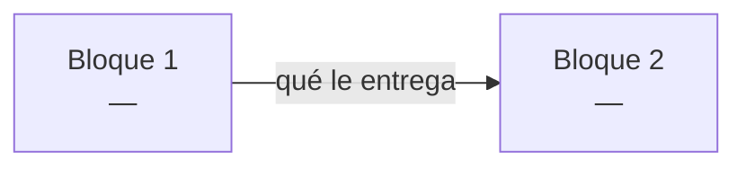

# PROJECT.md

> [!important] Documento vivo
> Aquí se anota **todo** el proyecto: restricciones, conceptos, bloques, clases y progreso.
> Lo rellena el agente conforme se avanza. Es lo que leerá un agente nuevo para saber en qué punto están.

---

## 🗺️ Mapa de flujo

> [!info] Dónde estamos
> **Fase actual:** `FASE 0`
> **Siguiente paso:** 
> **Bloqueos abiertos:** —

| Bloque | Descripción | Estado | Qué recibe | Qué entrega |
|---|---|---|---|---|
|  |  | ⚪ |  |  |

**Estados:** ✅ cerrado · 🔵 en curso · ⚪ pendiente · 🔴 bloqueado

> [!note] Se actualiza al cerrar cada bloque
> Las flechas del diagrama llevan **qué le entrega un bloque al siguiente**. Sin eso el diagrama solo muestra orden; con eso muestra el contrato entre bloques.

---

## FASE 0 — COMPRENSIÓN

### Input / Output

**INPUT:**
- 

**OUTPUT:**
- 

### Restricciones generales

> [!warning] Todo lo que limita el proyecto
> No solo lo prohibido por el subject. Si aparece una restricción nueva en cualquier fase, se añade aquí en el momento.

| Origen | Restricción | Impacto |
|---|---|---|
| Subject |  |  |
| Técnica |  |  |
| Entorno |  |  |
| Estilo |  |  |
| Diseño |  |  |
| Alcance |  |  |

### Mapa de temas

> [!info] Sale del subject
> El agente extrae los temas del enunciado, el estudiante quita lo que ya domina, y con lo que queda se genera el prompt de estudio para NotebookLM.

| Tema | En general | En este proyecto | ¿Ya lo domino? |
|---|---|---|---|
| `JSON` | qué es, cómo se parsea | serializar el output que exige el subject | ☐ |

> [!success]- Prompt para NotebookLM
> *(generado por el agente con la lista final)*

### Conceptos a estudiar

#### [Nombre del concepto]

> [!info] Estado
> pendiente / en progreso / **dominado**

**Por qué hace falta:** [qué parte del proyecto lo necesita]

> [!question] Duda
> [reformulada por el agente]

> [!success] Respuesta
> [explicación acordada, con su escena de la vida real]

**Se usa en:** [[Bloque X]]

> [!warning] Bloqueo de fase
> No pasar a Fase 1 hasta que **todos** los conceptos estén en `dominado`.

---

## FASE 1 — DISEÑO

### Responsabilidades sueltas

*(todo lo que el subject exige, antes de agruparlo en bloques)*

- [ ] 

### Bloques

*(en orden de dependencia)*

1. 
2. 

---

### Bloque [N] — [nombre]

> [!info] Estado
> diseño / implementando / testeando / **cerrado**

**Descripción:** [qué resuelve este bloque, breve y directo]

**Depende de:** [[Bloque X]] — porque: 
**Qué recibe:** [datos, estructuras o garantías que le llegan del anterior]
**Qué entrega:** [qué deja listo para el siguiente]

---

#### ==`NombreClase`==

| Campo | Valor |
|---|---|
| Descripción | [qué hace, en una frase directa] |
| Archivo | `src/...` |
| Estado | diseñada / implementada / testeada |

**Atributos:**

| Nombre | Tipo | ¿Argumento? | Descripción | Hecho |
|---|---|---|---|---|
| `name` | `str` | ✅ | [para qué existe] | ☐ |
| `_visits` | `int` | ❌ | [para qué existe] | ☐ |

> [!tip] Por qué cada columna
> **¿Argumento?** — qué entra por el constructor y qué se inicializa dentro.
> **Descripción** — entre diseñar e implementar pueden pasar días. Sin ella vuelves y no recuerdas por qué existe ese atributo.
> **Hecho** — checklist por atributo, no por clase. Así se ve el avance real.

**Métodos:**

| Firma | Descripción | Hecho |
|---|---|---|
| `get_neighbors(self) -> list[Zone]` | [qué hace] | ☐ |
| `drone_in(self) -> None` | [qué hace] | ☐ |

> [!important] Firmas completas
> `self` **siempre** va escrito, aunque el método no reciba nada más: `drone_in(self) -> None`, nunca `drone_in() -> None`.
> Tipo de retorno **siempre** explícito, incluido `-> None`.

> [!note] Una clase = un `####` resaltado, separado por `---`
> El nombre de la clase es el título más visible dentro del bloque: `#### ==\`NombreClase\`==`.
> Con varias clases seguidas hay que ver de un vistazo dónde empieza cada una — por eso van al mismo nivel que *Objeciones de diseño*, resaltadas y con separador delante, no enterradas en un `#####`.

---

#### Objeciones de diseño

> [!note] Cuando agente y estudiante discrepan
> Se hace la versión del estudiante, y la objeción del agente queda anotada aquí. Si el problema aparece después, hay rastro de dónde se decidió y por qué.

- 

---

> [!warning] Bloqueo de fase
> No pasar a Fase 2 hasta que **todos** los bloques y clases estén definidos y aprobados.

---

## FASE 2 — IMPLEMENTACIÓN

### Bloque [N] — [nombre]

- [ ] `NombreClase` — implementación
- [ ] `NombreClase` — tests pasando

> [!warning] Bloqueo de bloque
> No pasar al siguiente bloque sin los tests del actual pasando.

---

## FASE 3 — INTEGRACIÓN Y VALIDACIÓN

### Tests de integración

#### [[Bloque A]] + [[Bloque B]]

- [ ] Implementación
- [ ] Test

### Validación final

- [ ] Checklist del subject línea por línea
- [ ] `make lint` sin errores (`flake8` + `mypy`)
- [ ] README completo
- [ ] Revisión del agente contra todos los requisitos de [[HANDOFF]]
