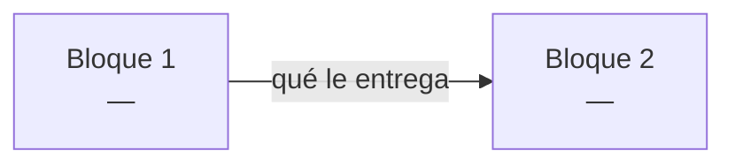

# PROJECT.md

> [!important] Documento vivo
> Aquí se anota **todo** el proyecto: restricciones, conceptos, bloques, clases y progreso.
> Lo rellena el agente conforme se avanza. Es lo que leerá un agente nuevo para saber en qué punto están.

---

## 🗺️ Mapa de flujo

> [!info] Dónde estamos
> **Fase actual:** `FASE 0`
> **Siguiente paso:** verificar los 10 temas del mapa con cuestionario/discusión — no se marca `dominado` solo porque el estudiante diga que ya estudió
> **Bloqueos abiertos:** ningún tema en `dominado` todavía → bloquea el paso a Fase 1



| Bloque | Descripción | Estado | Qué recibe | Qué entrega |
|---|---|---|---|---|
|  |  | ⚪ |  |  |

**Estados:** ✅ cerrado · 🔵 en curso · ⚪ pendiente · 🔴 bloqueado

> [!note] Se actualiza al cerrar cada bloque
> Las flechas del diagrama llevan **qué le entrega un bloque al siguiente**. Sin eso el diagrama solo muestra orden; con eso muestra el contrato entre bloques.

---

## FASE 0 — COMPRENSIÓN

### Input / Output

**INPUT:**
- 

**OUTPUT:**
- 

### Restricciones generales

> [!warning] Todo lo que limita el proyecto
> No solo lo prohibido por el subject. Si aparece una restricción nueva en cualquier fase, se añade aquí en el momento.

| Origen | Restricción | Impacto |
|---|---|---|
| Subject |  |  |
| Técnica |  |  |
| Entorno |  |  |
| Estilo |  |  |
| Diseño |  |  |
| Alcance |  |  |

### Mapa de temas

> [!info] Sale del subject
> El agente extrae los temas del enunciado, el estudiante quita lo que ya domina, y con lo que queda se genera el prompt de estudio para NotebookLM.

| Tema | En general | En este proyecto | ¿Ya lo domino? |
|---|---|---|---|
| Function calling | Qué es, por qué existe, cómo estructura la salida de un LLM | Traducir prompt → `{name, parameters}` según `functions_definition.json` | ☐ |
| Tokenización | BPE/SentencePiece — cómo se parte un texto en tokens | `llm_sdk.encode()` y el fichero de vocabulario del modelo | ☐ |
| Logits / softmax | Distribución de probabilidad sobre el vocabulario, selección de token | `get_logits_from_input_ids()` — de dónde salen los números que se van a restringir | ☐ |
| Constrained decoding | Restringir logits para forzar estructura válida token a token | Forzar JSON válido y conforme al schema de `functions_definition.json`, sin usar `outlines`/`transformers` | ☐ |
| Vocabulario / token↔ID | Cómo un fichero de vocab mapea tokens a IDs y viceversa | Usar `get_path_to_vocab_file()` para decidir, en cada paso, qué tokens continúan un JSON válido | ☐ |
| `uv` | Gestión de entorno y dependencias — `pyproject.toml`, `uv.lock` | El revisor solo corre `uv sync`; setup del proyecto depende de esto | ☐ |
| `python -m` | Ejecutar un paquete como módulo — estructura `src/`, `__main__.py` | Comando obligatorio: `uv run python -m src [--functions_definition ...]` | ☐ |
| `argparse` | Parseo de argumentos CLI | Flags `--functions_definition`, `--input`, `--output` con defaults a `data/input/` y `data/output/` | ☐ |
| JSON en Python | Parseo/serialización, manejo de JSON inválido | Leer `functions_definition.json` y `function_calling_tests.json` con manejo de errores; escribir `function_calling_results.json` válido | ☐ |
| `numpy` | Manipulación de arrays | Posible uso para manejar el vector de logits al aplicar la máscara de constrained decoding | ☐ |

> [!success]- Prompt para NotebookLM
> *(generado por el agente con la lista final)*

```text
Quiero estudiar a fondo los siguientes temas para un proyecto de la escuela 42 llamado
"call me maybe" (function calling con LLMs pequeños). Para cada tema, dame primero la
explicación general del concepto y luego cómo se aplica específicamente al escenario que
describo debajo. Usa ejemplos concretos, no solo definiciones.

CONTEXTO DEL PROYECTO:
Construyo una herramienta que traduce prompts en lenguaje natural (ej: "What is the sum
of 2 and 3?") en llamadas de función estructuradas (ej: {"name": "fn_add_numbers",
"parameters": {"a": 2, "b": 3}}), usando el modelo Qwen/Qwen3-0.6B a través de un SDK
wrapper (métodos: encode, get_logits_from_input_ids, get_path_to_vocab_file, decode
opcional). La restricción central: NO puedo confiar en que el modelo genere JSON válido
solo con prompting (falla ~70% de las veces en modelos de este tamaño). Debo implementar
constrained decoding manualmente: en cada paso de generación, tomar los logits, poner a
-infinito los que romperían la validez JSON o el schema esperado, y muestrear solo entre
los tokens que quedan válidos. Todo en Python 3.10+, con pydantic para validar las
clases, tipado estricto (mypy), sin librerías de alto nivel como outlines/transformers/
huggingface. Gestión de dependencias con uv. Ejecución vía `python -m src` con argparse
para las rutas de entrada/salida.

TEMAS:

1. Function calling en LLMs — qué es, por qué existe, cómo estructura la salida de un
   modelo que normalmente solo genera texto libre.

2. Tokenización (BPE/SentencePiece) — cómo un string se parte en subunidades (tokens),
   por qué no es un split por palabras, cómo se relaciona con el fichero de vocabulario
   de un modelo.

3. Logits y softmax — qué son los logits que devuelve un modelo antes de elegir el
   siguiente token, cómo se convierten en probabilidades, cómo se elige normalmente el
   siguiente token (greedy, sampling).

4. Constrained decoding — la técnica de modificar logits antes de la selección de token
   para forzar que la salida cumpla una gramática o schema específico (en este caso,
   JSON válido conforme a una definición de función). Cómo se identifican en cada paso
   qué tokens son válidos dado el estado parcial de la generación.

5. Vocabulario / mapeo token↔ID — cómo un fichero de vocabulario relaciona IDs numéricos
   con su representación en texto, y cómo se usa eso para filtrar tokens válidos durante
   constrained decoding.

6. uv — gestión de entornos virtuales y dependencias en Python moderno: pyproject.toml,
   uv.lock, uv sync, uv run.

7. Ejecutar un paquete Python con `python -m` — cómo funciona `__main__.py`, por qué se
   usa esta forma en vez de ejecutar un script suelto.

8. argparse — cómo definir argumentos opcionales con valores por defecto, para un CLI
   tipo `--functions_definition <file> --input <file> --output <file>`.

9. JSON en Python — parseo y serialización con el módulo json, cómo manejar excepciones
   de JSON inválido o archivos faltantes sin crashear el programa.

10. numpy — operaciones básicas sobre arrays, aplicables a manipular un vector de logits
    (por ejemplo, poner posiciones específicas a -infinito).

Al final, dame un resumen de cómo estas piezas encajan entre sí en el flujo completo:
prompt → tokenización → logits → constrained decoding → JSON de salida.
```

### Conceptos a estudiar

#### [Nombre del concepto]

> [!info] Estado
> pendiente / en progreso / **dominado**

**Por qué hace falta:** [qué parte del proyecto lo necesita]

> [!question] Duda
> [reformulada por el agente]

> [!success] Respuesta
> [explicación acordada, con su escena de la vida real]

**Se usa en:** [[Bloque X]]

> [!warning] Bloqueo de fase
> No pasar a Fase 1 hasta que **todos** los conceptos estén en `dominado`.

---

## FASE 1 — DISEÑO

### Responsabilidades sueltas

*(todo lo que el subject exige, antes de agruparlo en bloques)*

- [ ] 

### Bloques

*(en orden de dependencia)*

1. 
2. 

---

### Bloque [N] — [nombre]

> [!info] Estado
> diseño / implementando / testeando / **cerrado**

**Descripción:** [qué resuelve este bloque, breve y directo]

**Depende de:** [[Bloque X]] — porque: 
**Qué recibe:** [datos, estructuras o garantías que le llegan del anterior]
**Qué entrega:** [qué deja listo para el siguiente]

---

#### ==`NombreClase`==

| Campo | Valor |
|---|---|
| Descripción | [qué hace, en una frase directa] |
| Archivo | `src/...` |
| Estado | diseñada / implementada / testeada |

**Atributos:**

| Nombre | Tipo | ¿Argumento? | Descripción | Hecho |
|---|---|---|---|---|
| `name` | `str` | ✅ | [para qué existe] | ☐ |
| `_visits` | `int` | ❌ | [para qué existe] | ☐ |

> [!tip] Por qué cada columna
> **¿Argumento?** — qué entra por el constructor y qué se inicializa dentro.
> **Descripción** — entre diseñar e implementar pueden pasar días. Sin ella vuelves y no recuerdas por qué existe ese atributo.
> **Hecho** — checklist por atributo, no por clase. Así se ve el avance real.

**Métodos:**

| Firma | Descripción | Hecho |
|---|---|---|
| `get_neighbors(self) -> list[Zone]` | [qué hace] | ☐ |
| `drone_in(self) -> None` | [qué hace] | ☐ |

> [!important] Firmas completas
> `self` **siempre** va escrito, aunque el método no reciba nada más: `drone_in(self) -> None`, nunca `drone_in() -> None`.
> Tipo de retorno **siempre** explícito, incluido `-> None`.

> [!note] Una clase = un `####` resaltado, separado por `---`
> El nombre de la clase es el título más visible dentro del bloque: `#### ==\`NombreClase\`==`.
> Con varias clases seguidas hay que ver de un vistazo dónde empieza cada una — por eso van al mismo nivel que *Objeciones de diseño*, resaltadas y con separador delante, no enterradas en un `#####`.

---

#### Objeciones de diseño

> [!note] Cuando agente y estudiante discrepan
> Se hace la versión del estudiante, y la objeción del agente queda anotada aquí. Si el problema aparece después, hay rastro de dónde se decidió y por qué.

- 

---

> [!warning] Bloqueo de fase
> No pasar a Fase 2 hasta que **todos** los bloques y clases estén definidos y aprobados.

---

## FASE 2 — IMPLEMENTACIÓN

### Bloque [N] — [nombre]

- [ ] `NombreClase` — implementación
- [ ] `NombreClase` — tests pasando

> [!warning] Bloqueo de bloque
> No pasar al siguiente bloque sin los tests del actual pasando.

---

## FASE 3 — INTEGRACIÓN Y VALIDACIÓN

### Tests de integración

#### [[Bloque A]] + [[Bloque B]]

- [ ] Implementación
- [ ] Test

### Validación final

- [ ] Checklist del subject línea por línea
- [ ] `make lint` sin errores (`flake8` + `mypy`)
- [ ] README completo
- [ ] Revisión del agente contra todos los requisitos de [[HANDOFF]]
